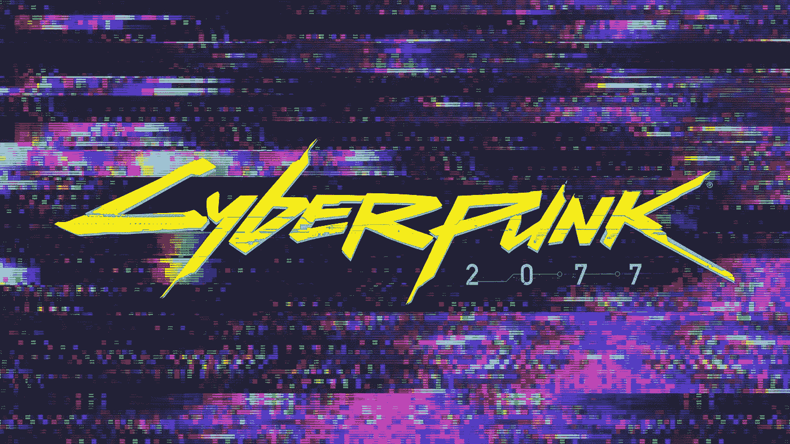

# 赛博朋克 2077:电子游戏警告标志

> 原文：<https://medium.com/nerd-for-tech/cyberpunk-2077-caution-flag-for-video-gaming-81a41db02a24?source=collection_archive---------10----------------------->

有一段时间，看起来 CD Projekt Red 可能会在视频游戏批评者面前笑到最后，这些批评者无情地抨击该公司去年 12 月发布的《赛博朋克 2077》存在严重的安全和质量问题。

这并不是批评不当。发布一周后，索尼从 PlayStation Network 上撤下了这款游戏。PlayStation 和 Xbox 以及 GameStop 和 Best Buy 提供全额退款。

它迅速成为一个妙语——许多妙语——由于从令人抓狂到令人捧腹的小故障。在一个场景中，一个骑摩托车的人没穿裤子，从坐在自行车上变成站在座位上。

它也不能在多个平台上运行。YouTube 创始人 Yong Yea 在彭博[的视频纪录片](https://www.youtube.com/watch?v=oq72nt9zshI)中谈到游戏的问题时说，“在 PlayStation 4 上，它就像不能玩一样好。”

伊丽莎白·洛帕托[在 The Verge](https://www.theverge.com/2020/12/23/22197547/cyberpunk-2077-glitches) 上写道，“如果有两样东西是我喜欢的，那就是戏剧和混乱，天哪，赛博朋克 2077 两样都有。”之后，她敦促读者在评论区张贴他们最喜欢的小故障的链接。

Engadget 上的一篇二月[帖子开始写道，“又一天，又一个](https://www.engadget.com/cyberpunk-2077-modding-vulnerability-hotfix-163044457.html)[赛博朋克 2077 更新](https://www.engadget.com/cyberpunk-2077-game-breaking-bug-fix-cd-projekt-red-152224262.html)修复一个关键问题。”

尽管如此，赛博朋克 2077 还是赚了钱——很多钱。在 2020 年底前，它售出了创纪录的 1370 万台。 [Ars Technica 在 4 月份报告](https://arstechnica.com/gaming/2021/04/cyberpunk-2077-refunds-barely-dented-cd-projekt-reds-bottom-line/)称，虽然游戏问题导致的退货、销售损失和其他费用花费了约 5120 万美元，但该公司的总收入在 2020 年增长了近四倍，达到 5.63 亿美元，净利润为 3.01 亿美元。

在过去的一周，赛博朋克 2077 回到了索尼 PlayStation 商店，尽管它带有一个警告——索尼建议不要在 PlayStation 4 上播放它。

**没有幸福的结局**

尽管如此，这并不意味着总部设在华沙的 CD 项目就此结束——至少现在还不是。破坏来自索尼的好消息，该公司[本月早些时候承认](https://www.cdprojekt.com/en/media/news/security-breach-update/)在[二月勒索攻击](https://www.engadget.com/cd-projekt-red-says-it-was-hacked-but-wont-pay-any-ransom-090055291.html)中被称为 HelloKitty 的犯罪集团窃取的数据正在网上流传。这些数据包括赛博朋克 2077 的源代码，以及早期的游戏，包括未发布版本的巫师 3。

尽管该公司试图通过《数字千年版权法案》(Digital Millennium Copyright Act)的撤销通知来阻止代码的非法分发，但到本月，正如 [PC Gamer 所说的](https://www.pcgamer.com/cd-projekt-confirms-stolen-source-code-is-being-circulated-online/)，“似乎任何想要访问(源代码)的人都可以得到它。”

Simir Shah 是 Synopsys 软件完整性小组的区域销售经理，他本人也是一名游戏玩家，他说，一旦源代码公开，黑客可以对代码进行逆向工程，并提供服务帮助玩家作弊。

“这意味着合法玩家将退出，”沙阿说，“因为没有办法战胜会作弊的人。”

事实上，该公司关于勒索软件漏洞的更新中包括这样一句话:“我们无法确认相关数据是否在漏洞发生后被操纵或篡改。”

因此，CD Projekt Red 现在正处于成为对重大违规行为的相当标准的反应的最激烈阶段。它的声明说，它一直在“与适当的服务、专家和执法机构的广泛网络合作，包括波兰警察总局。我们还联系了国际刑警组织和欧洲刑警组织。我们在 2 月份与个人数据保护办公室(PUODO)总裁分享的信息也已更新。”

它表示，它已采取“多种措施来保护和强化我们的内部系统，以防止未来出现类似的违规行为。”

这些措施包括重新设计核心信息技术基础设施；具有高级反恶意软件保护的新一代防火墙；一种新的远程访问解决方案；对特权账户进行更严格的限制；更好地保护端点、服务器和网络；更好的事件监测机制；一个扩大的内部安全部门；以及与多个外部网络安全和 IT 专家的合作。

**太少太迟**

所有这些都很好，但是所有这些(这是经常发生的情况)听起来像是在马(或者在这种情况下是源代码)逃跑后锁上谷仓门的多种版本。

其中没有一个直接解决软件安全问题，而软件安全是保护游戏等产品以及系统和网络的最基本措施之一。所有这些都是由软件驱动的。

具有讽刺意味的是，即使该公司因质量和安全问题损失的 5100 万美元中有一半在游戏发布前花在了修复这些缺陷上，也很可能避免了一次成功的网络攻击所伴随的可怕后果:品牌损害、销售损失和退款、响应和恢复成本、在网上公开的被盗知识产权， 以及潜在的法律责任——该公司是一项投资者诉讼的目标，该诉讼指控该公司在游戏发布前所做的声明“存在重大虚假和误导”

事后看来，当前问题的根源是显而易见的。彭博的视频将其概括为“一个被无节制的雄心、不切实际的时间表以及以牺牲发展为代价专注于营销所破坏的过程。”

和安全性，它可以添加。

沙阿说，考虑到该项目的雄心和规模，Cyberpunk 可能应该有数千名而不是数百名开发人员来开发它，这是一款以科幻反乌托邦之夜城市为背景的角色扮演游戏。

基于视频游戏历史上最灾难性的游戏发布之一的后果，开发者抱怨每天工作 13 小时试图满足不切实际的期限，很明显，这是成千上万个例子中的一个，当公司匆忙投入生产时，没有时间来纠正错误。

**使用测试工具包**

彭博记者 Jason Schreier [写道](https://www.bloomberg.com/news/articles/2021-01-16/cyberpunk-2077-what-caused-the-video-game-s-disastrous-rollout)开发团队的一名成员“将这个过程比作在你面前铺设铁轨的同时试图驾驶一辆火车。如果铺轨工人能提前几个月开工，事情可能会进展得更顺利。”

沙阿说，很明显，“他们花费了数亿美元来发布一个完整的垃圾。质量问题如此严重是因为他们没有进行静态分析。”

[静态应用程序安全测试](https://www.synopsys.com/software-integrity/security-testing/static-analysis-sast.html?cmp=pr-sig&utm_medium=referral)是市场上几种自动化工具之一，可以帮助软件开发人员在编写代码时发现并修复错误和其他缺陷。安全软件开发生命周期中的其他标准工具包括[动态](https://www.synopsys.com/software-integrity/application-security-testing-services/dynamic-analysis-dast.html?cmp=pr-sig&utm_medium=referral)和[交互式](https://www.synopsys.com/software-integrity/security-testing/interactive-application-security-testing.html?cmp=pr-sig&utm_medium=referral)应用安全测试，以及[软件组成分析](https://www.synopsys.com/software-integrity/security-testing/software-composition-analysis.html?cmp=pr-sig&utm_medium=referral)，后者帮助开发人员发现并修复开源软件组件中的已知漏洞和潜在许可冲突。

“我本可以告诉那家公司的总裁，他可以用静态分析解决安全和质量问题，这是一个大问题，因为这就是静态分析的作用。它同时关注安全和质量问题，”他说。

赛博朋克 2077 的故事也应该成为视频游戏制造商和玩家的一面红旗。因为它可能不会长期处于异常状态。就在几周前，黑客[攻破了游戏巨头电子艺界](https://www.vice.com/en/article/wx5xpx/hackers-steal-data-electronic-arts-ea-fifa-source-code)，战地、国际足联和模拟人生的制造商，并窃取了 FIFA 21 的源代码和相关的内部工具。

Akamai Technologies 刚刚发布了一份[报告](https://www.akamai.com/us/en/multimedia/documents/state-of-the-internet/akamai-state-of-the-internet-gaming-in-a-pandemic.pdf)，该报告跟踪了 2020 年全球范围内对游戏行业的 246，064，297 次网络应用攻击，自 2018 年以来增长了 415%。该报告还称，凭据填充攻击在 2019 年增加了 224%。

像这样的统计数字应该是意料之中的。游戏是一个巨大的、不断扩张的、利润丰厚的攻击面，在美国有[2.44 亿](https://www.npd.com/wps/portal/npd/us/news/press-releases/2020/more-people-are-gaming-in-the-us/)(并且还在增长)玩家，仅在美国，他们就已经成为了一个估计价值 640 亿美元的产业。它在全球的票房收入几乎达到了 1800 亿美元，比电影和北美体育产业的总和还要大。

黑客是机会主义者——他们寻找可利用的弱点和金钱。在游戏中，两者都有很多。

沙阿说，这部分是因为那些设计和制作游戏的人“认为自己是艺术家，而不是软件开发者。”

但是为了避免灾难，游戏公司显然需要雇佣这两个人。沙阿说，如果他们不想成为下一个赛博朋克，“他们需要在过程的早期就解决安全和质量问题，而不是在质量保证阶段。”“当您为软件规划和开发初始架构时，您需要构建要使用的工具，无论它们是手动的还是自动的，比如静态分析。”

否则，看似短期的收获，会造成长期的痛苦。

同样出现在彭博视频中的彭博情报公司股票研究分析师马特·坎特曼引用了被称为“超级马里奥之父”的任天堂公司的宫本茂的名言，“一个延迟的游戏最终是好的。仓促的游戏从来都不好。”

它也不太可能是安全的。