# Cypress 命令行界面

> 原文：<https://medium.com/nerd-for-tech/cypress-command-line-interface-a1d81c930e5f?source=collection_archive---------8----------------------->


在开始之前，我将脚本修改如下:

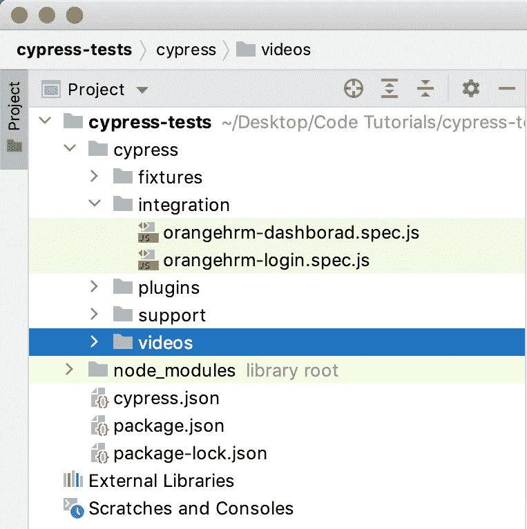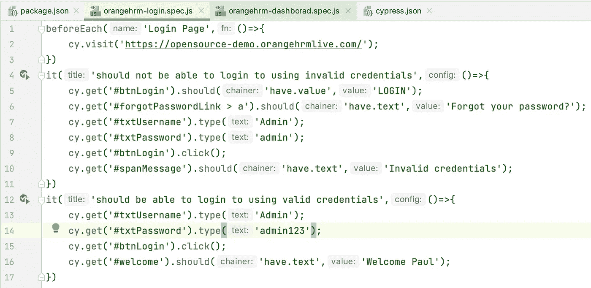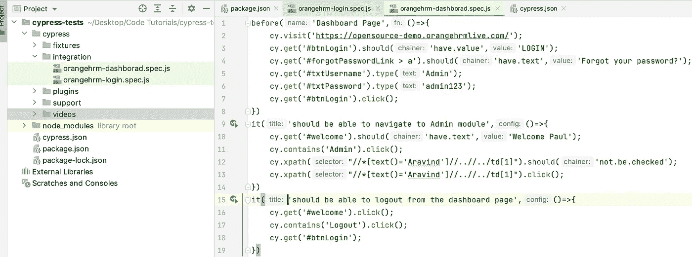

让我们打开一个终端，键入以下命令

```
npx cypress run
```

开始了。赛普拉斯正在进行测试。并以文件方式给出记录的结果。它在默认的浏览器中执行。

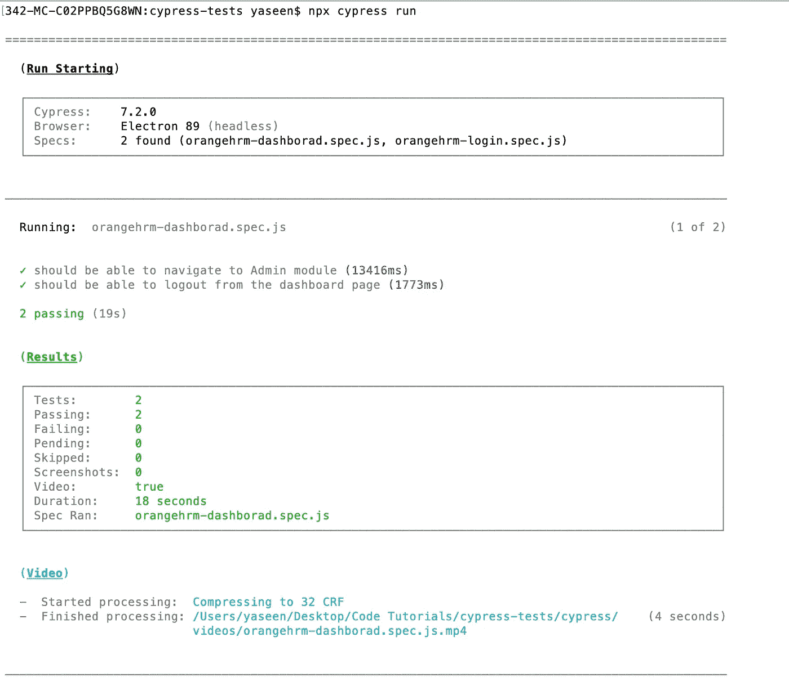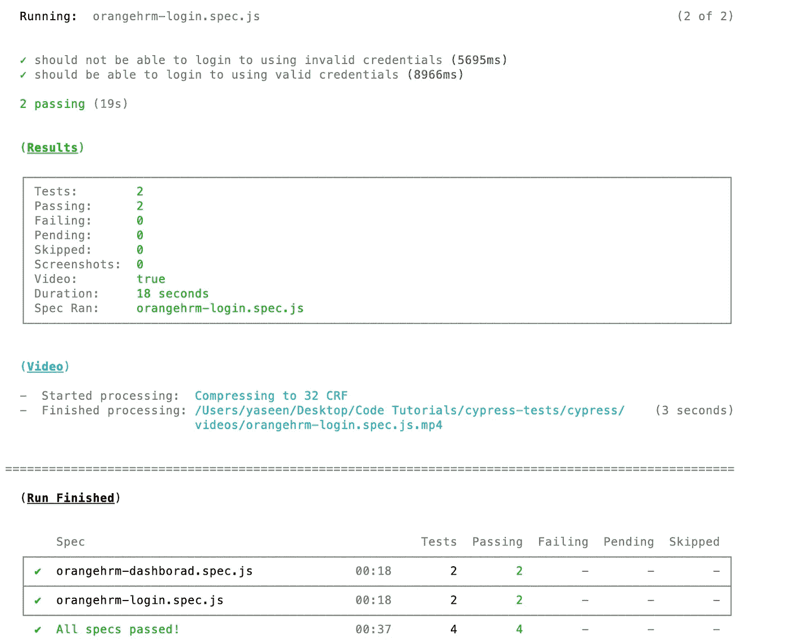

如果要在 Chrome 浏览器中执行，那么输入以下不带 headless 的命令:

```
npx cypress run --browser chrome --headless
```

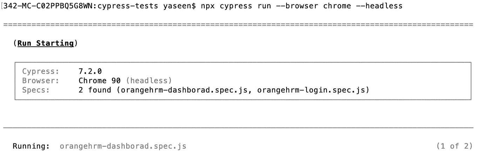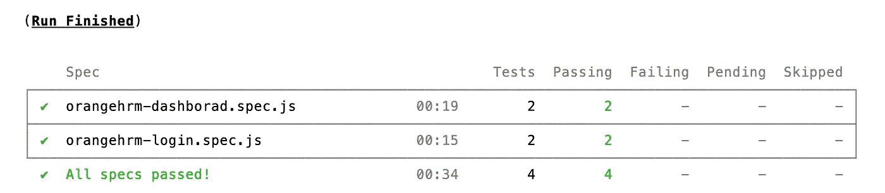

如果要执行单个测试文件，请键入以下命令:

```
npx cypress run --spec cypress/integration/orangehrm-login.spec.js
```

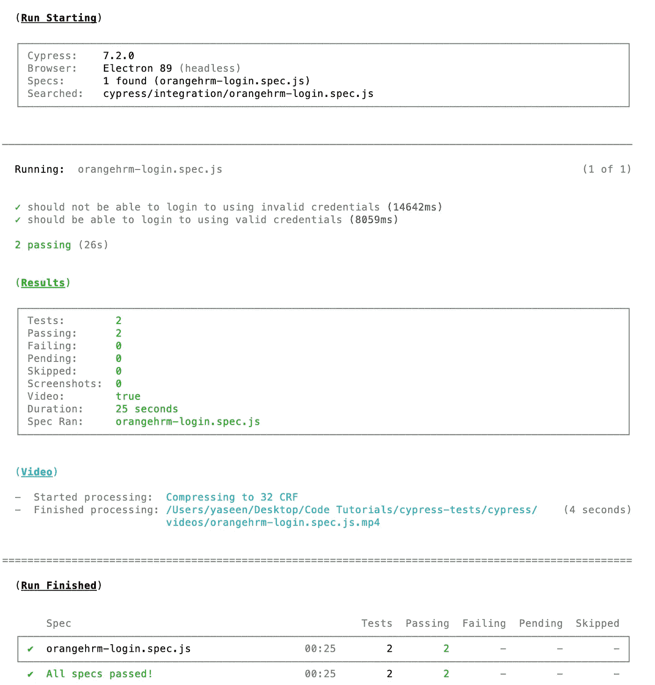

最重要和最适用的惯例之一是 npm 测试惯例。这是生态系统的一个巨大部分，对团队成长非常好。如果您将这个工具包提交到您的源代码控制，并将其推送到您的源代码控制，则不同的开发人员将通过使用 npm install 来获取您的源代码。所有软件包都是本地的，因此“npm 安装”可以更新所有必要的信息来执行测试。然而，这是惯例，他们假设如果他们运行 npm 测试，所有的包检查都会被执行。我们必须使这成为可能。让我们打开 package.json 并将下面的命令插入脚本-> test

```
cypress run --browser chrome --headless
```

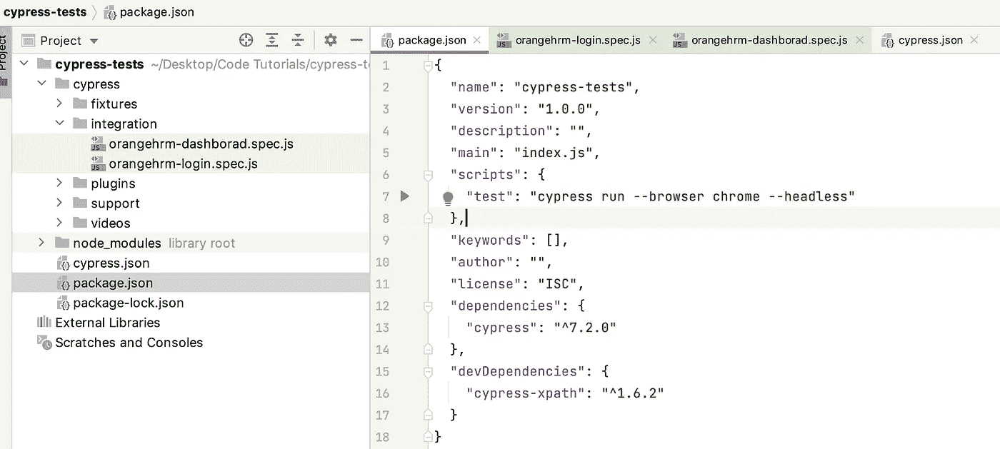

现在执行以下命令，使用 npm 运行测试

```
npm run test
```

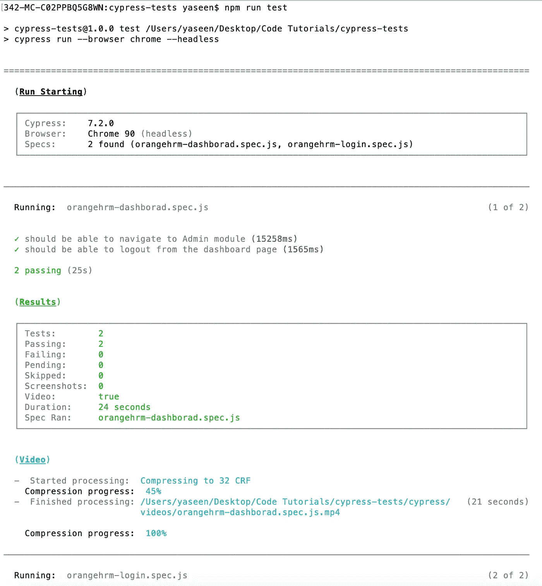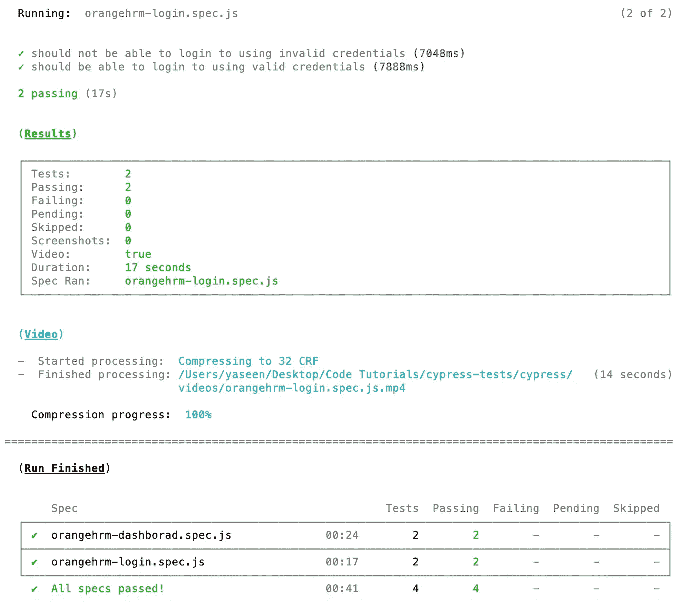