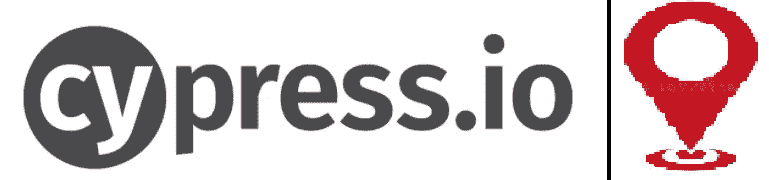
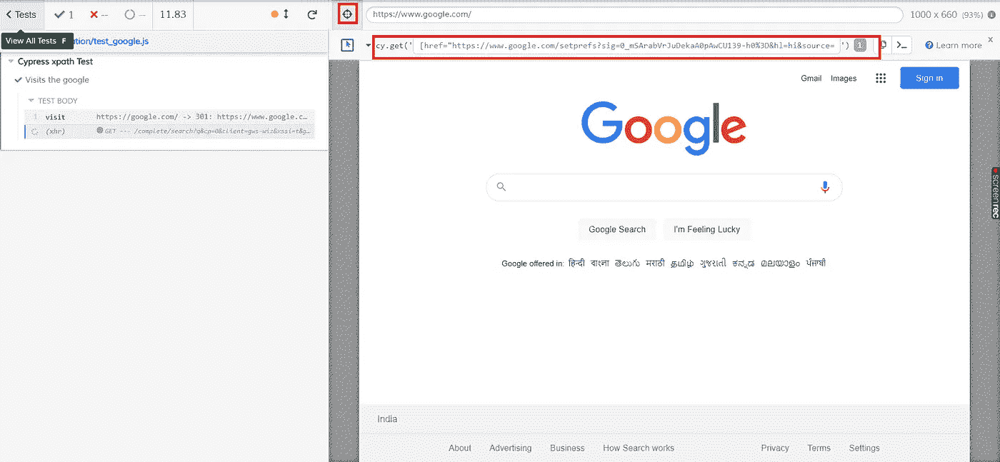
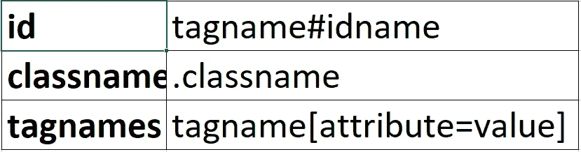

# Cypress 定位器策略

> 原文：<https://medium.com/nerd-for-tech/cypress-locators-strategy-ac38699ed0dd?source=collection_archive---------24----------------------->

在这一节中，我们将学习如何构建 cypress 定位器，作为一名 cypress 工程师，你们都知道 Cypress 只支持 CSS 选择器或 jQuery 选择器，所以在这篇博客中，我们将学习如何创建 CSS 选择器。

> 用柏树定位元素

在赛普拉斯的帮助下，我们可以找到下面给出的元素

> 从检查元素中定位元素

因此，通过查看上面的表格，您可以制作自己的定位器，这使得 cypress 中的事情变得简单。

因此，如果你不熟悉 CSS 选择器，那么你可以选择我已经在[**Cypress-xpath**](https://masoodahmad-65541.medium.com/how-to-use-x-path-in-cypress-eca5e894cda0)**中解释过的 Cypress-XPath 插件。**

干杯！！

注意:如果你有任何疑问，请在这里发帖！！