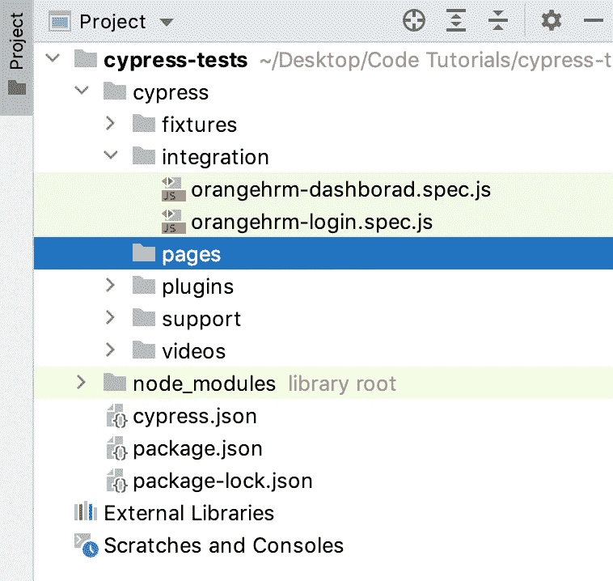
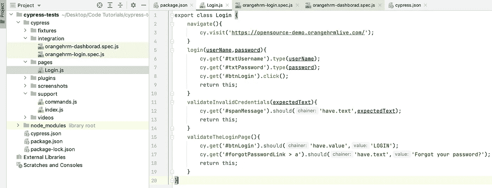
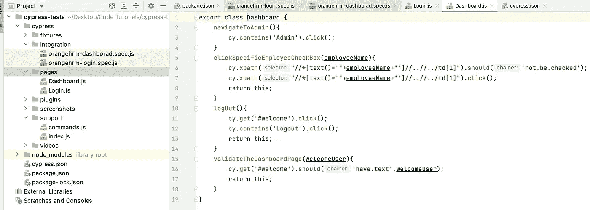
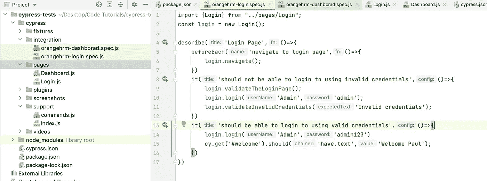
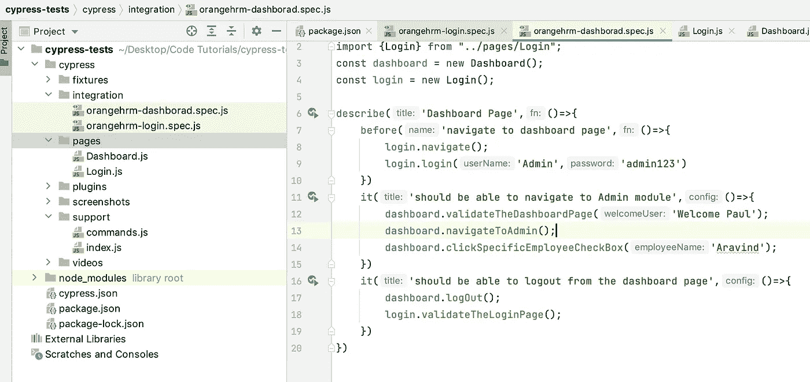
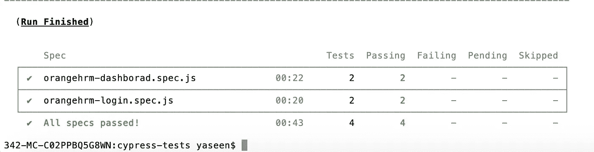
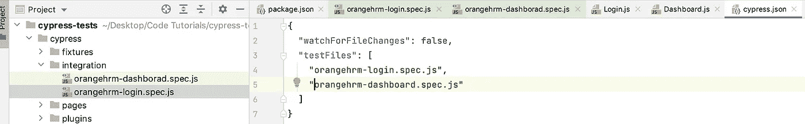
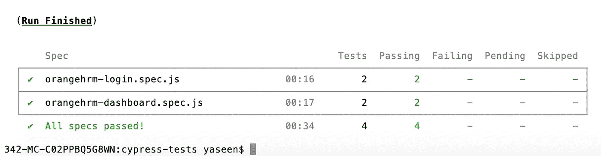
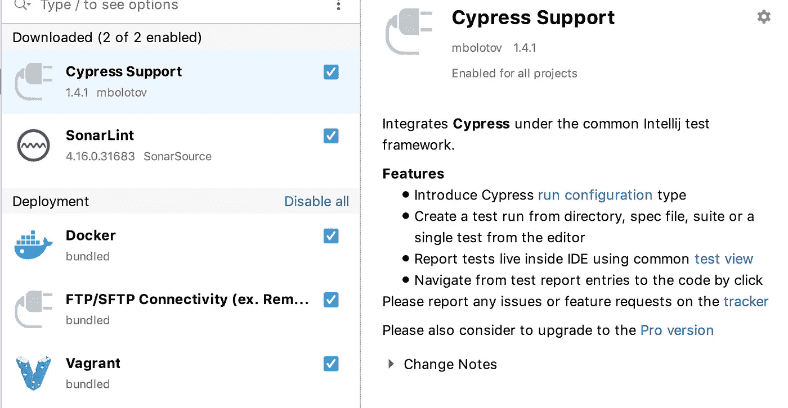

# Cypress 页面对象模型

> 原文：<https://medium.com/nerd-for-tech/cypress-page-object-model-953791736972?source=collection_archive---------1----------------------->

页面对象模型，也称为 POM，是一种创建用于存储所有 web 元素的对象存储库的设计模式。它有助于减少代码重复和改进测试用例维护。在页面对象模型中，将应用程序的每个网页视为一个类文件。每个类文件将只包含相应的网页元素。使用这些元素，测试人员可以在被测网站上执行操作。

让我们在 cypress 文件夹中创建一个名为 pages 的文件夹。

让我们为登录和仪表板功能创建一个页面，因此我创建了 Login.js 和 Dashborad.js，并插入以下代码行。

之后，我们将这两个类文件导入到我们的测试类中，如下图所示:(现在你可以看到代码的可用性)

就这些了，现在是运行代码的时候了。

我们来做一件事，当前默认的执行顺序是 DashboardTest 和 LoginTest。所以我想改变行刑的顺序。所以我的首要任务是登录测试。因此，我们必须按照下图对 cypress.json 文件中的测试列表进行排序:

现在看看结果

还有一点要补充的是，请使用名为 Cypress Support 的插件来获得所有与 API 和自动生成代码帮助相关的建议。

