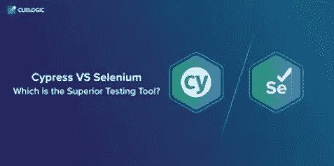

# 柏树 vs 硒

> 原文：<https://medium.com/nerd-for-tech/cypress-vs-selenium-32677b09ea5b?source=collection_archive---------7----------------------->

我将对比市场上可用的自动化研究工具的大列表中被认为是游戏规则改变者的两个最令人兴奋的工具。

这里有一个百万美元的问题:Cypress 不仅仅是一个 web 自动化平台，还是 Selenium 的替代品？

这个故事将做一个彻底的比较，来说明这两种方法如何为自动化测试工作，以及在各种情况下哪种方法占了上风。

**简而言之**
Cypress 是一个为下一代构建的网络测试平台。它是在 Mocha 和 Chai 上开发的，是一个基于 JavaScript 的端到端测试平台。
Selenium 是一个用于 web 浏览器自动化的开源测试平台。Selenium WebDriver 本地或远程驱动浏览器，用于 UI 自动化检查。其他要素通常在产品的可靠性和稳健性方面扮演着特殊的角色。

**架构**
Cypress 运行在应用程序的同一个运行循环上。Cypress 背后的服务器方法是 Node.js，Cypress 进程和 Node.js 进程不断地相互交互、同步、执行任务。此外，Cypress 通过解释和修改 web 流量在网络层工作。这使得 Cypress 不仅可以编辑所有的浏览器，还可以更新影响浏览器自动化的代码。
在 Selenium 中，当我们运行 Selenium 自动化脚本时，Selenium 客户端库与 Selenium API 通信，后者在 JSON wire 协议的帮助下向浏览器驱动程序发送绑定命令。浏览器驱动程序使用 HTTP 注册表过滤出 HTTP 请求和 HTTP 服务器的所有执行指令。然后浏览器上的命令在 selenium 脚本中运行，HTTP 服务器将回复返回给自动化测试脚本。
基于其内部操作架构，Selenium 在网络上执行远程命令，而 Cypress 在与您的程序相同的运行中运行。

**安装**自动化可以配置为在几分钟内运行。Cypress 的设计理念之一是使整个测试过程对开发者来说舒适方便，打包和联合。
您必须为您的首选语言安装语言链接库，以便在您的自动化项目中使用 Selenium。此外，对于您想要自动运行检查的浏览器，您将需要 WebDriver 二进制文件。
如果我们还考虑到实现的时间和难度，Cypress 比 Selenium 更胜一筹。

**支持的语言**
Cypress 只支持 JavaScript。不支持有时会迫使用户学习某种脚本语言的其他语言。
然而，Selenium 支持多种 Java、C#、Python、Ruby、R、Dar、Objective-C、Haskell 和 PHP 语言以及 JavaScript。
由于许多语言都支持 Selenium，所以考虑他们想要使用哪种语言来构建自动化平台对用户来说是有帮助的。

**跨浏览器支持**
Cypress 支持 Canary、Chrome、Chromium、Edge、Edge Beta、Edge Canary、Edge Dev、Electron、Firefox (Beta 支持)、Firefox 开发者版(Beta 支持)、Firefox Nightly (Beta 支持)。
Selenium 几乎支持市场上所有主流浏览器，这是 Selenium 的一个额外优势。以下是支持的浏览器列表:Chrome(所有版本)、Firefox(54 及更高版本)、Internet Explorer(6 及更高版本)、Opera(10.5 及更高版本)、Safari(10 及更高版本)
与 Cypress 相比，Selenium 具有更好的跨浏览器支持，因为 Selenium 支持市场上几乎所有可用的浏览器，而 Cypress 无法在 Safari 上测试。

**测试自动化套件的并行执行**
在并行检查方面与 Selenium 相比，cypress 落后了。
Selenium 有许多并行性能选择，这对自动化测试非常重要。网格通常在 QA 社区中使用，TestNG 用于并行实现。和码头集装箱化可以快速集成。

**性能**
如硒几个架构层无柏。它在浏览器中以同样的方式工作。这就是为什么我们看到在测试性能的速度上比 selenium 有显著的提高。
Selenium 在测试和浏览之间有多级代码，相对 Cypress 来说比较迟滞。

**自动化与 CI/CD 的集成**
Cypress:可能但有限制。对于命令行和 npm 库，只有一个替代方法，Mocha。摩卡。CI 服务必须支持 npm，并且在 CI 服务器上对大多数录音进行测试录音是一个付费的选择。
硒:CI/CD 掺入成为可能。硒。任何测试库、测试注释和执行模式都可以使用，并且可以快速适应需求。

Cypress 也可以在麻省理工学院的许可下作为开源软件使用。然而，如果我们将其与 Selenium 进行比较，所有的 Cypress 功能都不是免费的，例如，Cypress dashboard 对种子是免费的，而对萌芽、树和森林是免费的。([https://www . cypress . io](https://www.cypress.io))
Selenium 在 Apache 2.0 许可下授权，版权持有人软件自由保护。

**OS 支持**
Cypress: Windows、Mac、Linux
Selenium: Windows、Linux、Mac、Android、iOS

**支持 BDD &数据驱动测试**
Selenium 借助外部库支持 BDD 和数据驱动，这在 Cypress 中从此不可行。

**用于对象识别的定位器**
Cypress 只支持 CSS 和 Xpath。
支持 ID、名称、XPath、CSS 选择器、文本链接、文本部分链接等各种 web 应用。支持。

**执行报告**
Selenium: Extent、Allure 和任何其他仪表板都可以在自动化套件中实现。
柏树:原生仪表盘就是柏树。

**最终结论**
Selenium 更专注于测试自动化工程师，Cypress 更专注于开发人员以促进 TDD 生产。Selenium 于 2004 年推出，因此它比 Cypress 对生态系统的支持更多，Cypress 于 2015 年开发，并继续扩展。当我们使用 Selenium 时，可以在浏览器中操作几个不同的选项，如 Cookies、本地保存、屏幕、大小、扩展、Cypress 控制线选项，但只有在使用 Cypress 时才能处理网络选项。

但是，赛普拉斯声称的一些卖点是:
1。该计划将采取截图，而实验运行。然后，作为测试开发人员，我们可以在 Test Runner 面板中浮动每个订单，查看每个阶段发生了什么。
2。没有明确的等待或睡眠是需要你的测试与柏树。在继续之前，它会立即等待命令和语句。
3。类似于单元测试案例，Cypress spies 和 cabinets 可以验证和检查函数的动作、服务器响应或时钟。您可以使用 Cypress 拦截网络流量，并根据您的需要个性化您的 API 调用。

希望以上几点有助于确定使用和探索哪种方法。