# 每日进度:第一天，推进器。

> 原文：<https://medium.com/nerd-for-tech/daily-progress-day-1-thrusters-4f587b22f758?source=collection_archive---------35----------------------->

## 增加推进器。

与 GameDevHQ，我们已经设定了一个任务，使这个 2D 太空射手。在旅程的这一点上，我们必须研究如何将一系列任务添加到这个游戏中。

## 增加推进器:

我们目前在游戏中已经有了一些推进器，但它们纯粹是视觉上的，我开始是在按住 shift 键释放时添加一些功能。

当 shift 键被按住时，添加一个检查是很容易的，添加一个额外的变量来增加玩家的移动速度，这样当你按住 shift 键时，玩家会移动得更快。

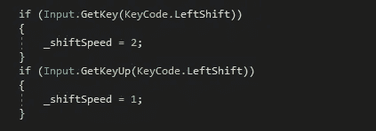

这被放在更新方法中，因为我们正在检查玩家的输入。

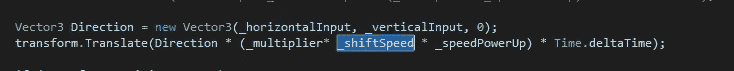

这个来自我们前阵子做的玩家移动法。

这是容易的部分，现在改变大小的推进器时，你按住 shift 键，并恢复时释放。就如何做到这一点做了一点研究，我遇到了“ **transform.localScale** ”。不过使用这个有一个缺点。当它按比例缩小推进器时，它会在中心按比例缩小，而不是在顶部，这样会更容易一些。

为推进器添加一个参考，在我的例子中是推进器。

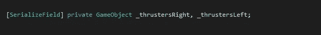

接下来，我们可以改变这些推进器的局部比例。按下 shift 键时变大，松开 shift 键时变小。

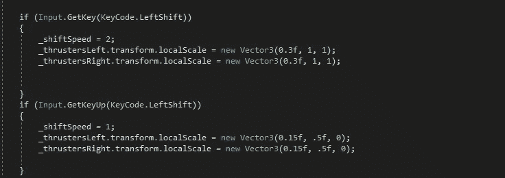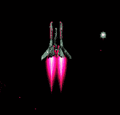

就尺寸而言，它起作用了！

当我在研究推进器的位置时，它们表现得很奇怪。而不是仅仅将推进器移动到它们应该在的地方并输入这些值。

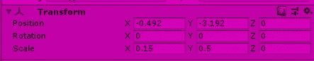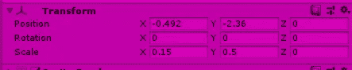

当 Shift 键被按下时—当 Shift 键未被按下时

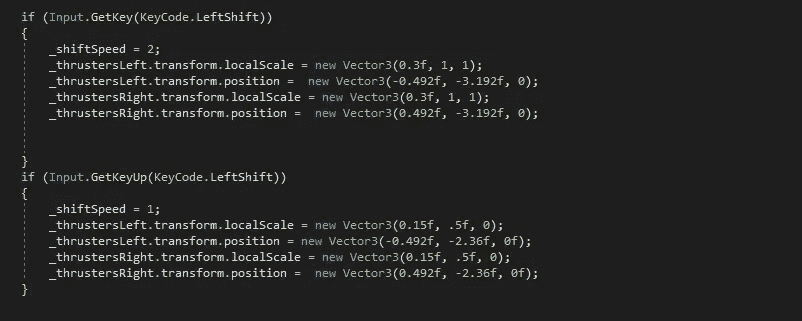

这应该行得通…但是…并没有。

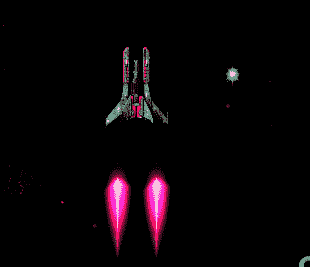

在推进器上增加*可以修正不跟随玩家的问题，但是仍然会与玩家距离太远。*

*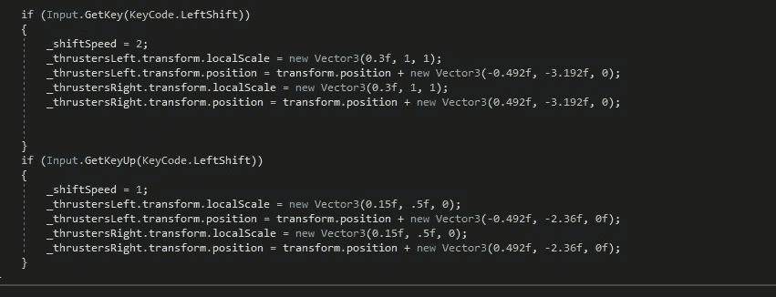**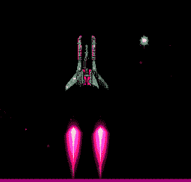*

*一次解决一个问题。*

*让推进器到达它们应该在的地方有点烦人。起初，我试图改变值，让它到正确的地方，大量的测试值，然后改变它。最后，虽然我发现这些值必须是它们应有值的一半。*

*之后，我将它们添加到自己的方法中，以清理更新循环。*

*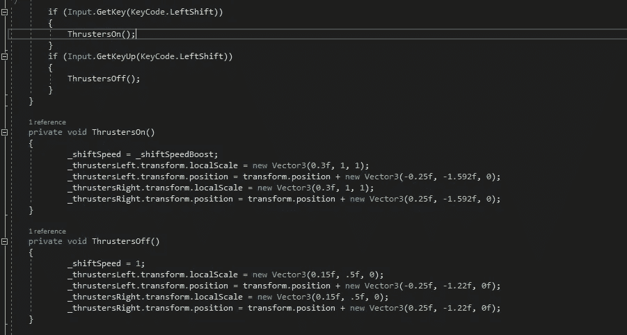*

*而最终的结果。*

*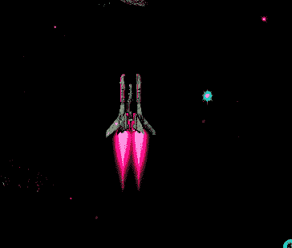*

*这就是我如何实现推进器的速度和视觉，以及我遇到的问题。下一篇文章我会增加护盾强度。那里见！*