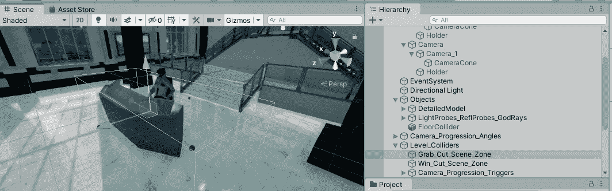
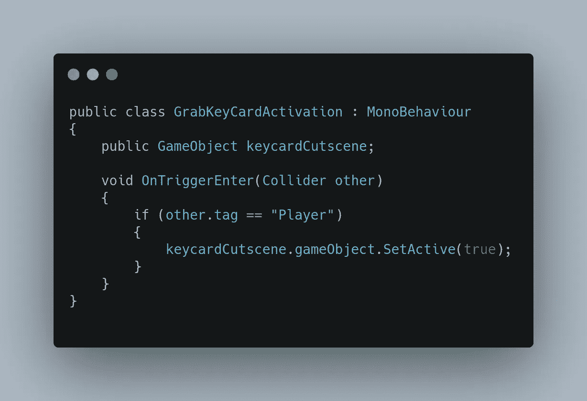
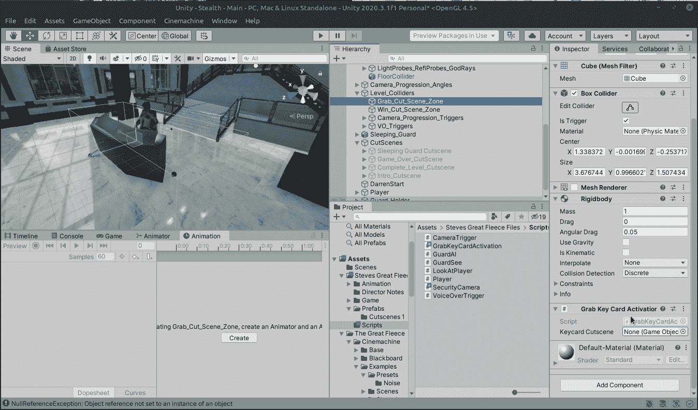
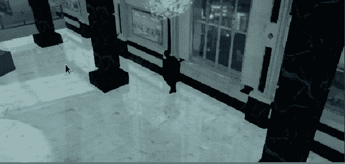
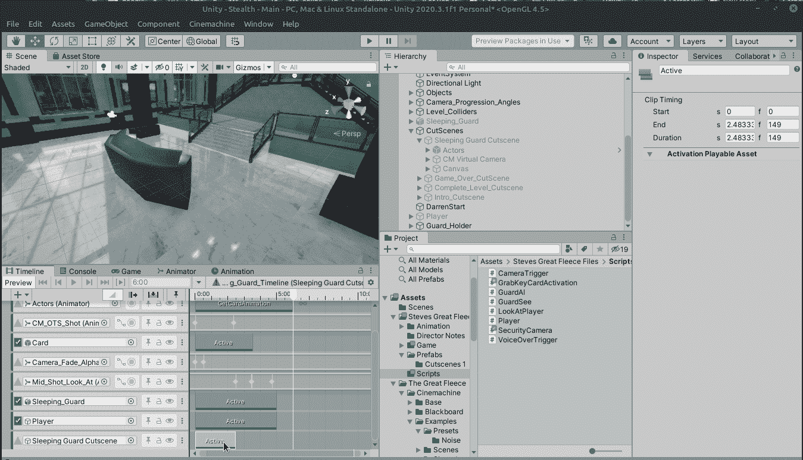
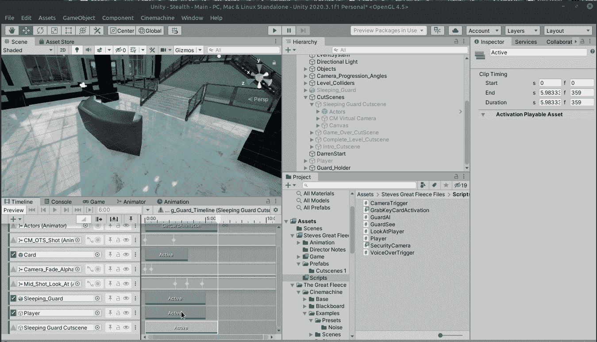
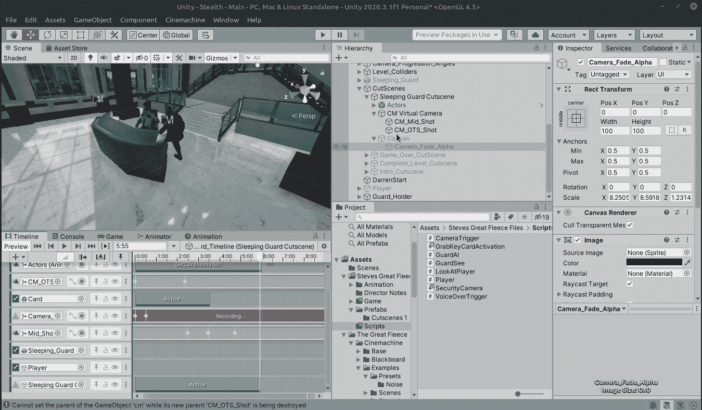
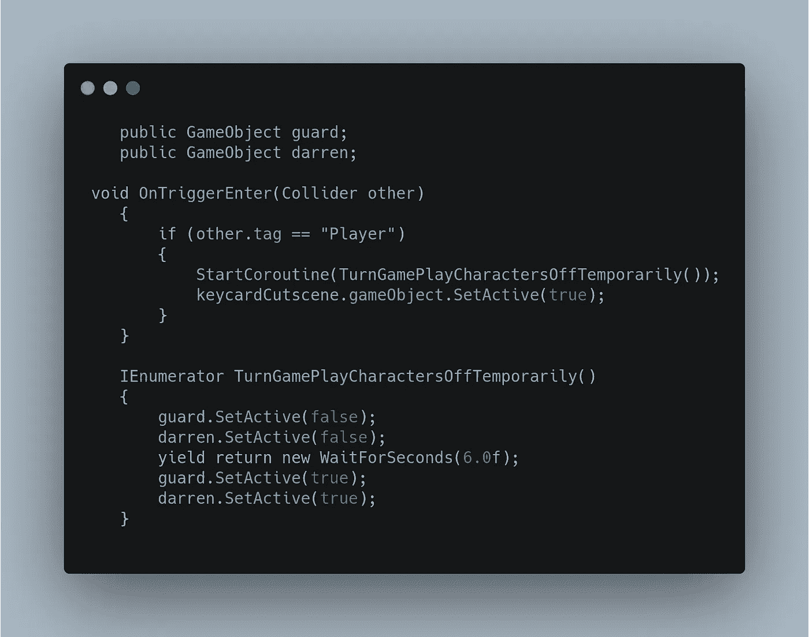
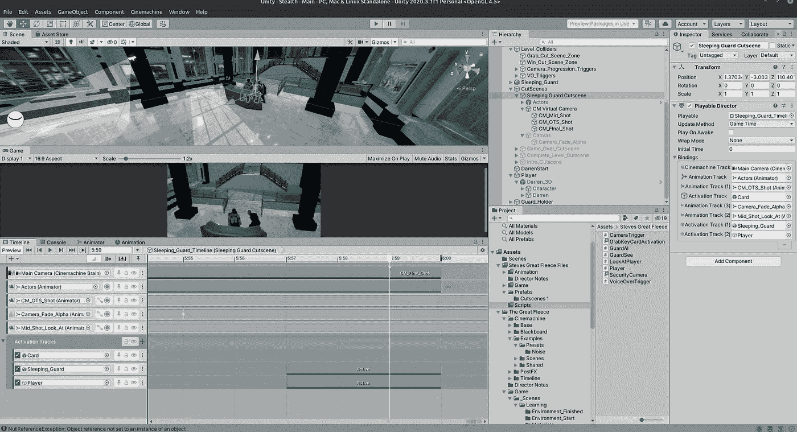
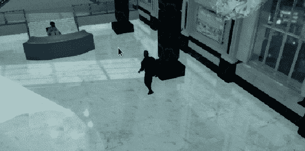

# 每日进展 2021 年 6 月 11 日:沉睡的守卫

> 原文：<https://medium.com/nerd-for-tech/daily-progress-june-11-2021-sleeping-guard-eb7c336fef12?source=collection_archive---------40----------------------->

今天的工作是将睡觉的保安过场动画整合到隐形迷你游戏中。

在睡觉的警卫桌子周围有一个名为 level collider/Grab _ Cut _ Scene _ Zone 的箱子碰撞器，当 Darren 走进去时就会触发。与之前的其他触发脚本一样，这是一个简单的例子，为过场动画创建一个占位符，然后检查 _Player 是否与碰撞盒发生碰撞。当然，如果没有刚体，我们就需要一个。

首先，让我们创建将附加到 Grab_Cut_Scene_Zone 的脚本:

接下来，我们将通过检查器将实际的过场动画拖动到支架中。

好的，让我们检查一下它是否工作…

哇哦。那不行！当过场动画达伦在玩的时候，游戏性达伦还在那里！游戏守卫也在那里，让我们让他们消失一会儿。

在过场动画时间线中，创建 3 个新的激活轨迹，一个用于 Darren，另一个用于警卫，还有一个用于过场动画本身。我们需要一种方法让过场动画一旦结束就停止，还有什么更好的方法呢？

对于过场动画本身，它是 360 帧，所以我们将它激活到 359 帧，并在最后一帧停用。对于沉睡的守卫和玩家，只需将两者都推到最后，并在最后将其缩短到几帧，这样它们将在我们渐变到黑色后激活(我们稍后会这样做)。

接下来，我们在最后添加了一个黑色的淡入淡出，这样我们可以让我们的游戏资产再次安全地出现。

出于某种原因，激活轨道无法在游戏模式下工作。当我清理时间线时，达伦会消失，但我一玩游戏，他就会出现，因为他的克隆人在偷守卫卡。当我在 Linux 上开发 Unity 时，我觉得我必须原谅这个引擎，因为它是一个正式的 Windows 程序。我想我可能很快就会勉强重装 windows 10 了。无论如何，我终于把事情掌握在自己手中，通过创建句柄并在协程中暂时禁用它们，手动关闭了达伦和守卫。

下一个出现的问题是在过场动画停止播放后，摄像机不能回到原来的位置。解决方案是创建一个新的虚拟摄像机，其位置和旋转与当前的切换摄像机相同，并将其放置在场景结束前的一帧。

还有一个问题，NavMesh 移动时出现错误，这是因为过场动画摄像机仍在使用，而不是主摄像机。解决方案是为主过场动画添加另一个激活轨道，并在结束前一帧将其停用，但因为我在 Grab_Cut_Scene_Zone 级别碰撞器中手动禁用了过场动画，所以问题最初没有出现！

明天，我们将讨论如何创建管理器类！