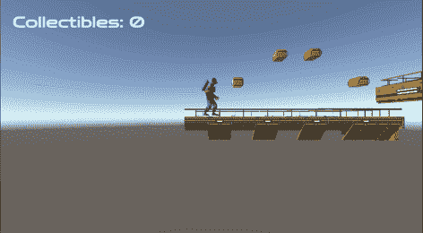
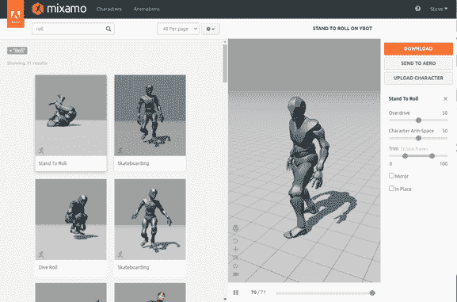
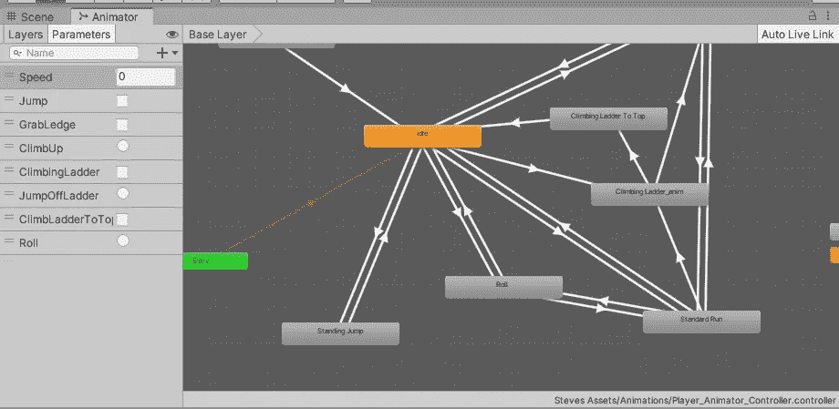
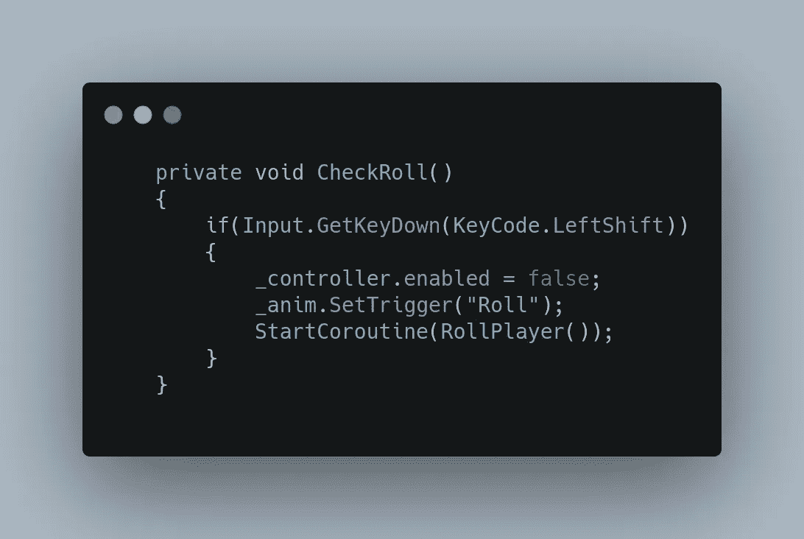
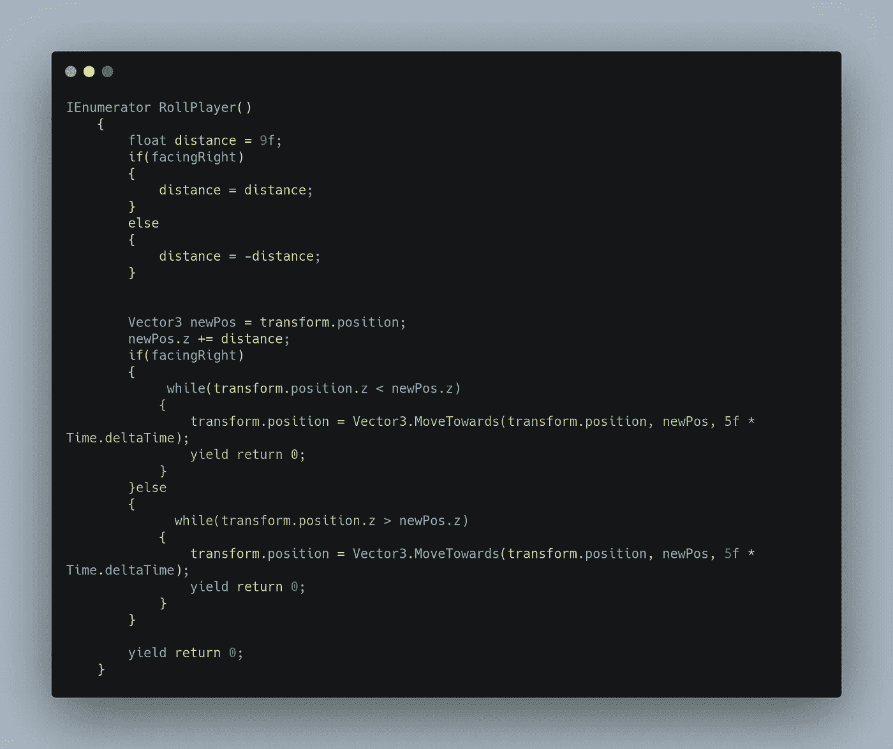
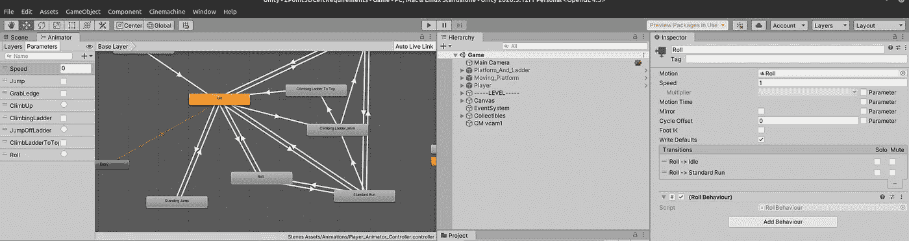
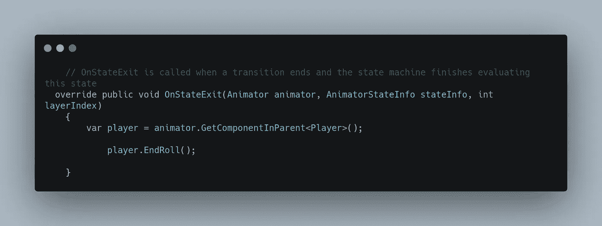
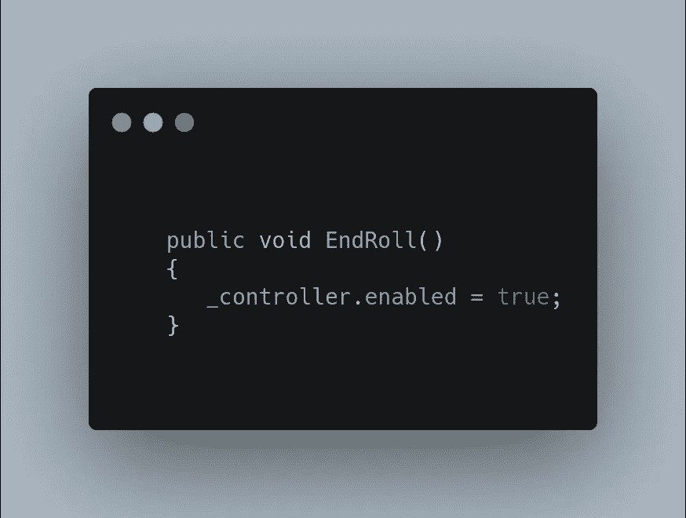

# 每天都在进步——他们看到我在滚动

> 原文：<https://medium.com/nerd-for-tech/daily-progress-they-see-me-rollin-e9268a38aa15?source=collection_archive---------20----------------------->

尽管有些问题确实为各种实现方法开辟了道路，但是实现这个挑战还是很有趣的。

Mixamo 有许多卷式，但第一个似乎是我需要的。

下载后，确保 fbx-unity 被选中，我导入它，并确保人形是索具风格。然后我复制了这个动画，并把它移动到玩家动画树中。

我使用了这些设置:

空转运行:
无退出时间，固定持续时间，过渡持续时间. 1，条件:滚动触发。

滚动到空转:
有退出时间，无固定持续时间，过渡持续时间 0，条件:速度<1

运行到滚动:
无退出时间，无固定持续时间，过渡持续时间. 2，条件:滚动触发

滚动运行:
有退出时间，固定时长. 25，条件:速度> 0。

在播放器代码中，我为滚动检查创建了一个函数来隔离它:

当玩家点击左移时，控制器会暂时关闭，这样玩家就不能在掷骰子时改变方向。我可以让它开着，但我想要一个承诺卷。然后动画被触发，一个协程开始根据玩家面对的方向将玩家向左或向右移动。

距离是玩家滚动时走过的距离。然后有一个检查，看看球员是面向右还是面向左，取决于哪里，它将是 9 或-9。

一个名为 newPos 的新变量用来增加我们当前变换位置的距离。如果玩家面向右侧，则使用矢量 3 将玩家移向新位置。向前移动，直到他到达那里。左边也一样。

最后，动画有一个行为脚本，它是在 Animator 中创建的，调用“EndRoll”函数。

滚动行为与滚动状态相关联。

要完成这个角色，我只需打开角色控制器:

这样我们就有了一个体面的工作辊！