# 每日进度——让玩家跳跃

> 原文：<https://medium.com/nerd-for-tech/daily-progression-getting-the-player-to-jump-44ac14b8b65b?source=collection_archive---------19----------------------->

上次我们用角色控制器给玩家编程跳跃。这一次，我们将使用刚体 2D 组件。我们需要检查玩家是否被禁足，但是让我们从简单的开始。让玩家跳起来。

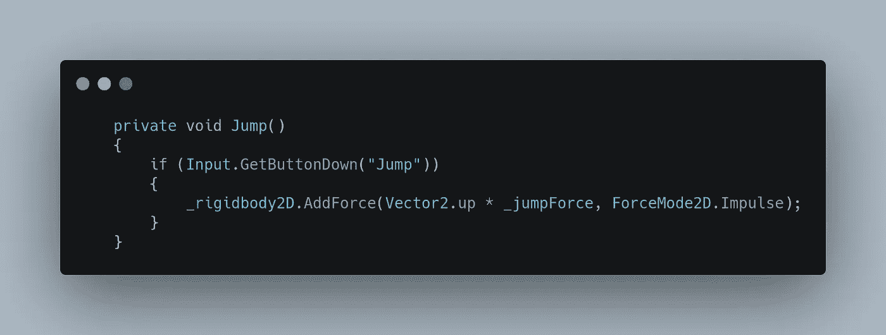

在做了一些初步的研究后，似乎 AddForce 是正确的选择，AddForce 也有多种模式:加速、力、脉冲和速度变化。冲动似乎最有意义，所以让我们看看我的选择是否正确:

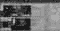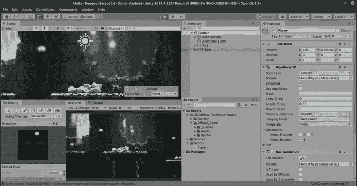

这只是跳跃的一种方式，另一种方式是改变刚体的速度:

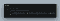

看起来不错！但是玩家可以想跳多少次就跳多少次，我们可以限制在一次，但是这给我们带来了下一个挑战:知道我们什么时候被禁足。为此我们需要使用光线投射。

游览 https://docs.unity3d.com/ScriptReference/Physics2D.Raycast.html 应该会给我们需要的信息:

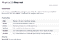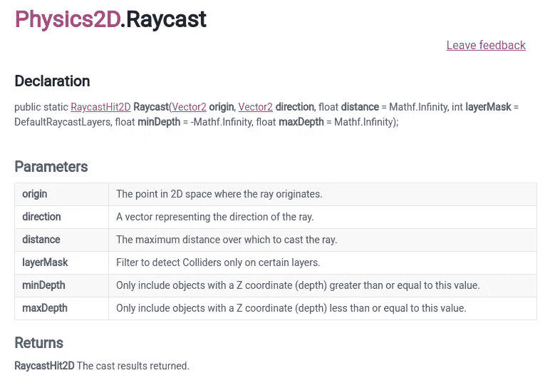

所以当使用 RaycastHit2D 时，我们需要一个原点，一个方向，一个距离，以及一个 RaycastHit2D 类型的变量。

我要创建一个新的函数，CheckIfGround，我们也会在更新中调用它。

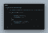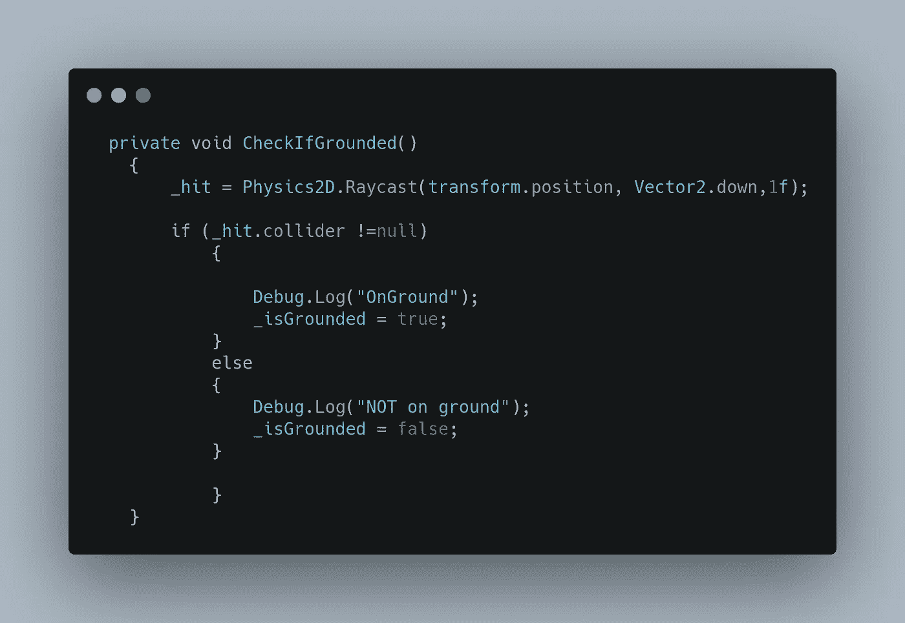

我们还会在跳转中添加一个复选标记:

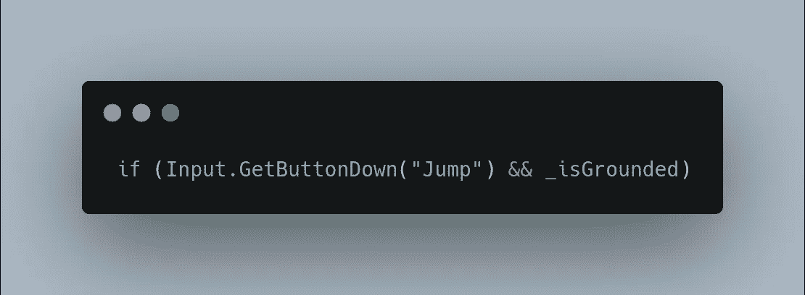

如果我们现在尝试，我们将不能跳跃，因为光线投射很可能探测到玩家。问一下就能看出这一点。

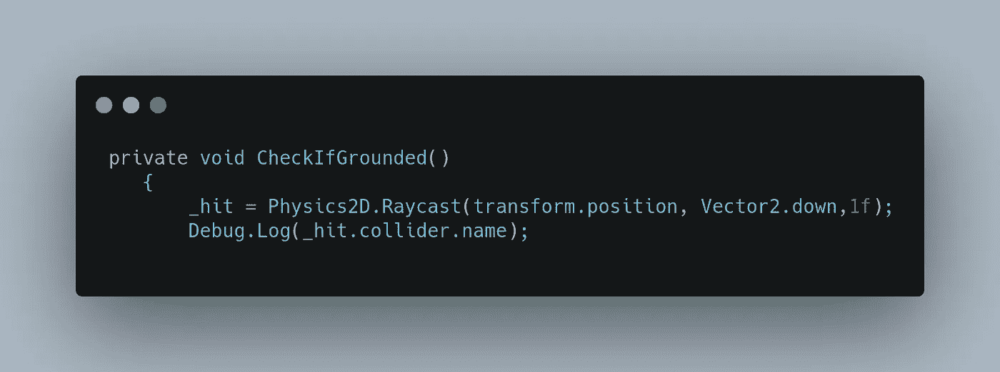

果然:

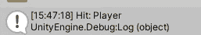

虽然地面瓷砖被标记为“地面”，但 Raycast 确实利用了层，所以我们可以给地面一个特殊的层名称，以便我们可以告诉 raycast 只检查该层！因此，与'地板'瓷砖选择，我药物下来层菜单创建一个新的，并在第 8 层，创建了一个新的地面层。

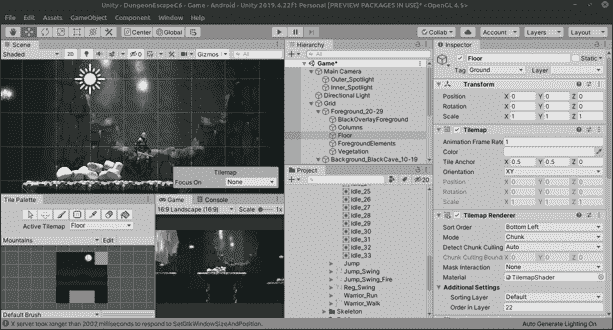

这里有一个警告，这种特殊的情况并不像它要求的那样容易，你需要使用一种叫做“比特移位”的东西才能正确工作，这实际上是一个高级计算机科学问题，人们可以获得博士学位，而不是一个 Unity 问题。我只想说，接受现实吧。

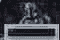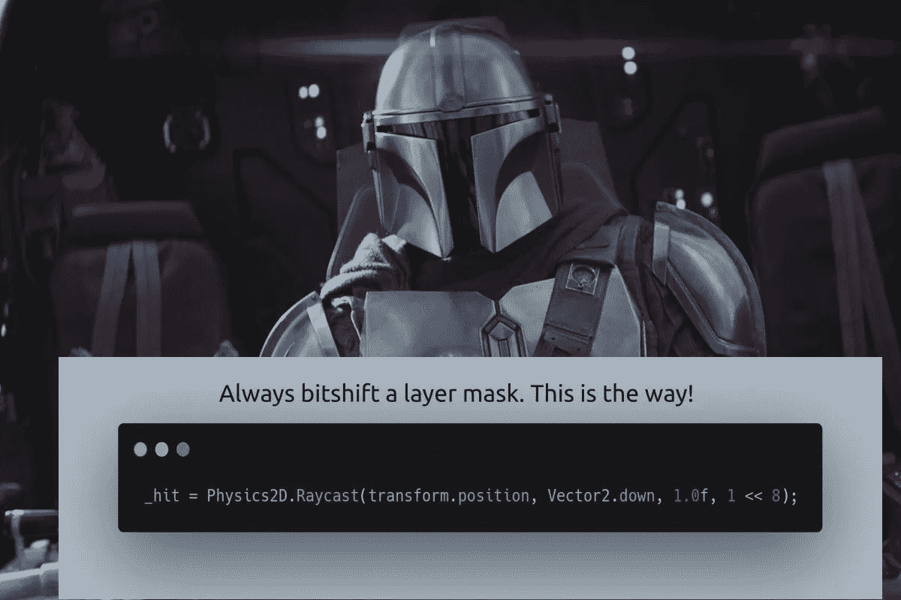

现在让我们检查一下:

这就是我们想要的！

一个可选的方法是为地面层创建一个 holder，我们就说 _groundLayer 作为一个示例变量名；对其使用 SerializeField 以使其在检查器中可用。然后在检查器的下拉菜单中选择图层，完成后。请使用 _groundLayer.value 代替移位后的数字。诚然，这两种方式都有点古怪，但这只是 Unity 的一部分。

顺便说一句，如果我们能看到真实的光线投射就好了。Unity 通过 Debug 再次拯救了我们。DrawRay:

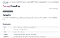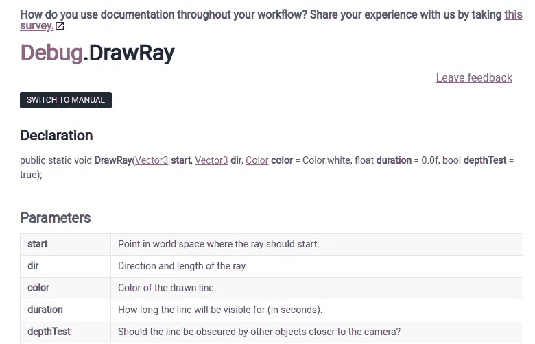

它非常类似于光线投射，所以让我们把 drawray 放在光线投射下面。

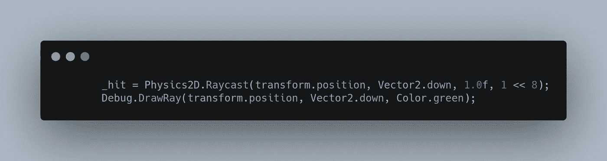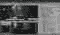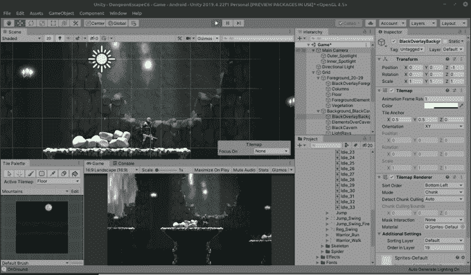

现在我们可以在我们的场景中看到它！你也可以通过点击游戏区上方的小发明按钮在游戏中看到它。

也就是说，现在如果我们在检查器中检查我们的 _isGrounded 变量，我们可以看到光线投射现在正在完美地工作！

如果你能在这一点上双跳，可能是你的光线投射太长了。随意把它缩短到几乎接触不到地面的程度。这是一个反复试验的过程，每个人都不一样。我最终将 _raycastDistance 变量改为 1.1，这看起来很好。

我们会给我们的射线检查一点喘息的空间，但是现在，我们称它为一篇文章。:)