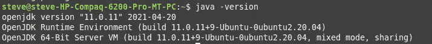
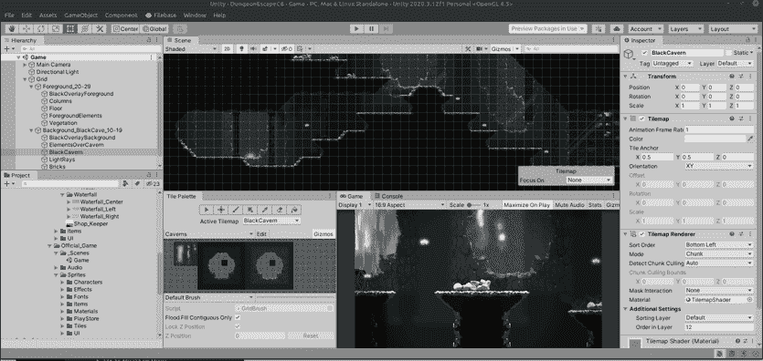
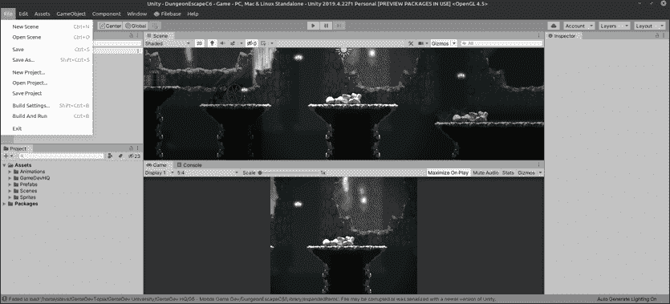
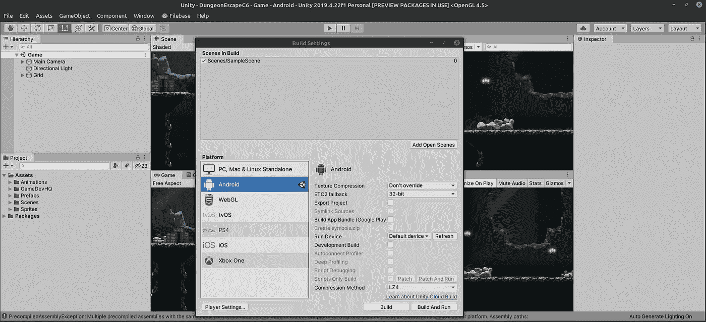

# 每日进展:为 Linux Mint 20 上的 Unity 中的 Android 开发做准备。

> 原文：<https://medium.com/nerd-for-tech/daily-progression-preparing-for-android-development-in-unity-on-linux-mint-20-f265aa4540ee?source=collection_archive---------20----------------------->

linux 的好处在于，在编程方面，它几乎拥有开箱即用的一切。

举个例子，我将使用 Ctrl-Alt-T 打开一个终端，并键入“java -version”来查看它是否已安装。

看来我有最新的版本！万岁。向团结前进！让我们进入构建设置，切换到 Android。

上面说没装安卓，其实装了。我切换到 Unity 2019 的早期版本，该版本的 SDK 可以正常工作，所以我们将使用这个版本，直到我弄清楚另一个版本是怎么回事。

这个过程需要几分钟，请耐心等待。在所有东西都被转换后，你会看到 Android 平台旁边的 Unity 标志以及 build 按钮变为可用，这意味着它可以编译到该平台了！

除了一些系统相关的故障，您可以看到在 Unity 中切换到不同平台是多么容易！现在你所需要做的就是点击“构建”,你的 APK/AAB 就会被构建出来！明天我们将开始创建视差滚动。到时候见！