# 设置动画之间的过渡

> 原文：<https://medium.com/nerd-for-tech/daily-progression-setting-up-transitions-between-animations-40643426d05?source=collection_archive---------16----------------------->

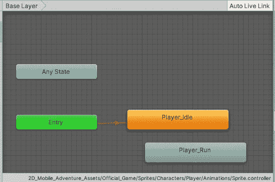

目前，我们需要在空闲和运行状态之间创建一个转换，但是什么时候应该这样做呢？显然当玩家按下方向键移动玩家时。我们知道使用 GetAxisRaw，按键的结果是-1、0 或 1，所以我将创建一个 Int 类型的参数，并将其命名为 Move，我将使用它来创建转换规则:

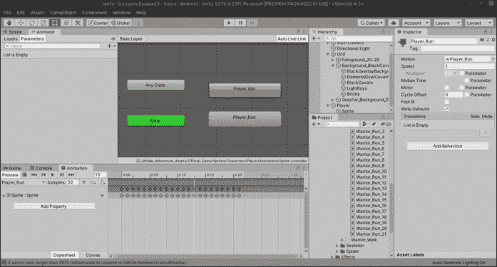

让我们做一个转换:右键单击并拖动一个箭头，从 idle 变为 run。然后点击箭头，你会看到一个条件框。点击加号，我们将看到我们新创建的移动变量或参数。当它大于 0 时，我们要改为运行。

同样，从运行返回到空闲，添加一个新条件，并使其等于 0 以进入空闲状态。

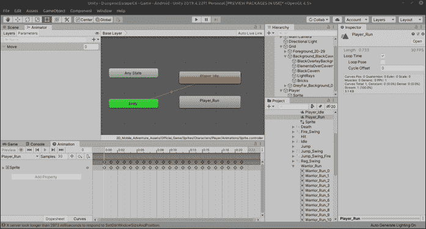

为了保持美观和面向对象，我们将创建一个名为 PlayerAnimation 的新脚本来处理所有的过渡。

现在让我们为动画师创建一个句柄。请记住，实际的动画师是在 Sprite 中，而不是在容器中，所以我们需要使用 GetComponentInChildren。

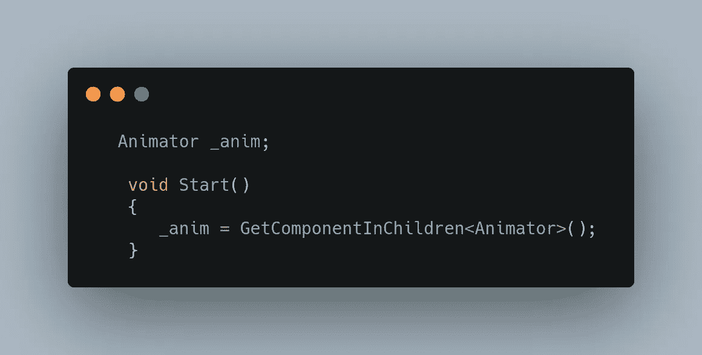

接下来，我将创建一个函数，当玩家移动时，它将被玩家调用，它将包含参数 move，该参数将保存 _horizontalInput 变量。

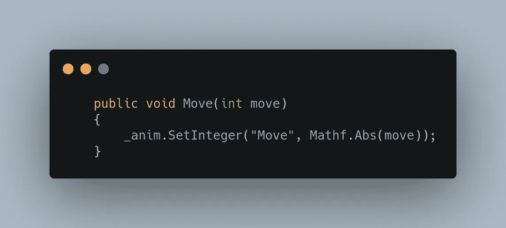

在 move 函数中，我们告诉动画师我们设置的“Move”参数是输入变量的绝对值。使用 Mathf。Abs 本质上只是删除任何负值，并总是返回一个正值。所以我们基本上要么看 0 要么看 1。

在 Unity 中使用 integer 而不是 float 会导致一些问题，因为在某些情况下它需要 float，但是我们马上会解决这个问题:

在播放器脚本中，我们将把 _horizontalInput 的值从 float 改为 int。

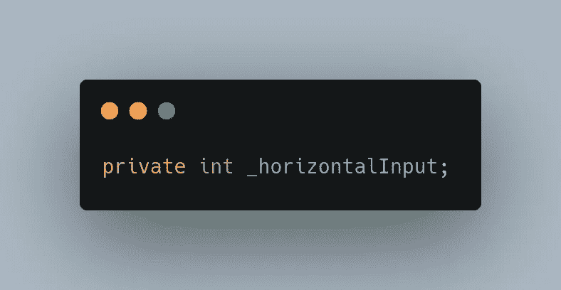

在 CheckMovement 函数中，我们将获取 _horizontalMovement 值并将其传递给动画制作人，但首先，让我们创建一个动画制作人的句柄:

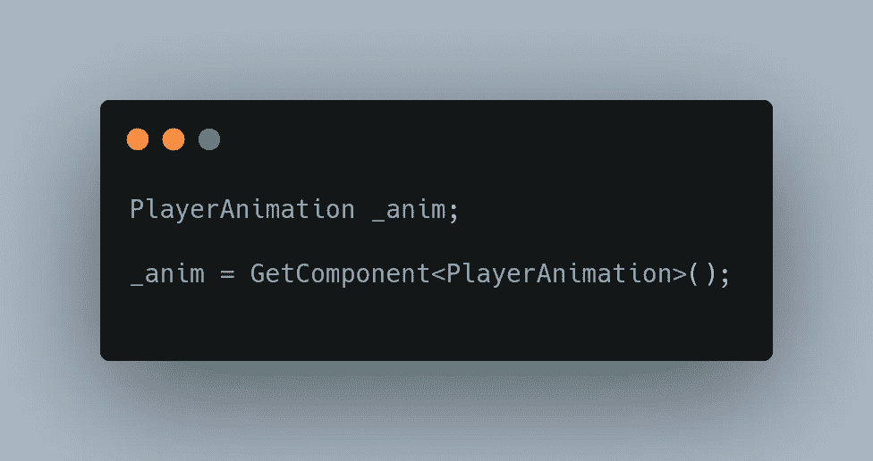

这看起来很熟悉，因为我们在动画和刚体上使用它，但是现在我们有了自己的类！整洁！

现在让我们开始行动吧！

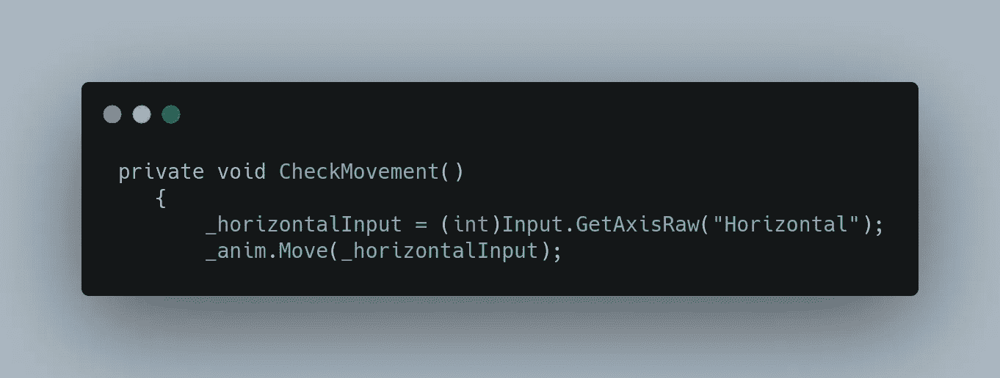

这里有一种情况，即使我们将所有的东西都指定为整数，Unity 仍然希望来自 GetAxis 方法的任何东西都是浮点数，所以我们在前面加上一个(int)来告诉 Unity，当我们得到一个浮点数时，它会将其转换为整数。这就是所谓的造型，你可以用这种方法动态地转换几乎任何东西。你可以把它想象成施咒把某种东西从一种类型变成另一种类型。

抛开变形咒语的伦理含义，让我们看看它是否有效:

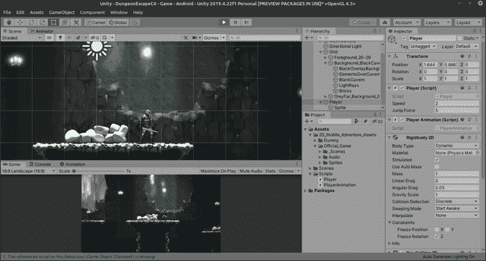

这是可行的，但是在各州之间有一段难以置信的时间间隔。现在这应该是一个熟悉的问题，它很容易通过点击“有退出时间”并将过渡时间设置为 0 或像 0.1 这样极低的值来解决。因为我们正在处理一个有精灵的 2D 游戏，所以让我们将过渡时间设置为 0。较长的过渡对于骨架可以利用插值的 3d 角色更有用。

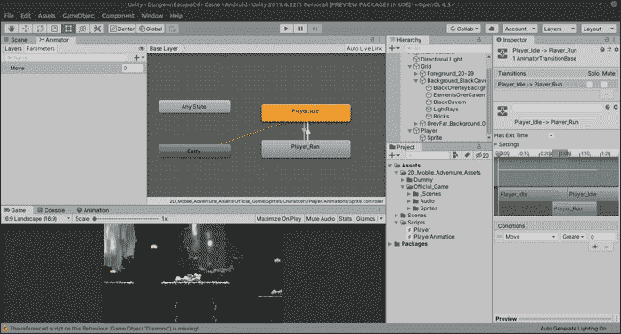

现在让我们看看不同之处:

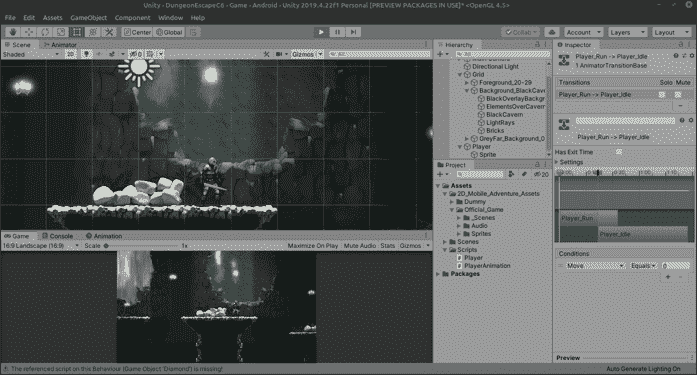

看起来不错！但是玩家只面向一个方向！的确，这是我们明天要解决的问题！到时候见！:D