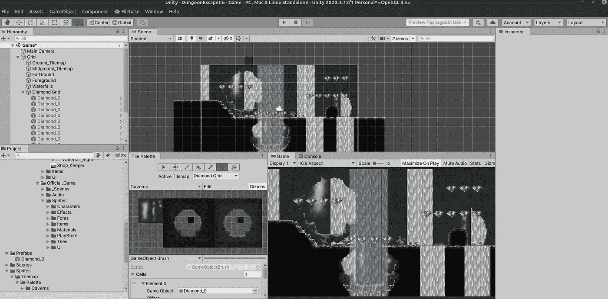
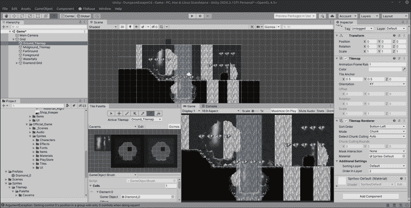
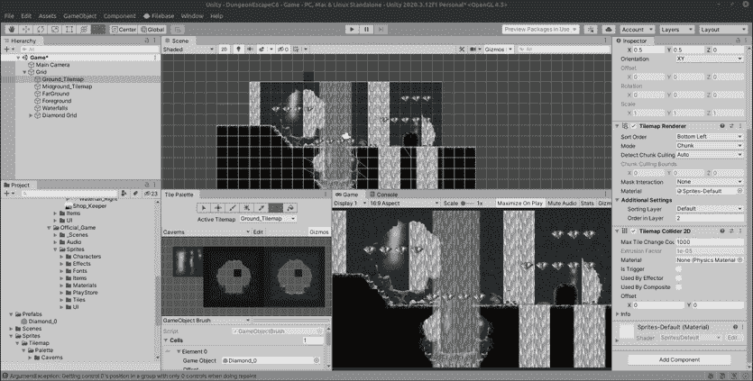
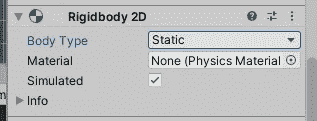
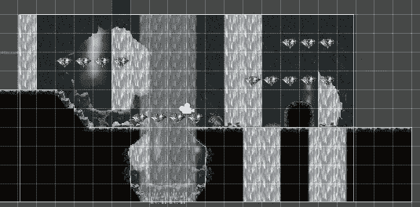

# 每日进展:Tilemap 碰撞器

> 原文：<https://medium.com/nerd-for-tech/daily-progression-tilemap-colliders-29cbaabce0b2?source=collection_archive---------24----------------------->

目前关卡只有一组平铺地图，如果我们想要一个玩家对象与之互动，我们需要一个碰撞器让玩家站在上面。

为此，我们只需将一个 TileMapCollider2D 组件附加到适当的 tilemap，在本例中是 ground tiles:

一旦附加，组件将为每个单独的 tilemap 创建一个盒子碰撞器。这并不理想，所以您需要做的是向同一个 tilemap 添加另一个组件 CompositeCollider2D。

复合碰撞器还附加了一个刚体，这是它工作所必需的。一定要把体型改成‘静态’，否则 Unity physics 会接手，你的陆块会降到无穷大！

最后，在最初的 Tilemap 碰撞器中，勾选“由复合碰撞器使用”,你会在你的地图周围看到一个完美的碰撞器！

