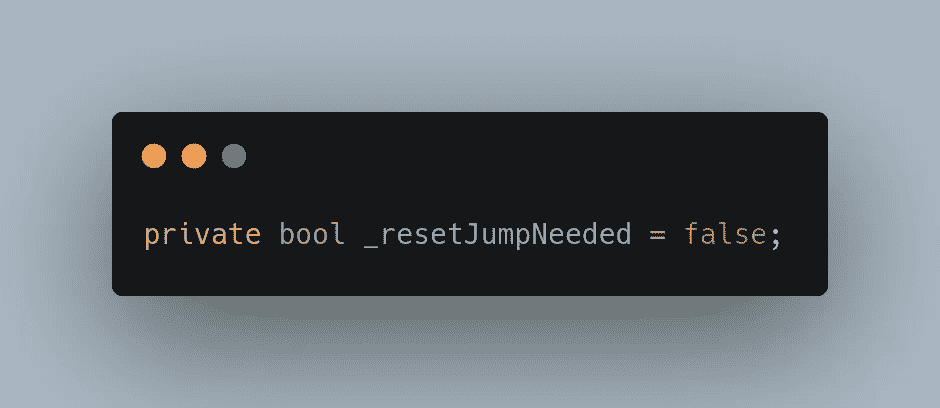
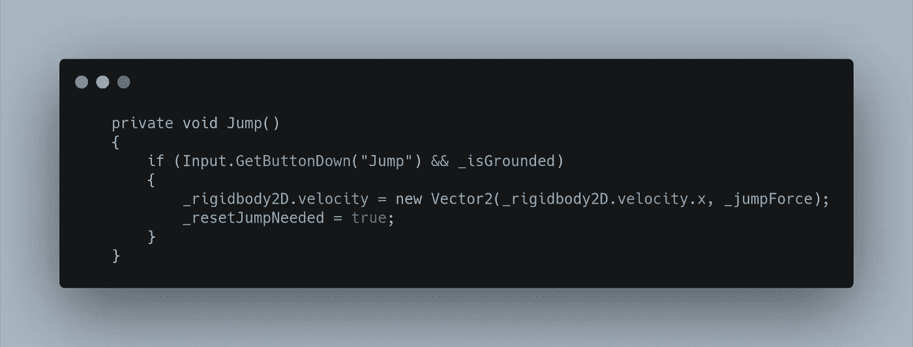
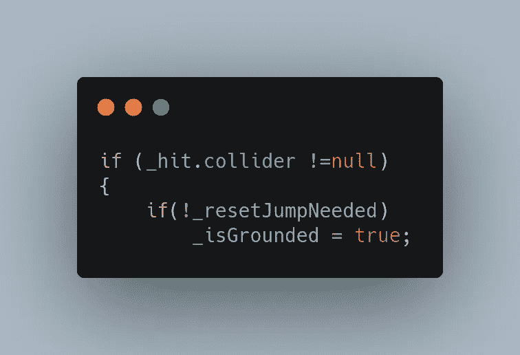
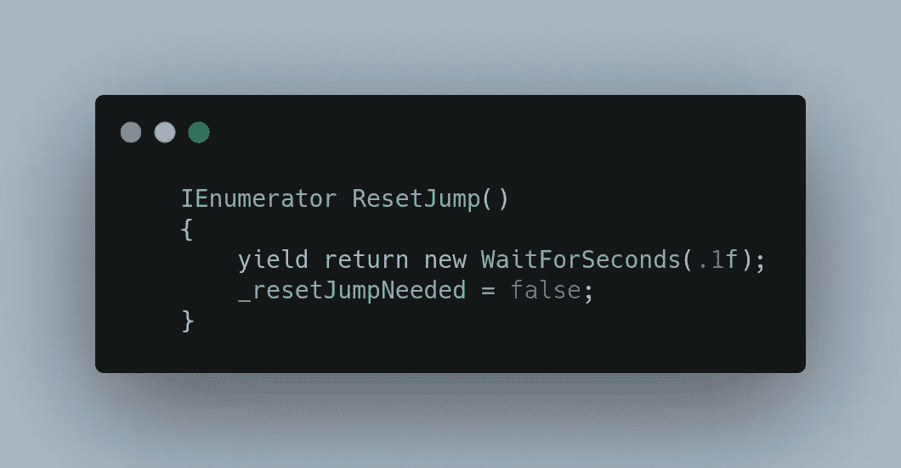
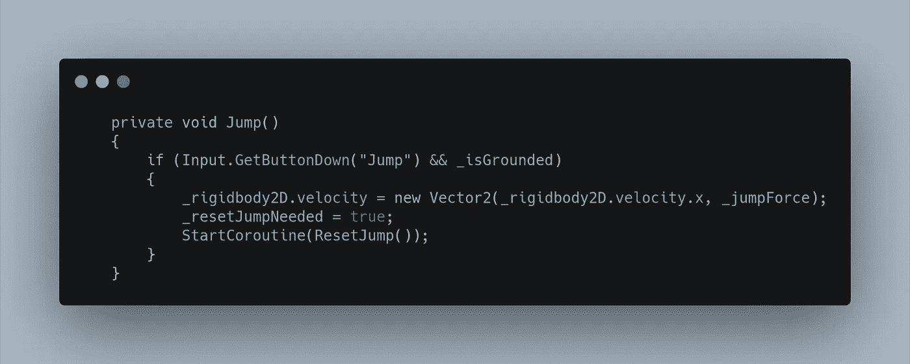
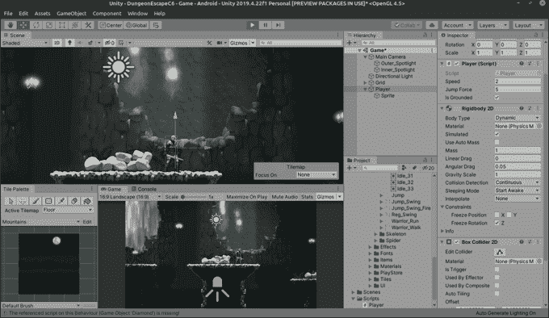
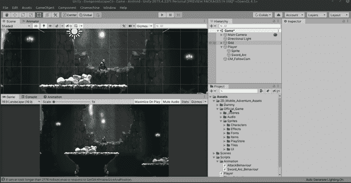
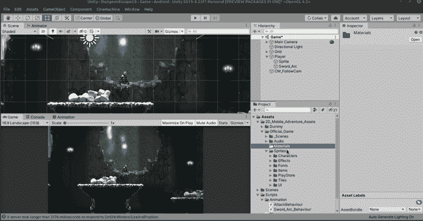
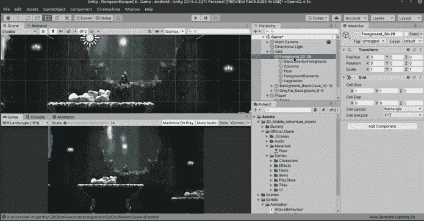

# 每日进度——调整跳跃

> 原文：<https://medium.com/nerd-for-tech/daily-progression-tweaking-the-jump-3bd79921f6da?source=collection_archive---------16----------------------->

昨天我们让玩家跳跃并限制了一点，但今天我们将通过创建一个冷却系统来创建一个更可靠的方法来限制玩家的跳跃。

和任何冷却系统一样，我们需要一个许可布尔值，在安全的时候给出 OK 来再次执行一个动作。

接下来，在跳转函数中，我们将把 _ resetJumpNeeded 设置为 true

当 _ resetJumpNeeded 为 true 时，我们希望防止 _isGrounded 返回 true。所以在我们的 CheckIfGrounded 方法中:

因此，当 resetJumpNeeded 为 true 时，感叹号会将其翻转为 false，并忽略下一行。只有当 _ resetJumpNeeded 变为 false 时，才会再次将 _isGrounded 赋值为 true。

现在，玩家只能跳一次，让我们创建一个协程，在几分之一秒后重置 ResetJumpNeeded。

我们将在跳转后立即启动协程:

现在我们有了更好的跳跃！

还有一个快速调整，我们现在应该避开，以避免将来出现任何令人头疼的问题，比如跳跃时卡在壁架上。首先创建一个名为 Materials 的新文件夹

让我们创建新的 Physics2D 材质，我们称之为地板。我们将它设为 0 摩擦力和 0 反弹力。

最后，打开地板对象，将地板材质拖动到 Rigidbody2Ds 材质窗中。你的球员将不再卡在边缘！

