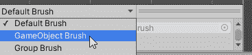
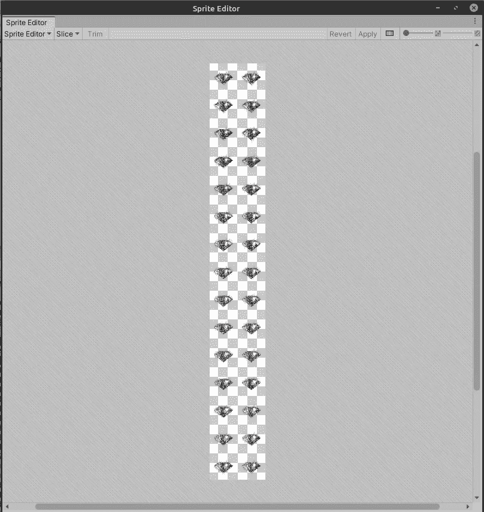
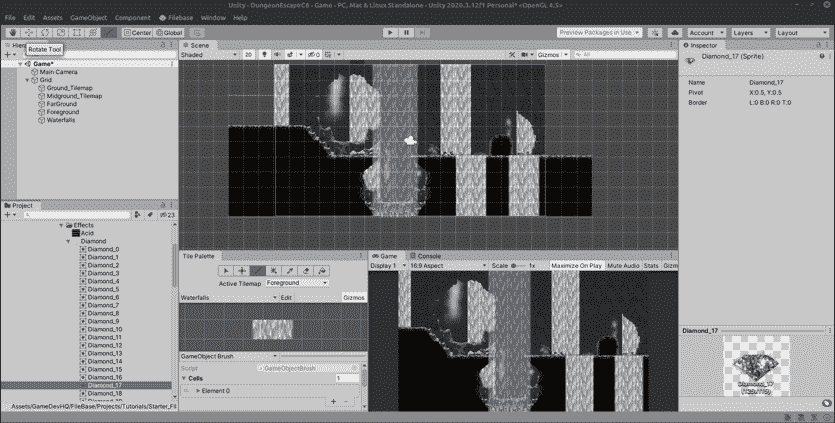
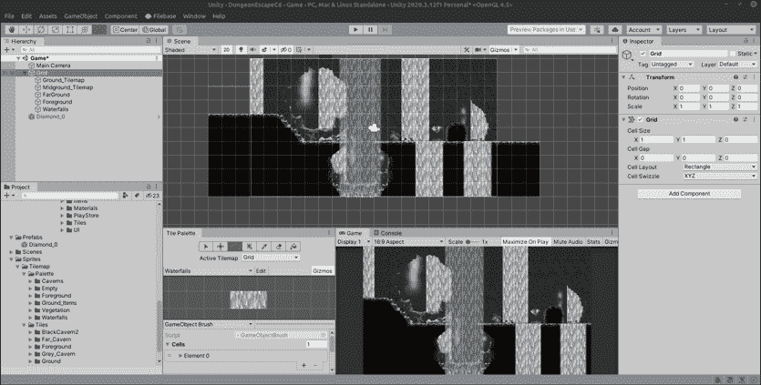
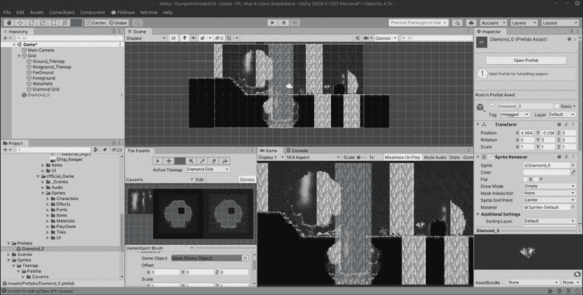
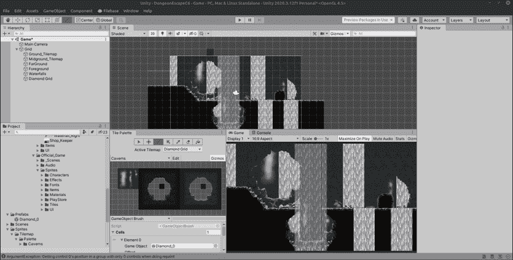

# 每日进度:预设笔刷不再，满足游戏对象笔刷

> 原文：<https://medium.com/nerd-for-tech/daily-progression-update-prefab-brushes-no-more-meet-the-gameobject-brush-43d7898fd343?source=collection_archive---------13----------------------->

这个课程的下一部分讲的是预设笔刷，不幸的是，这似乎是一个被否决的项目，但现在被游戏对象笔刷所取代。非常感谢詹姆斯·韦斯特关于这次更新的文章。

首先，你不能像以前一样创建一个预设笔刷，你必须进入面板菜单，选择游戏对象笔刷

在继续之前，我想我应该分享一下课程让我们做的事情，那就是把一个钻石精灵切成 32x32 的单元大小，我假设这些帧将被合并到笔刷预设中。自动切片似乎很好地完成了这项工作。

我把所有的钻石框拖到场景中，然后 Unity 会创建一个动画，并问我想把它保存在哪里，我创建了一个动画文件夹，然后是一个收藏品文件夹，最后是一个钻石文件夹来放置它。然后我把钻石动画拖到一个新的预设文件夹中。

接下来，我创建了一个名为 Diamond_Grid 的新 tilemap 网格，并将排序层放置为 2，与地面层相同。

在图块面板中，我选择了游戏对象笔刷，并将当前的菱形预设拖到它的游戏对象槽中。

选中瓷砖面板中的菱形网格后，我开始绘制菱形。(注意:我必须将预设的精灵分类层设置为 3，这样它就可以在所有东西的前面)

我很感激预制画笔的替代品并不太难。我似乎也不需要在网格中放置预制组件来绘制它，所以也许这是一个已修复的 bug？