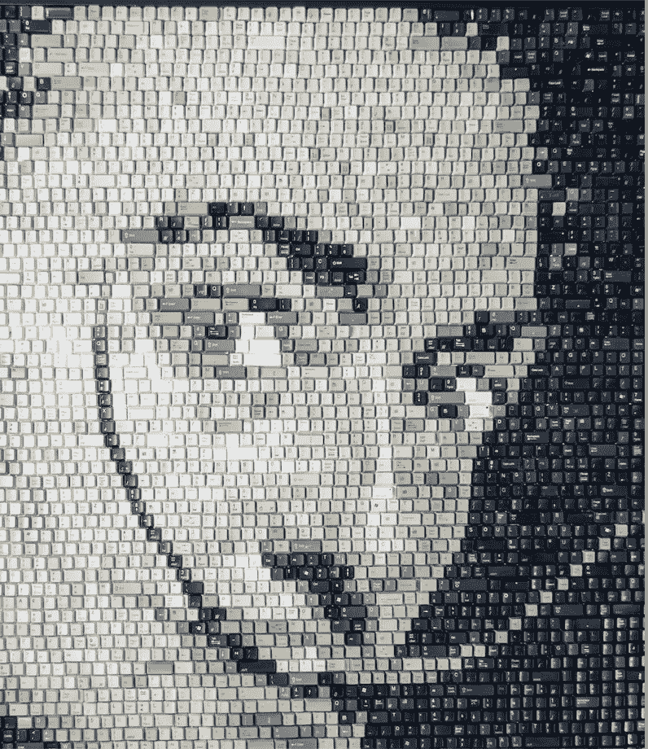
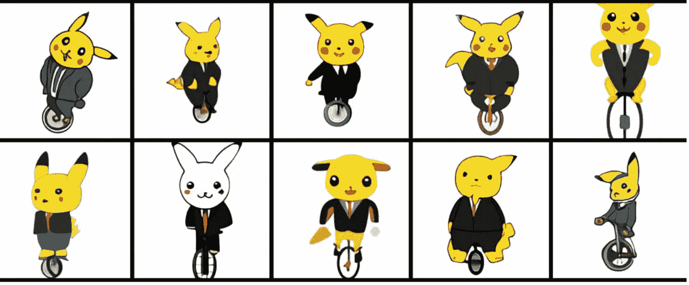

# DALL-E 图像生成器与人工智能的未来

> 原文：<https://medium.com/nerd-for-tech/dall-e-image-generator-and-the-future-of-artificial-intelligence-b905d3e92a35?source=collection_archive---------11----------------------->

今年早些时候，OpenAI 发布了他们新的 GPT 3 驱动的机器人，它可以从文本中生成图像:**达尔-E** *(艺术家萨瓦尔多·达利和皮克斯的 WALL E 的组合)*。
我对人工智能非常感兴趣，立刻对它的工作原理感到好奇，如果你像我一样是一个怀疑论者，你可能会假设它只是为你提供来自大型数据库的现有图像。*事实并非如此。它将生成你能想到的最随机、最怪异、“绝对不是预先存在的”图像，包括拟人化(将人类特征、情感或意图赋予非人类实体)版本的动物和物体。*

我收集了一些非常有趣的例子来解释我所说的。假设您想要一个鳄梨形状的**扶手椅图像。**以下是它创建的内容:

或者也许你想要一只竖琴做的蜗牛:

一只穿着西装骑着独轮车的皮卡丘怎么样？

你明白我的意思了。我必须承认，相当令人印象深刻。如果你曾经想要一个龙的图案，穿着短裙，在 t 恤上吹口琴，但除了简笔画什么都不会，你的愿望可能最终会实现。

撇开所有的笑话不谈，虽然这一切都令人印象深刻、令人兴奋，但作为一名软件工程专业的学生，我内心有一小部分不禁想知道人工智能是否会最终接管许多工作，包括我的工作，并使我们的技能变得有些过时。但是，就像我说的，这是我的一小部分。现实是，就像技术一样，社会总是在进化，随着进化而来的是适应。“敲门者”是在闹钟发明之前的工业革命时期，在英国到处走动的工人，他们确保在人们要求的时间叫醒他们。当然，你再也找不到它们了，但这难道不是为了换取闹钟的存在和普及而付出的小小代价吗？我们不能因为害怕个人过时而停止成长和发展的可能性，只有当你允许自己被抛在后面时，你才会被抛在后面。

人工智能技术在这里主要是为了与我们合作，而不是与我们作对，它会一直存在下去，所以让我们拥抱它，看看我们能在不变得不道德的情况下走多远，当然，这是一个全新的话题，我将留待另一次讨论。