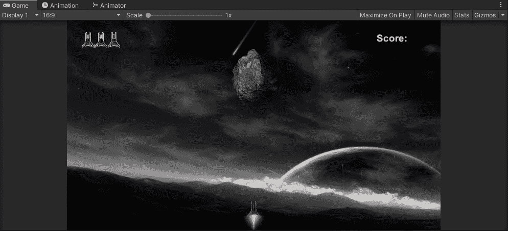
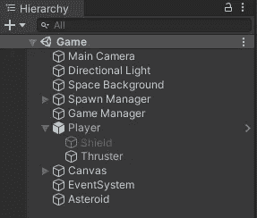
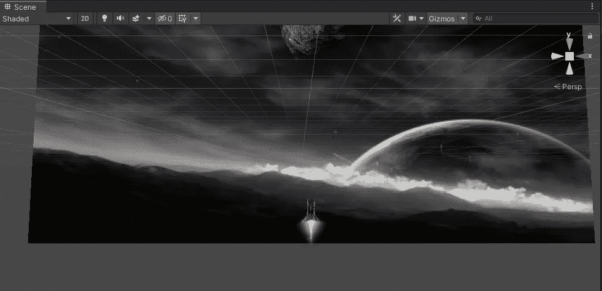
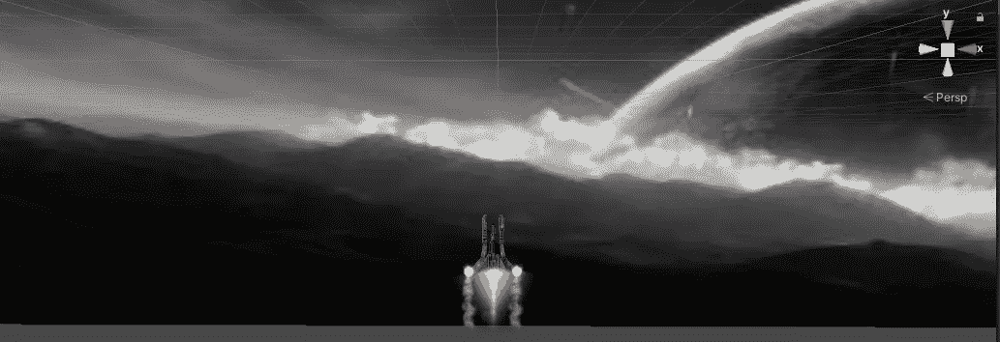
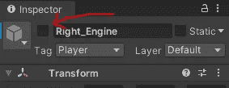
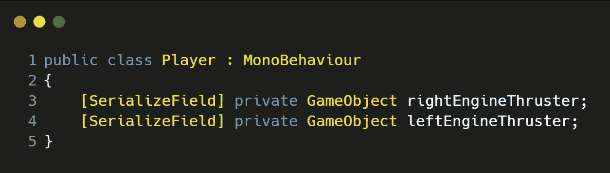
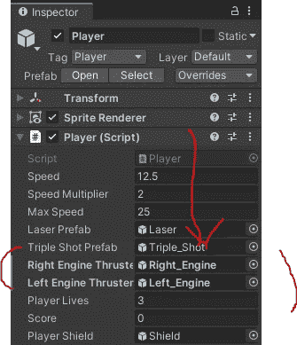
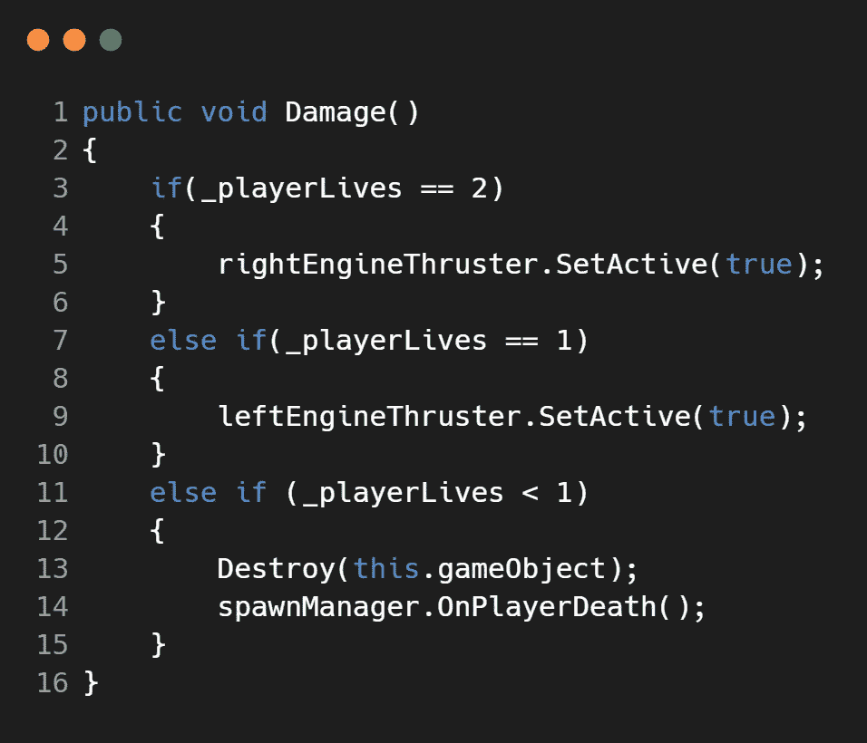

# 在 Unity 中使用动画精灵伤害 VFX

> 原文：<https://medium.com/nerd-for-tech/damage-vfx-using-animated-sprites-in-unity-37aa59577a24?source=collection_archive---------9----------------------->

**目标**:展示如何使用 **Unity** 中的**动画**精灵为我们的 **2D 银河射手**中的玩家**推进器**设置一个伤害 **VFX** ！

现在让我们给我们的**玩家**飞船添加一个**推进器**引擎，它是由精灵**动画**制作的，同时添加一个左右引擎，这样当玩家被击中时，它会触发其中一个引擎着火，并播放一个**动画**精灵。首先，让我们简单地添加主**推进器**，它将一直开启:

## 主发动机推进器

让我们首先简单地将第一个精灵拖到**层次**中，并使其成为**玩家**的**子**。

你也可以花一些时间操纵**标尺**和**位置**到你喜欢的位置。对我来说，我将精灵 **PPU** 改为 **51** ，因为我们正在处理一个 **512x512** 精灵图像，其相机大小为**5**(**5****x 2**的总相机高度) **= 512 / 10 = 51** 。现在我不需要改变**刻度**的大小，因为它看起来很完美！我还将前景层改为 1，因为它部分隐藏在玩家**的后面，现在看起来更好了。**

现在，我们需要**动画**我们的精灵！因为我们已经经历过几次了，我将简单地提供步骤和一个快速的 GIF！

让**推进器**游戏对象在**层级**中高亮显示，然后点击**动画窗口→创建→命名动画→按下录制按钮→将所有精灵拖入窗口→停止录制→勾选检查器中的 Animator。**

## 左右发动机推进器

让我们继续对左右引擎**推进器**执行上述相同的步骤，将一个精灵拖动到**播放器**上您喜欢的位置，并调整 **PPU** (如果您想要的话)。

现在让我们确保左右引擎**推进器**在游戏开始时关闭，因为它们只有在损坏后才会激活。

## 通过代码触发左右引擎推进器的损坏 VFX！

最后一步是现在当**玩家**被损坏时，打开左右引擎**推进器**游戏对象。为了做到这一点，让我们打开“ ***玩家*** ”脚本，首先我们需要为我们的游戏对象创建一个句柄，然后在**检查器**中分配它们:

接下来，在我们的 **Damage()** 方法中，让我们编写一些逻辑来打开这些:

很简单，**如果****_ player lives**等于 **2** (意味着玩家被击中一次)，那么将 **rightEngineThruster** 游戏对象设置为 **true** ，同样对于左侧引擎的 **_playerLives** 等于 **1** 。然后，我将先前的 **if** 语句添加到该逻辑中，询问 **_playerLives** 是否小于 **1** ，然后**销毁**自身。

我们现在有一个全功能的**伤害 VFX** 给我们的玩家使用雪碧**动画**的左右引擎**推进器**！！