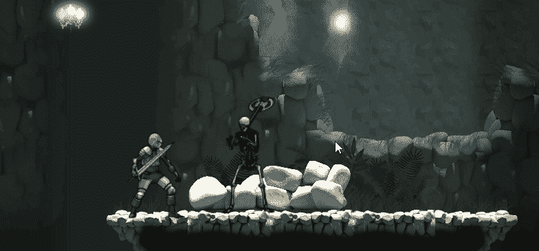

# 使用界面伤害敌人

> 原文：<https://medium.com/nerd-for-tech/damaging-an-enemy-using-an-interface-1f1103a53bf9?source=collection_archive---------1----------------------->

## 开始 Unity 游戏开发

## //多态性来拯救

重击骨骼

在过去的几天里，我们一直在考虑增加玩家挥舞武器的能力。创建了一个击中框来检测敌人何时被击中，并设置了一个模块化的敌人职业用于战斗系统。