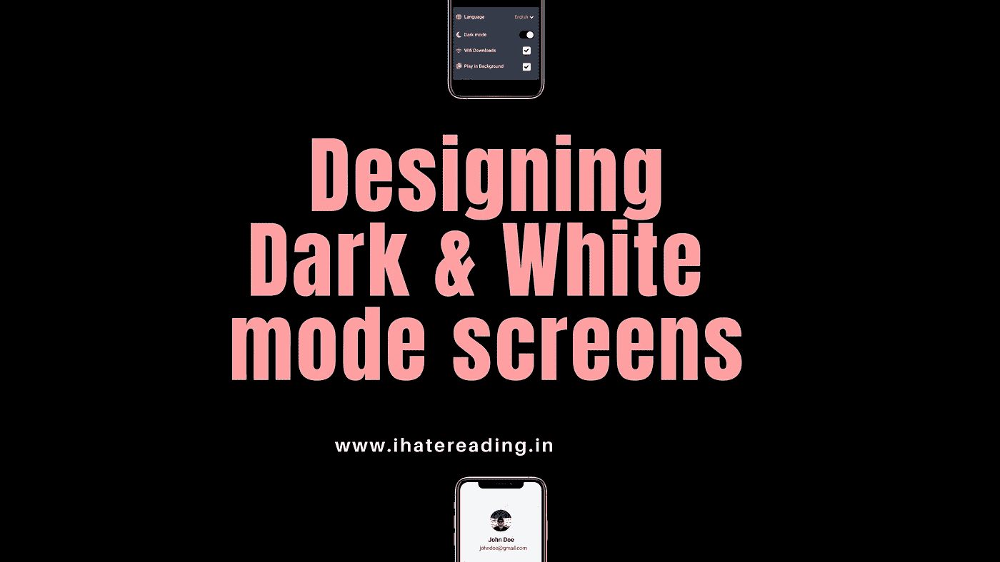

# 应用程序中的黑暗和光明模式

> 原文：<https://medium.com/nerd-for-tech/dark-light-mode-in-our-application-f5eb49518dde?source=collection_archive---------18----------------------->

为什么以及如何在你的移动应用原型中添加明暗模式

[点击此处了解更多信息](http://www.ihatereading.in)

# 为什么？

黑暗和光明的主题，我是黑暗主题的最大粉丝，从社交媒体到开发的所有应用程序都只能通过黑暗模式访问。

你想过为什么我们需要在应用程序中加入黑暗模式吗？原因是什么呢？