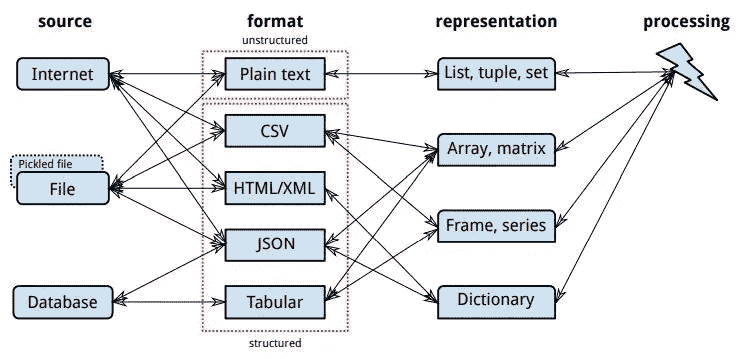
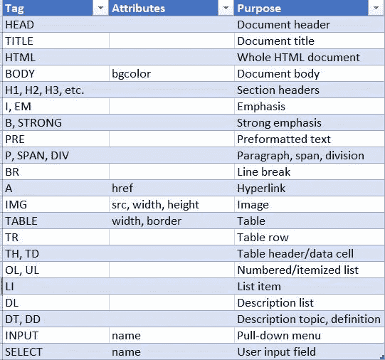
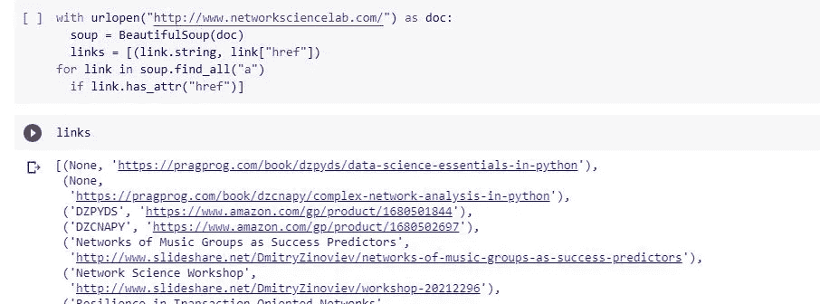
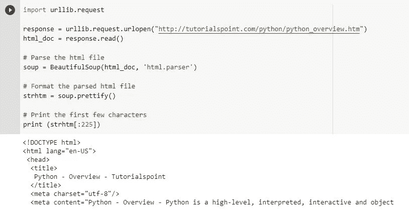
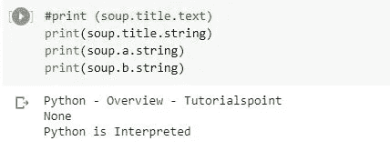
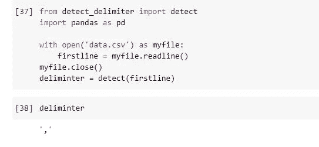
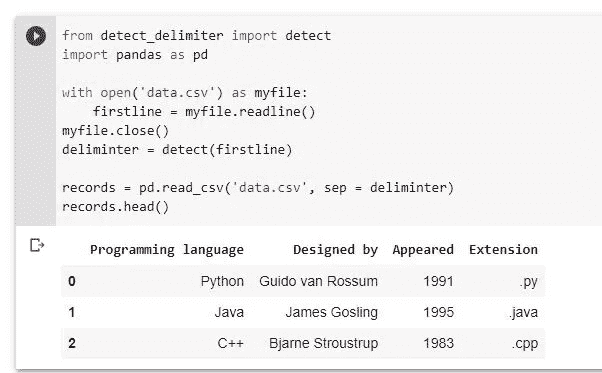
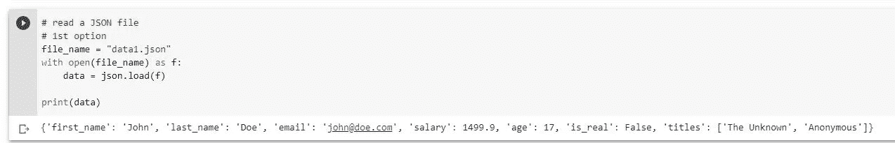
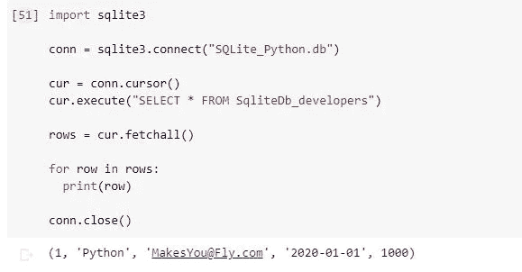

# 数据采集

> 原文：<https://medium.com/nerd-for-tech/data-acquisition-c2fa2e022496?source=collection_archive---------12----------------------->

数据采集

数据获取就是从各种来源获取包含输入数据的工件，从工件中提取数据，并将其转换成适合进一步处理的表示。

数据的三个主要来源是互联网(即万维网)、数据库和本地文件(可能是以前手工下载或使用附加软件)。

1.  自然语言(如英语或汉语)中的非结构化纯文本
2.  结构化数据，包括:逗号分隔值(CSV)文件中的表格数据、数据库中的表格数据、超文本标记语言(HTML)中的标记数据，或者一般来说，可扩展标记语言(XML)中的标记数据、JavaScript 对象表示法(JSON)中的标记数据

**处理 HTML 文件**

HTML 标签和属性

BeautifulSoup 通过 Python 字典接口提供对 HTML 标签属性的访问。如果对象 t 代表一个超链接(比如[，那么超链接的目的字符串值就是 t["href"].string .注意 HTML 标签是不区分大小写的。](””)

也许最有用的 soup 函数是 soup.find()和 soup.find_all()，它们查找某个标签的第一个实例或所有实例。

环

**读取 HTML 文件**

例如，我们请求将一个 URL 加载到 python 环境中。然后使用 HTML 解析器参数读取整个 HTML 文件。接下来，我们打印 HTML 页面的前几行。

读取 HTML 文件

**提取标签值**

我们可以使用下面的代码从标记的第一个实例中提取标记值。

使用 HTML 标签提取

**处理 CSV 文件**

CSV 是一种结构化文本文件格式，用于存储和移动表格或近似表格的数据。它可以追溯到 1972 年，是 Microsoft Excel、Apache OpenOffice Calc 和其他电子表格软件的首选格式。data . gov 1 是一个提供公开可用数据的美国政府网站，仅该网站就提供了 12，550 个 CSV 格式的数据集。

请记住，有时看起来像分隔符的东西根本不是分隔符。要允许字段中类似分隔符的字符作为变量值的一部分(如…，“Hello，world”，…)，请用引号将字段括起来。

检测分隔符

**使用 csv 模块读取 CSV 文件**

开发 reader 函数是为了获取文件的每一行并列出所有列。然后，您必须选择想要可变数据的列。

正在读取 CSV 文件

**读取 JSON 文件**

JSON 是一种轻量级数据交换格式。与 pickle 不同，JSON 是独立于语言的，但是在数据表示方面有更多的限制。

JSON 支持以下数据类型:

*   原子数据类型—字符串、数字、真、假、空
*   数组—数组对应于一个 Python 列表；它用方括号[]括起来；数组中的元素不必是相同的数据类型:[1，3.14，"一个字符串"，true，null]
*   对象—一个对象对应于一个 Python 字典；它用大括号{}括起来；每一项都由一个键和一个值组成，用冒号分隔:{“年龄”:37，“性别”:“男”，“已婚”:true}
*   数组、对象和原子数据类型(对象数组、以数组作为项目值的对象等)的任何递归组合

正在读取 JSON 文件

**数据库**

从数据库中读取数据是使用 SQLite 之类的工具的优势所在。虽然我们可以查询整个表，但是我们可以只查询单个列，或者甚至基于特定的行值。

从数据库读取

**结论**

我敢肯定，我们已经对数据科学有了一个概念，但它绝不仅仅
获得洞察力！数据科学是从数据中提取知识的学科。它依赖于计算机科学(数据结构、算法、可视化、大数据支持和通用编程)、统计学(回归和推理)和领域知识(提出问题和解释结果)。

无论何种分析类型，数据科学都是第一科学，只有魔法。因此，这是一个遵循非常严格的基本序列
的过程，从数据采集开始，以结果报告结束。

**参考**

Python 中的数据科学基础——Dimitry Zinoviev 编辑 Katharine Dvorak