# 使用 DynamoDB 和 Hive 对 Twitter 数据进行数据分析

> 原文：<https://medium.com/nerd-for-tech/data-analysis-on-twitter-data-using-dynamodb-and-hive-12d9164d6aa3?source=collection_archive---------0----------------------->

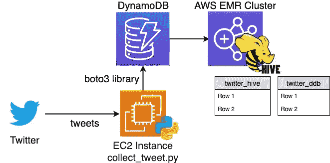

**我遵循两个步骤来创建这个管道:**

**1)** **收集推特信息并上传到 DynamoDB**

**2)** **将 Twitter 数据从 DynamoDB 复制到 Hive**

**首先:收集 Twitter Feeds 并将其导入 DynamoDB**

**为了创建一个管道，我收集特定主题的推文，并将其写入 DynamoDB 表中。**

**我启动了一个 EC2 实例并安装了以下内容:**

**蟒蛇 3**

**Python 包(** tweepy，boto，awscli，textblob)

我在 DynamoDB 中创建了一个表，我将用它来写推文。

**我准备了一个脚本“collect_tweets.py”，它将收集与“trump”话题相关的推文，并将其写入 DynamoDB 表。在脚本中，我从每条推文中提取了 11 个字段，分别是 id、用户名、屏幕名称、推文文本、关注者、地理位置、创建时间、每条推文的情绪、极性和主观性。**

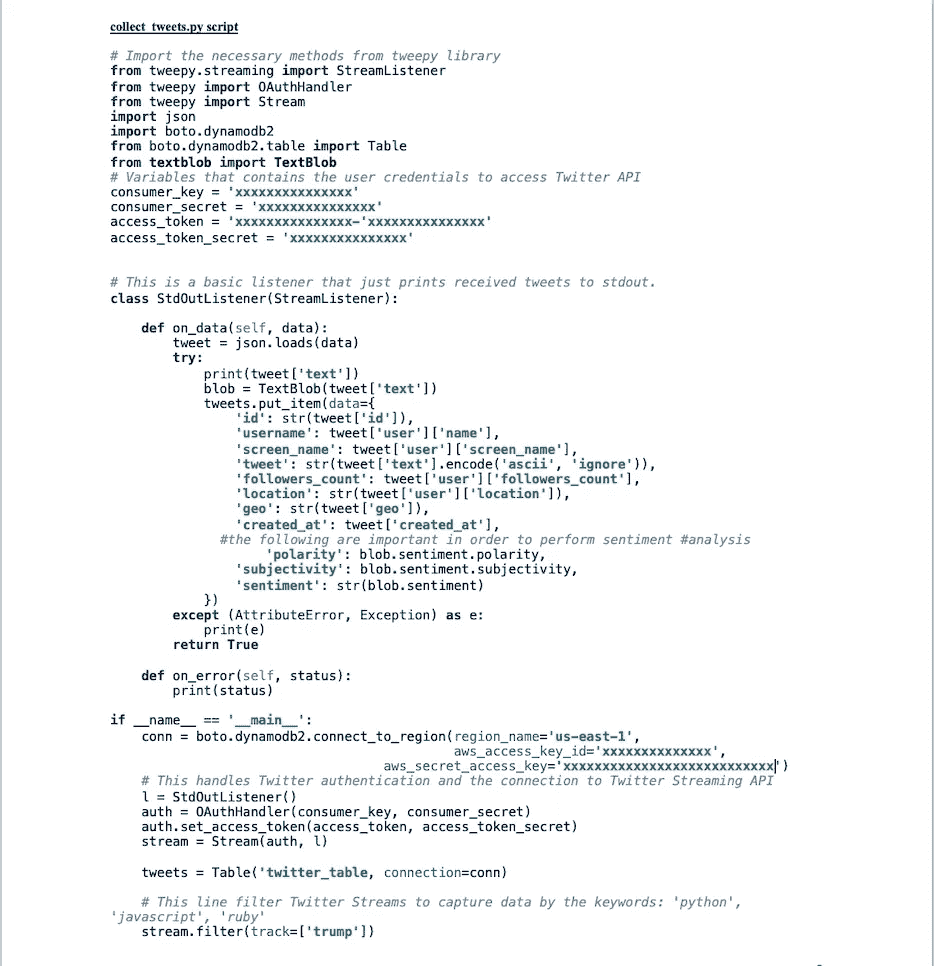

我将 collect_tweets.py 脚本从本地机器复制到 EC2 实例。

scp-I ~/private keyfile . PEM collect _ tweets . py ec2-user @ ec2–xx–XXX–XXX–XXX . compute-1 . Amazon AWS . com:/home/ec2-user

我使用 nohup 在 EC2 上运行脚本，以确保即使在断开 ssh 会话后脚本也能在后台运行。

nohup python 3 collect _ tweets . py 2 > & 1 &

我使用 tail 来检查脚本是否正常工作。

尾部 nohup.out

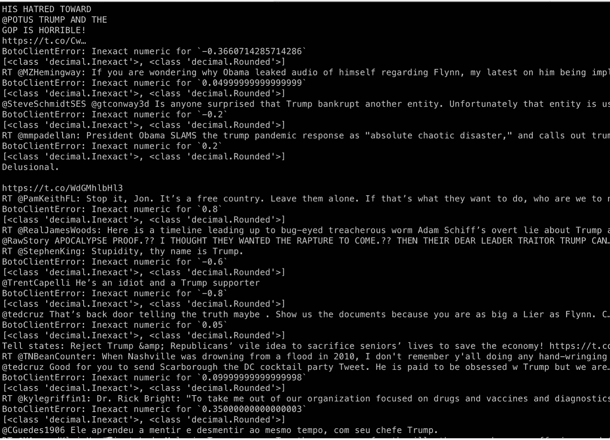

**外壳上印的推文**

**我检查了 DynamoDB 中的 twitter_table，在我停止在 EC2 上运行脚本之前，它已经写入了 2816 条 tweet 记录。**

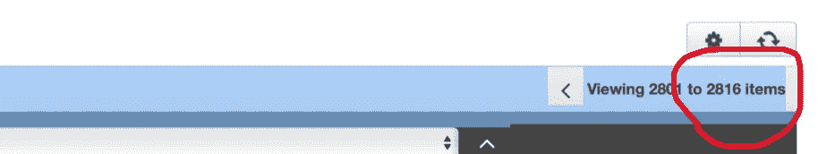

**dynamo db 表中的记录数**

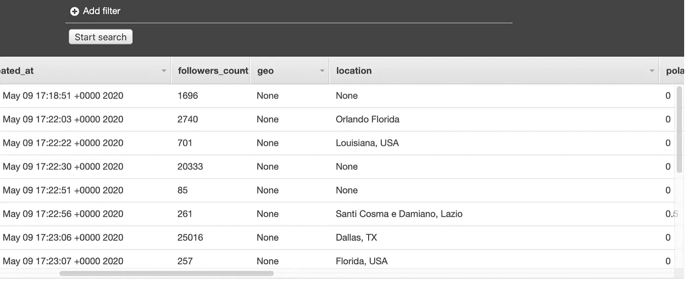

**DynamoDB 表样本记录**

**第二步:将 twitter 数据从 DynamoDb 复制到 hive**

**我推出了一个 EMR 集群，用了以下工具** Hadoop，Hive，Presto，HBase。

**我连接到 Hue，创建了两个外部表，并将“twitter_table”中的数据从 DynamoDB 复制到 hive 表“twitter_hive”中。**

**下面是“twitter_hive”表:**

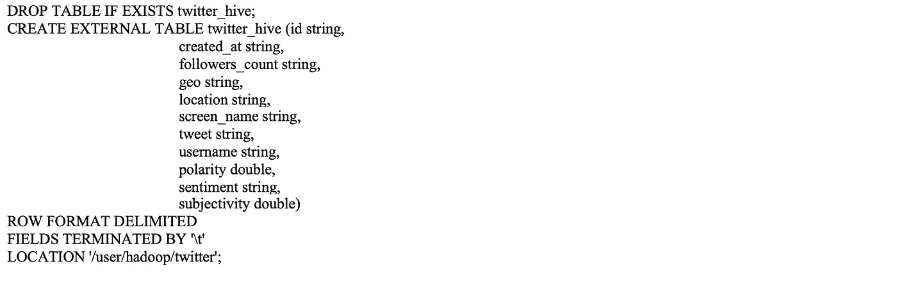

**twitter_hive 表**

**下面是“twitter_ddb”表，用于将“twitter_table”中的数据从 DynamoDB 复制到 hive 表“twitter_hive”中。**

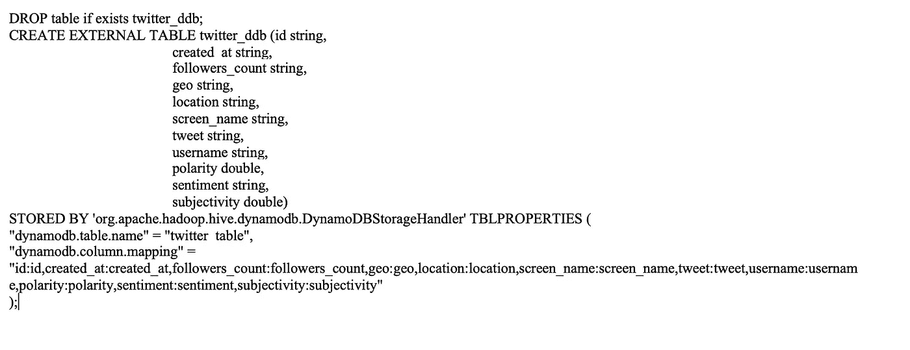

**twitter_ddb 表**

**我将“twitter_ddb”表中的数据复制到“twitter_hive”表中。**

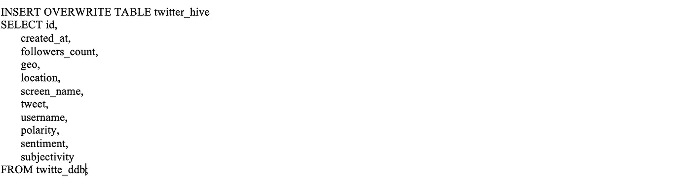

通过执行一些查询，我测试了数据是否被成功复制到了配置单元表中。

**在下面的查询中，我选择了 twitter_hive 表的前 10 条记录。**

**查询:**

select * from Twitter _ hive limit 10；

**输出:**

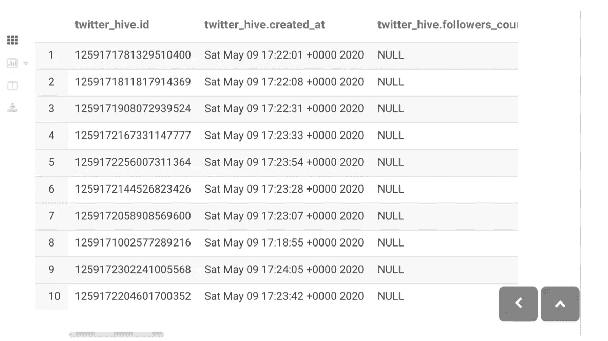

**在下面的查询中，我从 twitter_hive 表的前 10 条记录中选择情感、极性和主观性。**

**查询:**

**输出:**

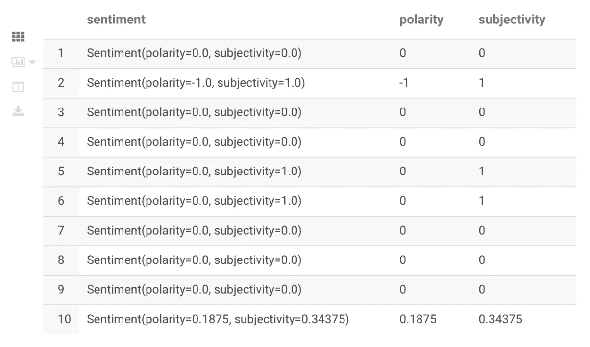

**在下面的查询中，我计算了 twitter 数据集中前 10 个最受欢迎的标签**

**查询:**

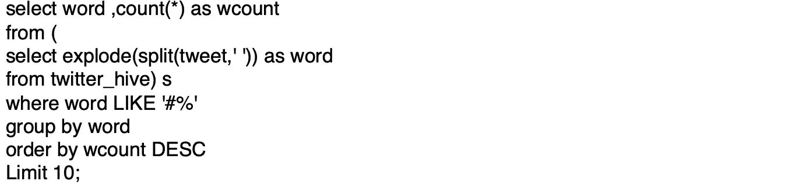

**输出:**

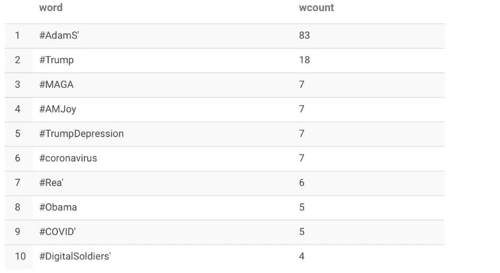

在下面的查询中，我将检查哪些地点关于“trump”的推文数量最多。

**查询:**

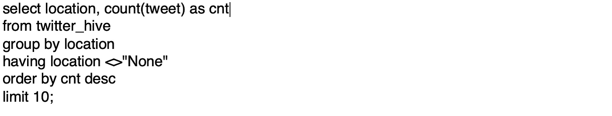

**输出:**

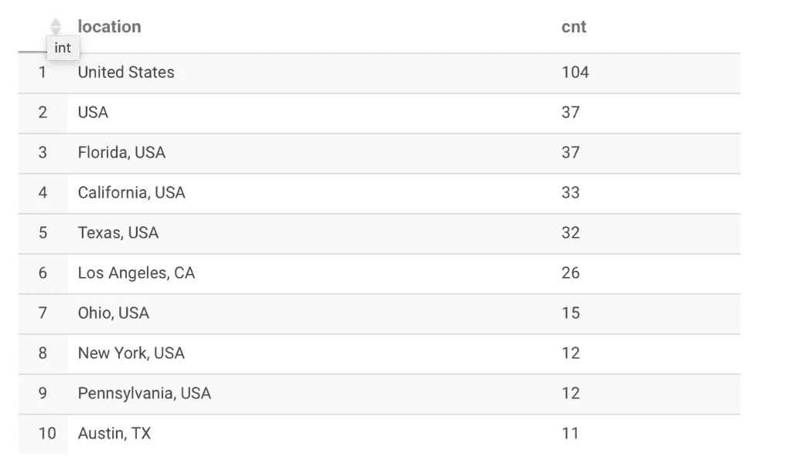

在下面的查询中，我将检查哪些地点对特朗普的负面情绪最大。

**查询:**

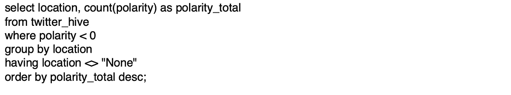

**输出:**

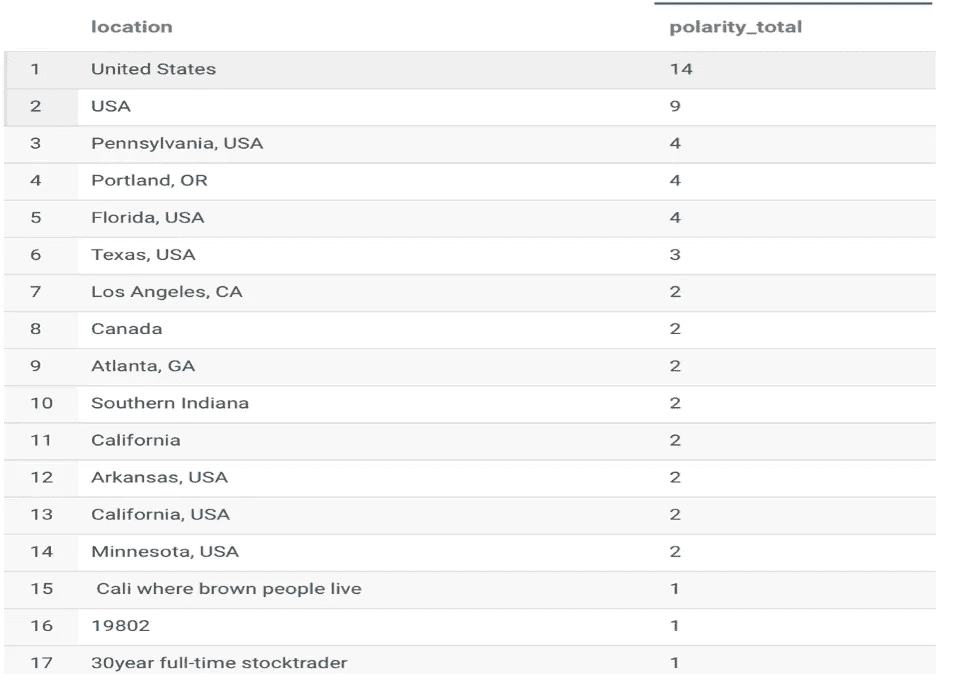

在下面的查询中，我进行了字数统计，以在数据集中找到一个流行的关键字，然后计算包含该关键字的所有推文的平均极性。

**首先，我做了一个字数统计，在数据集中找出一个热门关键词。**

**查询:**

**输出:**

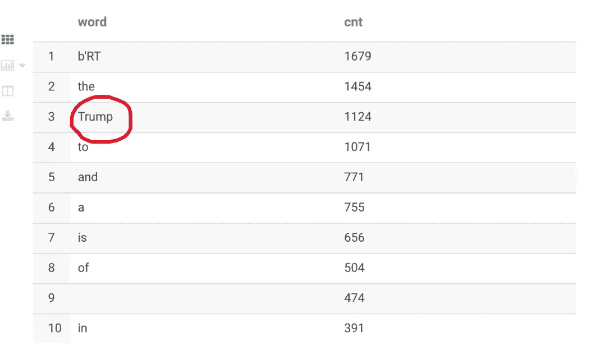

**其次，我选择了出现 1124 次的单词“Trump”来计算所有包含“Trump”的推文的平均极性。**

**查询:**

**输出:**

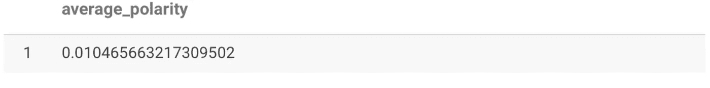

**注意:**推文被原样使用，实际上它们不应该被使用。数据在用于分析之前应该进行清理。一种清理形式可以是删除停用词，另一种清理形式可以是删除提及，..等等。