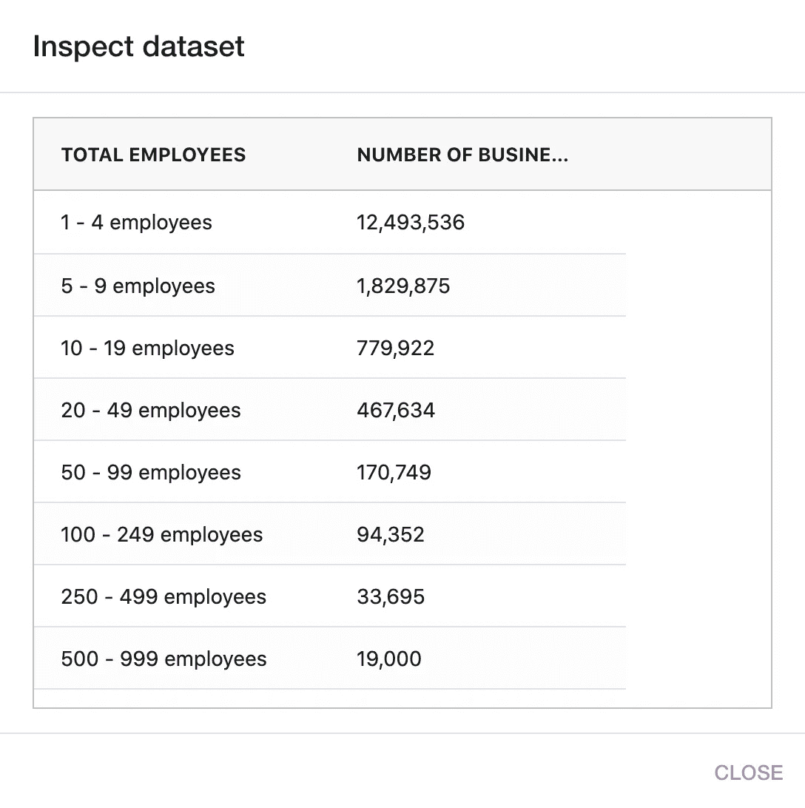

# 数据分析与大数据分析

> 原文：<https://medium.com/nerd-for-tech/data-analytics-vs-big-data-analytics-c361c832fb25?source=collection_archive---------9----------------------->

## 通过解决更广泛的问题空间，最大限度地发挥技术的影响

弗兰基·查马基在 [Unsplash](https://unsplash.com?utm_source=medium&utm_medium=referral) 上拍摄的照片

## 大数据繁荣

过去 10 年是大数据计算蓬勃发展的时期。分布式系统被发明来扩展大规模数据处理，统一 SQL 接口是进行数据分析和洞察构建的标准方式，有助于公司改进产品以更好地适应市场。

在大数据技术的繁荣中，许多产品和技术被创造出来以处理大规模的数据处理，仅举几个例子，有批处理计算引擎(map-reduce、hive、spark、presto)，有分布式文件系统(hdfs、云对象存储，如 s3、gcs 和 azure blob)，有用于实时场景的专门技术(pub/sub 系统，如 kafka、pulsar 和实时计算引擎，如 flink)，此外，各种分布式键值存储被发明出来(redis、rocksdb、hbase)用于高 QPS 应用，有时为其定制除此之外，大数据技术将触角延伸到 ML/AI 领域，并推动下一阶段的技术革命。

## 范围？

如果我们更深入地考察“大数据繁荣”，我们会很快发现，这些伟大的技术正在惠及大型科技公司，尤其是互联网巨头。对于公司/企业来说，要将相关的大数据技术作为自己的竞争优势，您需要

*   足够的数据(用户群、设备、终端)。
*   足够的人力资源(数据科学家、软件工程师、IT 专业人员)

开源软件一旦投入人力资源，就会加速所有顶级公司的采用，本质上这些技术可以标准化，因为所有数据问题都属于同一模式。对于大多数大公司来说，这是一个很好解决的问题…

## 更大的画面

现在，让我们把目光移向全世界所有类型的企业。我想你同意我的观点:

> 每个公司都会是数据公司。每个企业都将是数据驱动的。

我认为我不需要就这一点进行争论——随着云基础设施的成熟，成为我们在发达地区可以找到的所有运营工作的基础，随着智能设备(包括物联网)渗透到各个角落，所有企业都在某种程度上相互连接，他们拥有数据。

这里唯一有争议的一点是，我们如何帮助他们利用数据的力量，将他们的宝贵资产转化为他们的竞争优势。我对这个机会感到兴奋，我要说的是**数据分析**基本功能使企业/个人能够利用他们拥有的数字资产:

> 让每个个人和企业都能接触到数据科学，帮助他们将数据转化为见解和故事，并提供平台帮助他们分享自己的故事。

请记住，就数量而言，大多数企业都是小企业，根据[这一来源](https://www.naics.com/business-lists/counts-by-company-size/)， **88%** 的美国企业员工少于 50 人，而 **80%** 的美国企业员工少于 10 人。在这种资源规模有限的情况下，企业通常拥有这些属性

*   他们没有 IT 部门。
*   他们甚至没有一个 IT 专业人员(懂 excel/电子表格)。
*   他们没有时间/动力去学习如何使用复杂的软件，比如 Tableau，PowerBI，甚至 Excel，Google 电子表格。
*   他们没有多少软件方面的知识。

美国企业规模分布(2021 年 2 月)

为了对这个巨大的长尾进行数据分析(从顶级大公司的角度来看)，我们需要这样的东西

*   简单明了(超低或无学习曲线)。
*   与他们所拥有的一切进行深度整合和顺畅连接。
*   用户没有付出努力来建立洞察力。
*   容易分享。
*   从技术上来说，是在宽度上而不是在深度上缩放。

## 数据分析与大数据分析

简而言之，感谢迄今为止的阅读:尽管大数据分析技术不断深入服务于垄断企业，但数据分析对所有人都有广泛的需求。

我们作为一个团队致力于一项使命，即“让每个个人和企业都能够接触到数据科学，将他们的数据转化为见解，并轻松分享他们的故事。”。简单地解释一下，我们正试图利用大数据技术(包括人工智能)并利用它们为世界上更多的人服务。

让我听听你的想法。如果你对这个愿景感兴趣，请在 [Medium](https://shawncao.medium.com/) 或 [Twitter](https://twitter.com/caoxhua) 上关注我，随着我们团队在产品迭代方面的进展，我会分享更多进展。