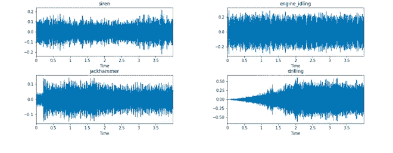

# 数据标注—数据标签服务如何帮助构建更智能的金融行业？

> 原文：<https://medium.com/nerd-for-tech/data-annotation-how-data-labeling-service-helps-build-a-smarter-finance-industry-8a3e30c1b0d2?source=collection_archive---------11----------------------->

# 智能金融

随着深度学习和计算机视觉技术的大规模商业应用，金融行业与人工智能的结合更加紧密，智能金融的浪潮开始席卷整个金融行业。

从产品设计到客户服务，从外部管理到内部监控，人工智能技术在金融行业价值链的每一个环节都有清晰的落地场景，有效降低了运营成本和金融风险。

生态重塑的背后是 AI 技术的突破。计算机视觉、语音交互、自然语言处理更加紧密地融入金融行业，这些技术的应用离不开数据标注行业。

# 计算机视觉

在金融行业，计算机视觉主要应用于内部流程优化、客户服务、人脸识别、物体检测等领域。

这种技术提供了简单性和便利性，例如，面部刷卡进行快速支付。这种模式不仅简化了支付流程，提高了效率，也大大改善了用户的支付体验。之前的方法是用户输入密码后再支付。比较复杂，还有密码泄露问题。

这种计算机视觉技术需要不同的标注类型，如**关键点、2D 拳击**等。

# 语音交互

在金融行业，尤其是在银行机构，工作人员总是与客户沟通。有各种各样的场景，比如商业咨询、客户服务和市场营销。

目前，许多金融机构都配备了语音交互技术。而客服机器人就是最典型的。

例如，问答系统(QA)是一种聊天机器人，可以用自然语言自动回答人类的问题。理解语音是一半的过程，另一半是给予回应。聊天机器人的竞争优势是沟通的简化和人力成本的降低。

由于不同场景下的术语和表达差异很大，对基于场景的、定制化的数据标注服务有很高的要求。

ByteBridge，一个人力和 ML 驱动的数据标签工具 SaaS 平台

# 自然语言处理

自然语言处理的应用包括语义分析、信息抽取、文本分析、机器翻译等。在金融行业，主要应用场景是文本检查、信息搜索、翻译等。

比如通过对文本内容的语义分析，分析意图，最后通过文本合成形成回应。

人工智能的融合深刻改变了传统金融行业，重塑了新生态。未来随着人工智能技术的发展，在金融方面会有更多的垂直应用。

## 金融领域常用的标签工具:

*   注音(STT)
*   光学字符识别
*   语义分析
*   [区域分割](https://tinyurl.com/48w576p7)
*   [情绪分析](http://tinyurl.com/rbgfnvwk)

## 金融中常见的标签类型:

*   **财经正文&演讲分类**
*   **聊天机器人客服**
*   **欺诈检测法规合规性**
*   **KYC 自动化**
*   **客户调查反馈分析**
*   **子句和实体提取**
*   **文本分类**

# 结束

将你的数据标注任务外包给[字节桥](https://tinyurl.com/mtd9ttxp)，你可以更便宜更快的获得高质量的 ML 训练数据集！

*   无需信用卡的免费试用:您可以快速获得样品结果，检查输出，并直接向我们的项目经理反馈。
*   100%人工验证
*   透明和标准定价:[有明确的定价](https://www.bytebridge.io/#/?module=price)(包括人工成本)

为什么不试一试呢？

**相关文章:**

[1 聊天机器人——自然语言处理领域最流行的应用之一](/p/807b7d0d7e6d)

[2 自然语言处理(NLP)的主要应用— 1](/@bytebridge/data-labeling-the-main-application-scenarios-1a6d494dd112)

[3 数据标注服务:机器学习和 AI 项目如何保证数据质量？](https://tinyurl.com/1ae8xslj)

[4 数据标注——如何选择数据标注公司](https://tinyurl.com/u32bv8jk)

[2021 年 5 家最佳数据标签公司](https://tinyurl.com/3runtux4)