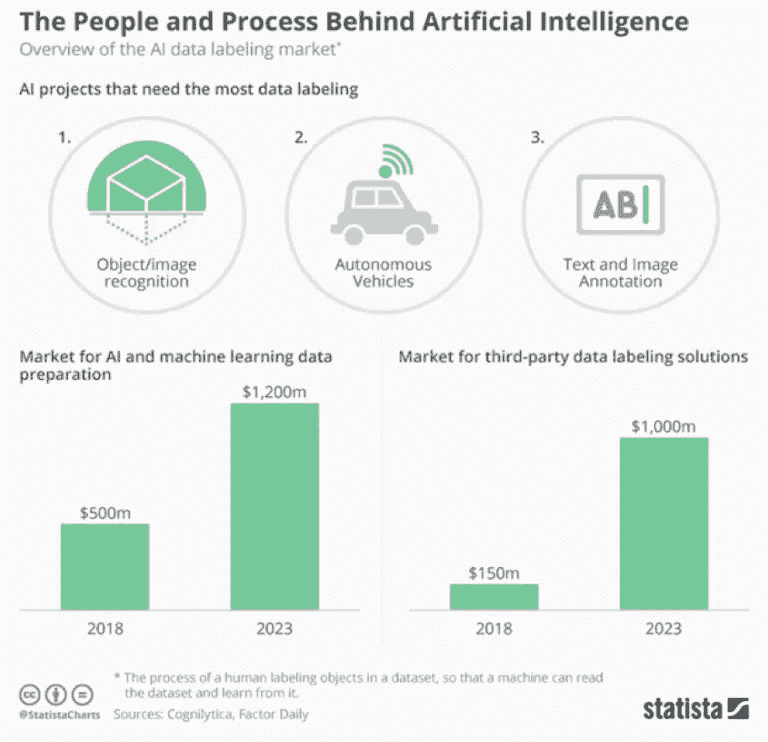

# 什么是数据标注，2021 年的关键优势是什么？

> 原文：<https://medium.com/nerd-for-tech/data-annotation-market-sees-tremendous-growth-in-the-forthcoming-future-b49fc05dedc7?source=collection_archive---------1----------------------->

# 数据注释和市场规模

数据标注技术用于使机器学习模型的对象可识别和可理解。它对于机器学习(ML)行业的发展至关重要，如人脸识别、自动驾驶、空中无人机、机器人以及许多其他人工智能和应用。

根据研究与市场的报告，2019 年全球数据注释市场价值 6.955 亿美元，预计到 2027 年将达到 64.5 亿美元。预计从 2020 年到 2027 年，CAGR 将以 32.54%的速度增长，蓬勃发展的数据注释市场正在见证未来的巨大增长。**人工智能行业的不断增长推动了数据注释行业的发展。**

资料来源:统计数据

# **数据标注过程艰难**

未标记的原始数据无处不在，例如电子邮件、文档、照片、演示视频和语音记录。今天，大多数机器学习算法需要标记数据，以便自己学习和训练。数据标注是标注者通过计算机或智能手机手动标注文本、视频、图像、音频等各种类型数据的过程。一旦完成，手动标记的数据集就会被输入到机器学习算法中，以训练人工智能模型。

然而，数据注释本身是一个费力且耗时的过程。做数据标注项目有两种选择。一种方法是在内部进行，这意味着公司建立或购买标签工具，并雇佣一个内部标签团队。另一种方式是将工作外包给知名的数据标签公司，如阿彭、Lionbridge。

蓬勃发展的数据注释市场也刺激了[多个新玩家](https://tinyurl.com/3hf6694y)在竞争中获得一席之地。例如，人工智能的数据标签平台 Playment 与领先的激光雷达传感器提供商 Ouster 合作，后者以 2018 年 3D 图像的注释和校准而闻名。

## 客户的棘手问题

以下是 Reddit 讨论组的一些摘录:

1 缺乏 QA/QC 流程。

2 缺乏监控，一些贴标机是好的，而另一些是坏的。根据标签来区分表演会很棒。

3 软件不是为贴标机设计的，也不鼓励出错。

这份清单还在继续…

# **灵活性是 2D 图像数据标记循环的关键优势**

由于高质量标准、数据安全性和可扩展性是标签服务中最重要的衡量标准，我们可以看看其余的竞争部分，例如**灵活性和客户服务**。

在机器学习中，在每一轮测试中，工程师都会发现新的可能性来完善模型性能，因此，工作流程会不断变化。数据标注存在**不确定性和可变性。客户需要工作人员根据模型测试和验证阶段快速响应并对工作流进行更改。**

因此，**客户对贴标环节的更多参与和控制将是一个关键的竞争优势，因为它提供了灵活的解决方案**。

# 结束

将您的数据标注任务外包给[字节桥](https://tinyurl.com/3hf6694y)，您可以更便宜、更快速地获得高质量的 ML 训练数据集！

*   无需信用卡的免费试用:您可以快速获得样品结果，检查输出，并直接向我们的项目经理反馈。
*   100%人工验证
*   透明和标准定价:[有明确的定价](https://www.bytebridge.io/#/?module=price)(包含人工成本)

为什么不试一试呢？

**相关文章:**

[1 数据标注服务:机器学习和 AI 项目如何保证数据质量？](https://tinyurl.com/1ae8xslj)

[2 数据标注:通过键入 Captcha，实际上是在帮助 AI 模型训练](https://tinyurl.com/4y252dhv)

[3](https://tinyurl.com/vpadjbsn) [数据标注服务——从后台到前台](https://tinyurl.com/vpadjbsn) [？](https://tinyurl.com/vpadjbsn)

[4 2021 年 ML 项目数据标注和标注](https://tinyurl.com/ys4mv7tt)

[5 如何让数据标注更高效？](https://tinyurl.com/1amyxmhb)