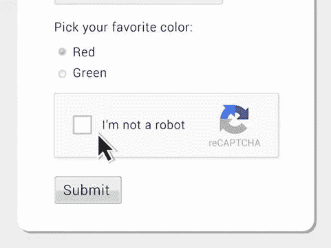

# 数据标注:通过输入 Captcha，你实际上是在帮助 AI 模型训练

> 原文：<https://medium.com/nerd-for-tech/data-annotation-service-by-typing-captcha-you-are-actually-helping-ai-model-training-5902e8794a6f?source=collection_archive---------7----------------------->

生活在互联网时代，当你输入密码或填写表格以证明你是完整的人类时，你有多偶尔会遇到棘手的验证码测试？例如，键入扭曲图像的字母和数字，将对象旋转到特定角度，或将拼图块移动到位。

# 什么是验证码，它是如何工作的？

CAPTCHA 也被称为完全自动化的公共图灵测试，用于过滤大量的垃圾邮件。卡内基梅隆大学的研究人员在 21 世纪初开发了验证码。最初，该程序显示一些计算机无法阅读、只有人类才能阅读的乱码、扭曲或变形的文本。用户被要求在进入网站之前在一个框中输入文本。

这个项目取得了巨大的成功。验证码已经成为互联网用户体验中常见的一部分。网站需要验证码来防止垃圾邮件发送者和其他计算机黑社会类型的“机器人”。“任何人都可以编写一个程序来注册数百万个账户，这个想法是为了防止这种情况，”早期验证码团队的先驱、谷歌最大的验证码服务之一 reCAPTCHA 的创始人路易斯·冯·安(Luis von Ahn)说。这些小谜题之所以会继续下去，是因为计算机在阅读扭曲的文本方面不如人类。谷歌称，人们每天解决 2 亿个验证码。

在过去的几年里，谷歌的 reCAPTCHA 按钮说“我不是机器人”出现在更复杂的场景中，例如在图像网格中选择所有的交通灯、人行横道和公共汽车。

## 验证码对人工智能的潜在影响

虽然验证码主要用于安全原因，但它也可以作为人工智能技术的基准任务。根据 Ahn，Blum 和 Langford 的 [*CAPTCHA:使用困难的人工智能问题用于安全*](https://www.researchgate.net/publication/221348053_CAPTCHA_using_hard_AI_problems_for_security) ，“任何对 CAPTCHA 高度成功的程序都可以用来解决困难的、未解决的人工智能(AI)问题。验证码可以用在很多地方。”

R [eCAPTCHA](https://g.co/kgs/F7GcHZ) 是谷歌开发的验证码系统，这是一个允许网站主机区分人类和机器的系统。最初的版本要求用户破译难以阅读的文本或匹配图像。

自 2011 年以来，reCAPTCHA 已经数字化了整个谷歌图书档案和《纽约时报》目录中的 1300 万篇文章，可追溯到 1851 年。此后，reCAPTCHA 在 2012 年开始从谷歌街景中选择片段。该公司让用户认识门牌号、标志和符号。

用户为 reCaptcha 识别和填充的扭曲字符是为了更大的目的，尽管用户在不知不觉中为谷歌转录了文本。reCAPTCHA 将相同的内容分发给世界各地的十几个用户，并通过比较结果来自动验证它是否被正确转录。

点击模糊的图像也可以帮助识别计算系统未能管理的对象，用户实际上是在对图像进行排序和澄清，以训练谷歌的人工智能引擎。2014 年，该系统开始训练人工智能(AI)引擎。

通过这种机制，谷歌已经能够让用户参与识别图像，以便提供更好的谷歌搜索和谷歌地图结果。

# 结束

将你的数据标注任务外包给 [ByteBridge](https://tinyurl.com/mtjeec9c) ，你可以更便宜更快的获得高质量的 ML 训练数据集！

*   无需信用卡的免费试用:您可以快速获得样品结果，检查输出，并直接向我们的项目经理反馈。
*   100%人工验证
*   透明标准定价:[有明确的定价](https://www.bytebridge.io/#/?module=price)(含人工成本)

**为什么不试一试？**

**相关文章:**

1 [印象最深的 AI 产品有哪些？](https://tinyurl.com/y7wmwk6z)

2 [高质量训练数据在不同 AI 算法阶段的重要性](https://tinyurl.com/4k3h2ujv)

3[2021 年机器学习数据标注公司](https://tinyurl.com/26ch6xfw)

4 [数据标注服务——从后台到前台](https://tinyurl.com/vpadjbsn)

5 [客户对数据标注服务的需求和期望](https://tinyurl.com/hlyth6gh)