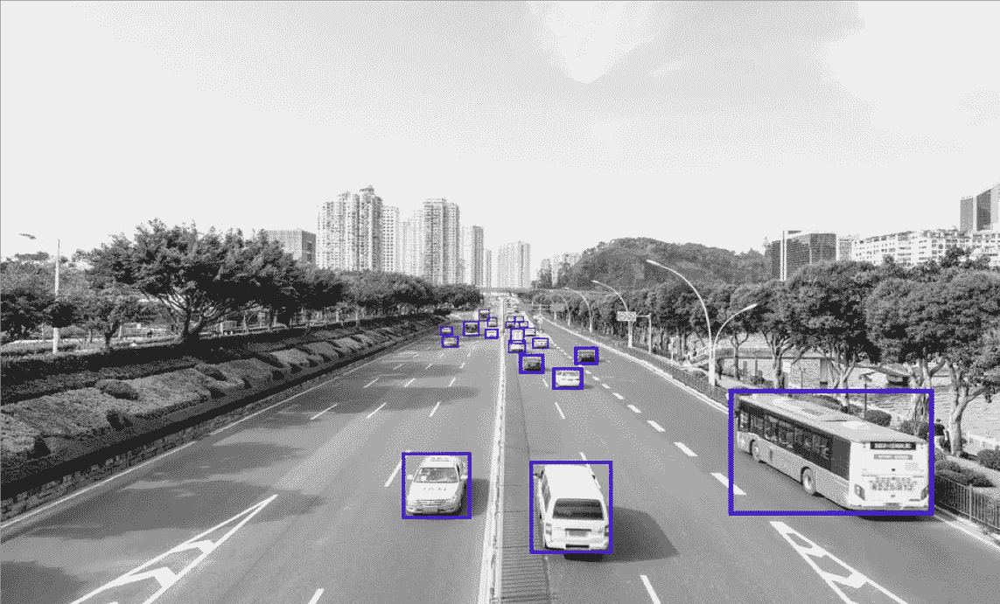

# 数据标注服务——数据标注服务如何推动自动驾驶汽车行业？

> 原文：<https://medium.com/nerd-for-tech/data-annotation-service-how-an-automated-data-labeling-platform-fuels-autonomous-vehicles-f7dd343c7ae1?source=collection_archive---------0----------------------->

# 热门话题——自动驾驶汽车

“我非常有信心自动驾驶汽车或基本上完全的自动驾驶将会发生，我认为这将会很快发生，”特斯拉首席执行官埃隆·马斯克在 2020 年 7 月世界人工智能大会的虚拟演讲中说。马斯克提到，特斯拉将在 2020 年具备 Level5 完全自主的基本功能。

自动驾驶汽车的话题不仅仅在硅谷很热。

在中国这个全球最大的汽车市场，一些公司也开始开发自动驾驶技术，包括中国的互联网搜索巨头百度(也被称为中国的谷歌)。百度一直在通过其于 2017 年 4 月启动的“阿波罗”项目(又称开源阿波罗平台)开发自动驾驶技术。现在，该公司宣布，世界上第一个用于自动驾驶汽车的生产就绪平台已经就绪。

**更多阅读:** [**造价 74160 美元**](https://tinyurl.com/2rvr7kk8) 量产无人飞行器阿波罗登月

人们不禁要问——是什么让自动驾驶汽车成为可能？

# 自动驾驶背后——机器学习和数据标注

## **机器学习**

机器学习算法、传感器和图形处理设备已经集成到智能驾驶神经网络中，或者我们可以称之为智能“大脑”。“智能大脑”需要学习图像验证和分类、物体检测和识别、交通规则以及天气情况。工程师通过向机器学习模型输入数百万张带标签的图像来开发“智能大脑”，使智能“大脑”擅长分析动态情况并根据他们的决定采取行动。

无人驾驶汽车应该能够感知环境，在没有人类干预的情况下导航。自动驾驶汽车在道路上行驶时依赖于硬件和软件。硬件收集数据，软件通过机器学习算法处理数据，这些算法已经在现实世界的场景中训练了数百万次。

## **数据标注**

标注越准确，算法性能越好。驾驶过程中任何微小的错误都可能导致可怕的后果。如今，随着几起自动驾驶汽车事故的发生，人们越来越关注驾驶安全问题。

由于大量的训练数据和高精度的要求，高质量的数据标注服务对于保证自动驾驶汽车对公众的安全至关重要。

回到特斯拉，这家公司使用摄像头进行视觉检测，每辆车配备 8 个环绕摄像头。全球有超过 75 万辆特斯拉汽车。如果一个特斯拉用户平均每天开车一个小时，每个月可以产生 1.8 亿小时的数据。

特斯拉自动驾驶项目包括 300 名工程师和 500 多名熟练的数据注释员。该公司计划将数据注释团队扩大到 1000 人，以支持数据处理。在一次采访中，埃隆·马斯克(Elon Musk)承认，标注是一项繁琐的工作，需要技能和培训，尤其是在涉及 4D (3D 加时间序列)的时候。

## 自动驾驶行业的数据标注类型包括:

*   2D 包围盒
*   [车道标线](https://tinyurl.com/u7u4me)
*   [语义分割](https://tinyurl.com/48w576p7)
*   [视频跟踪标注](http://tinyurl.com/wmu4yfhh)
*   点标注
*   三维物体识别
*   3D 分割
*   传感器融合:传感器融合长方体/传感器融合分割/传感器融合长方体跟踪

ByteBridge 数据标注外包服务:让您的 ML 训练数据集更便宜、更快！

# 自驾车行业中的数据标注服务

自动驾驶技术将改变交通行业、社会和日常生活。很难知道那一天什么时候会到来。因为生命是无价的，我们必须从一开始就追求完美。自动驾驶制造商很难在内部满足对高质量数据注释的快速增长的需求。

## **人工智能辅助工具**

[**3D 标注**](https://tinyurl.com/u7u4me) 和 [**视频标注**](http://tinyurl.com/wmu4yfhh) 被认为是数据标注中最难的服务。目前，基于机器学习的目标跟踪算法已经可以辅助视频标注。标注器在第一帧上标注对象，然后算法跟踪后续帧中的对象。注释器只需要在算法运行不好的时候调整注释。

如今，一些人工智能辅助工具开始实践，在两个因素中脱颖而出。

*   降低成本:在人工智能辅助功能的帮助下，随着劳动力成本的下降，客户可以节省更多的钱。
*   时间缩减:使大规模的训练数据需求在短时间内完成。

**我们能摆脱人类劳动力吗？**

答案是否定的

一些具有基于人工智能的自动化功能的工具无法完全取代人类劳动力，特别是在处理异常、边缘情况、复杂的数据标记场景等方面。

## 内部团队还是外包？

如前所述，数据准确性在汽车行业至关重要，这里又来了一个问题:**我应该建立一个内部团队吗？**

在做出最终决定之前，我们必须记住两点:

1.复杂的过程:包括注释工具和数据预处理建立，贴标机性能培训和跟踪，数据验证和质量检查等。

2.高财务涉入:如基建人工成本、R&D 等。

与内部基础设施相比，外包服务需要有效的沟通和快速的反馈。对于制造商来说，选择一个合适的人作为他们公司的“扩展部门”是非常重要的。

## 还应考虑以下部分:

**进度预览:**客户可以实时监控贴标进度

**结果预览:**客户端可以实时获得结果

客户服务:客户可以与项目经理就变更进行沟通，这样员工就可以快速响应并对工作流程进行更改

总之，在自动驾驶行业，我们非常依赖人类劳动力。因此，在外包合作伙伴的选择方面，我们必须确保贴标循环的灵活参与，因为我们需要贴标机快速响应，并根据模型测试和验证阶段对工作流程进行更改。

# 结束

将你的数据标注任务外包给 [ByteBridge](https://tinyurl.com/32fnkfvb) ，你可以更便宜更快的获得高质量的 ML 训练数据集！

*   无需信用卡的免费试用:您可以快速获得样品结果，检查输出，并直接向我们的项目经理反馈。
*   100%人工验证
*   透明和标准定价:[有明确的定价](https://www.bytebridge.io/#/?module=price)(含人工成本)

为什么不试一试呢？

## **相关文章:**

[1 自动驾驶是如何通过机器学习实现的？](https://bytebridge.medium.com/how-auto-driving-achieved-through-machine-learning-873c667233f1)

[2 标签服务案例研究—视频标注—车牌识别](https://becominghuman.ai/labeling-case-study-video-annotation-license-plate-recognition-e94ce0260e43)

[3 2021 年自主汽车高质量训练数据](/nerd-for-tech/high-quality-training-data-for-autonomous-cars-22d542d62cbf)

[4 什么是语义分割、实例分割、全景分割？](/nerd-for-tech/what-is-semantic-segmentation-instance-segmentation-panoramic-segmentation-3bbb03856c12)

[5 数据标签和标注服务如何赋能自动驾驶巴士？](https://bytebridge.medium.com/how-data-labeling-and-annotation-services-empower-self-driving-bus-f187c90f40c)