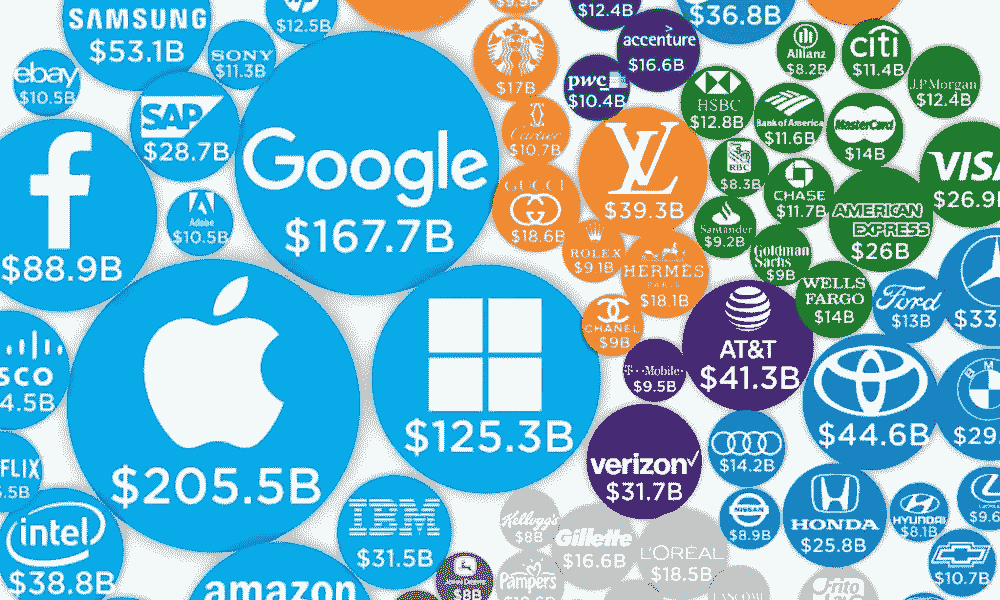

# 数据支持的商业模式

> 原文：<https://medium.com/nerd-for-tech/data-backed-business-models-ca23b2e0238e?source=collection_archive---------2----------------------->

大公司和亿万公司

在你看来，数据支持的商业模式可能意味着不同的东西，但在我看来，有些商业模式的潜在成功是由硬数据证明的，其增长是完全可控和可扩展的，硬运营数据来自这种商业模式的执行，我称之为数据支持的商业模式。你可以看到，我可以说这些业务模型是数据驱动的，因为它们的可扩展性是由运营数据指导的。我不愿意使用另一个风投和科技企业家的行话，但我最终还是这么做了。

这种商业模式的最佳例子是网络泡沫时代和社交媒体时代的成功投资，在今天的股票市场选择中仍然是最成功的，在我看来，它们将在未来继续引领我们的经济。我对你和我所能希望的是，他们开始致力于让我们的生活变得更好，而不仅仅是卖给我们会让我们迷上切东西的产品和服务。我几乎准备举谷歌为例，但我认为亚马逊和社交及电子商务互联网初创公司是第一个例子。谷歌恰好是完全由数据驱动的公司，也是最早开始与你我这样的人分享一些硬数据的公司之一，但只有像你这样的早期技术采纳者才知道这些数据的可用性，即使它们位于像我这样的人容易访问的简单网页上(我开玩笑，但我确实知道)。我想起了几年前的 Altavista、Multimania、yahoo，prodigy 和 CompuServe 也值得称赞。所有这些都是基于数据支持的商业模式，因为他们获得了关于其目标市场以及其产品和服务如何被使用和销售的明确信息。它们与实际和未来商业模式的区别在于，它们并不是从关于其成功的明确事实开始的，而是在今天，由于大量的数据及其可访问性，商业模式可以并且确实被硬数据所证明。

但我遇到了麻烦，因为风险投资公司似乎不是基于硬数据而是基于团队成员、品牌和人际网络做出决策，而不是硬数据和网络效应，而像你这样的一个人可以在互联网上搜寻硬数据，用这些数据和一些电子表格和统计模型建立商业模型，这证明了这些商业模型的成功，以及你作为单一创始人从启动到 IPO 经营的可能性，因为你有能力自动化和整合现有的解决方案。

一个只着眼于一个领域投资的可能性和机会的资本硅谷不配拥有美国和世界。硅谷是一种思维模式。我赋予美国在世界上的地位和重要性让我为这种情况哭泣，因为这个国家作为一个思想多元化的国家，可以在当地和国际上做得更多，可以成为保证全世界所有人的声音都应该并将得到考虑的领导者。偏离了这篇关于数据和商业模式的文章，但早期互联网的咒语，以及至少我是如何看待它的，以及它是如何被体验的，就像美国，连接的人，行动和表达的自由和自由的区域，那么我希望你明白我的偏离可能是主题。

我的情况，但强调你一个机会。这个机会很简单，告诉你，如果你努力学习和工作，你有可能收集数据，找到受众和商业模式，并从开始到成功执行这些商业模式。如果你下定决心，要有耐心，忍受那些肯定会发生的艰难时刻，他们可以成为数十亿美元的公司，就像所有这些引领当今世界经济的数据支持公司一样。