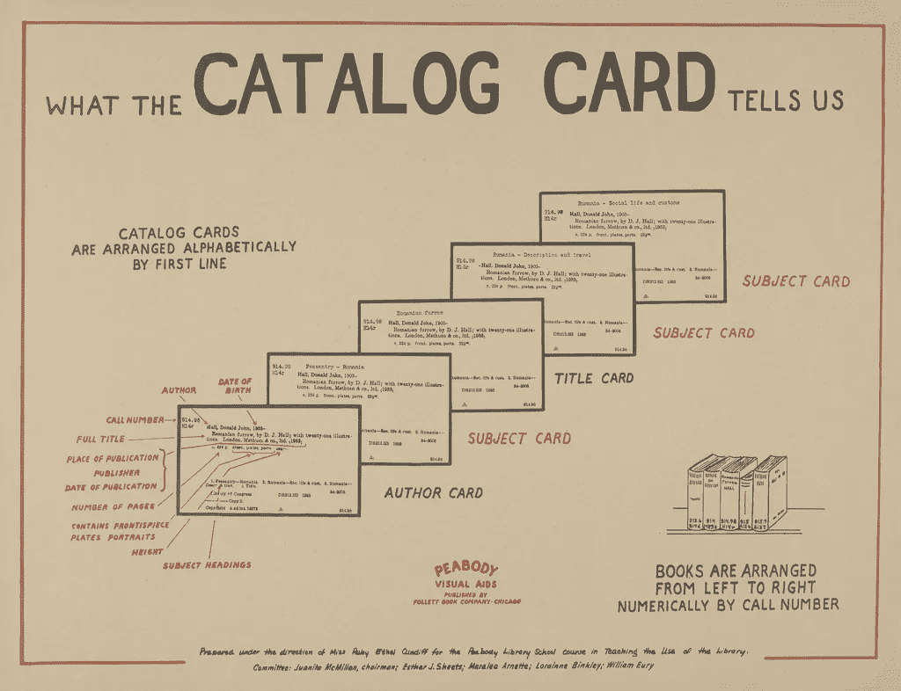

# 数据目录故事

> 原文：<https://medium.com/nerd-for-tech/data-catalog-story-35eae09e684?source=collection_archive---------0----------------------->

演职员表:[https://www.flickr.com/photos/68103485@N05/6197933357/](https://www.flickr.com/photos/68103485@N05/6197933357/)

从前，人们习惯去“办公室”工作。这是一个过去时代故事。

数据工程师 Dayana 和商业分析师 Brian 在咖啡机旁相遇。

“你过得怎么样？自从我们在一个叫不出名字的客户那里工作后，我就没见过你了！”达雅娜问。

“忙，忙，忙！等等，你是数据工程师！”布赖恩说。“也许你能帮我！”

“很高兴能帮助布赖恩”，达雅娜说

“所以我目前的客户是最大的零售商之一，对吗？他们希望通过创造客户个性化来关注影响者营销。作为该计划的一部分，我们需要提出一个客户 360 度视图。这将帮助他们建立更牢固的关系等。”布赖恩开始了。

“如你所知， *Customer 360* 指的是从市场营销到销售再到客户服务的所有人员。我们需要从所有产品组合和业务部门的整个客户旅程中提取数据。我们需要他们数字渠道的互动历史、最近的优惠、营销活动、购买历史、关于客户的信息、他们与组织的关系(比如他们是否以积极的方式认可我们的品牌)、当前互动的背景、任何最近的服务请求及其状态。”布赖恩继续说道。

“我已经联系了多个可能拥有这些数据的团队，但都是徒劳。不幸的是，每个系统都是孤立的，没有人知道端到端的流程。因此，我计划将相关数据带到分析区域，在那里我可以轻松地进行分析。但是，我想知道这是否会导致 [*阴影分析*](https://www.oreilly.com/content/how-self-service-data-avoids-the-dangers-of-shadow-analytics/) 。”

“我敢打赌，分析看起来比收集数据更容易，”Dayana 说

布莱恩打开了咖啡机里的卡布奇诺选项，继续说道:“为什么这种数据消耗不能更像一台自助服务的咖啡机！”

Dayana 回答说:“Brian，如果我对你的需求理解正确的话，你需要——*跨数据孤岛工作的能力和一个自我服务的平台*来做你的分析，从而让你的生活变得简单。”

“基本上，您需要一个存储库，以便从这些多个孤立的数据系统中获取数据的详细信息。因此，您可以通过简单的自助搜索功能轻松找到您想要的内容。这是数据目录**的核心功能之一。**

布莱恩:“有意思！能不能请你多解释一下？”

达雅娜继续说道:

“一般来说，数据目录维护着可用数据资产及其描述的清单，并有助于以易于发现的方式进行组织。数据资产描述提供了关于数据的必要背景，这使得数据管家、业务分析师(像你一样)、数据工程师(像我一样)、数据科学家和其他数据消费者能够找到并理解这些数据集，从而可以更放心地使用它们。本质上，*数据目录处理关于数据资产的数据，我们称之为元数据。因此，数据编目包括元数据摄取、发现、丰富和创建元数据之间的语义关系等任务*

布莱恩打断道:“你一直在引用元数据。能不能请你多解释一下？”

Dayana:“一般来说，我们有两组可能的元数据”

*“被动元数据*，本质上通常是静态的。在设计时出现，通常需要在创建后更新。通常包括设计时技术元数据，其细节范围从一些固定的源模式一直到业务定义，因此可以被视为正式的字典。”

“为了让它更有用，团队需要增强这些元数据参数，不仅是技术参数，还包括运营、业务和众包元数据，在某种程度上包括访问频率、数据谱系、上下文和数据质量指标。收集这些信息、创建语义关系、对其进行分析并使用这些结果来自动化数据管理活动(通过 ML stuff 或一些其他自动化过程)的过程称为激活被动元数据，结果称为*主动元数据*

布莱恩打断道:“等等！你说的行话太多了。你能解释一下技术、运营、业务和众包元数据吗？”

达雅娜:“当然。未来将尝试以更简单的方式解释事物:)

元数据的可能类型包括

"*技术元数据*，指数据资产的模式，如列列表、它们各自的数据类型；数据样式、数据模型和配置

*操作元数据*，是指数据谱系、起源、性能相关信息(如 SLA、技术流程的端到端延迟)、流程输出和数据在其端到端旅程中的操作(也称为转换)。

*业务元数据*(又名术语表)，指映射到业务关系的本体和元数据

*众包元数据*，指用户生成的内容，如数据资产的文本描述、使用该数据的用例、关于该数据资产的质量和使用的评级和审查。"

布莱恩认为他明白了。“那么，让我看看我是否明白了。数据目录就像一份清单，从中可以找到可用的数据、数据的外观、位置、是否用于我们的分析以及数据的格式。如果它被创建，它可以帮助像我这样的人找到我们想要的数据，以更简单和更快的方式。”

达雅娜:“是的。你设法用比我少得多的话说出来了！”

布莱恩继续说道:“如果我没记错的话，它们确实存在，甚至在此之前就存在，对吗？”

达雅娜回答说:“是的，它们确实存在”

"*数据管理*是那些日复一日处理数据的人非常需要的流程。这一流程有助于数据消费者识别可用数据、请求访问、获得适当的审查和批准以及调配数据，而无需花费大量时间和 IT 工作。

作为这一过程的一部分，我们有*数据清单*，它指的是您拥有的数据及其位置的物理列表。它更倾向于技术元数据方面。有时，它也被称为像*数据字典、元数据库*和*数据资产清单*这样的术语。这些曾经是数据系统的一部分，因此有时被称为*嵌入式目录*。此外，这些系统倾向于不公开数据，因为不存在这样的需求。由于它们相对较小，来自这些系统的数据被带到单个存储库(也称为数据仓库)来执行所需的数据分析。

数据捕获技术的最新进展、数据日益分散的性质以及数据被视为资产，正在推动这些数据清单拓宽视野。因此，我们看到目录从嵌入式状态发展到更加独立和外部的状态。

***数据目录*** ，表示某人可能有权访问的数据的业务视图。人们可以将它视为整个组织中可用数据集的菜单，而不像传统菜单那样局限于封闭的数据系统，用户可以从中找到并选择所需的信息。"

“除了上述驱动因素，推动采用外部数据目录的其他触发点包括(但不限于)*云迁移、自助服务分析、数据湖、由于数据泄露和对信息安全的关注而增加的数据治理计划*、*IT 影响评估失败*例如，由于缺乏元数据管理，在没有正确分析和正确识别系统之间的关系的情况下就直接开始迁移系统”

现在，Brian 明白了，“什么是数据目录以及它如何解决他当前的问题”

Brian 问 Dayana:“鉴于分布式数据的性质，数据目录的范围正在扩大。我想知道这是否同样适用于用例。我的意思是，你知道任何超越捕获和存储元数据的用例吗？”

Dayana 回答说:“是的，随着这些新时代数据目录范围的扩大，这些工具在其他用例中的应用开始成倍增长”

布莱恩:“知道了。我只知道我必须做什么——向我的客户推销数据目录的想法——这不仅有助于解决我的问题，还会给他们未来的几项计划带来更大的成功机会。”

"那么你认为你要推销的到底是什么？"达雅娜问。

“什么意思？”布赖恩问。

“嗯，有许多数据目录工具——既有开源的，也有许可的,”Dayana 说。

“哦，所以这不仅仅是一件事，”布赖恩说。

“不。根据您的需求选择合适的目录变得越来越重要。这是我通常寻找的，”

*   自动创建和维护*数据环境*
*   跨数据源的*数据谱系*的文档
*   记录*的出处*，数据的来源和传承，数据在通过多个数据系统的过程中发生了什么
*   作为*数据治理*计划的一部分，帮助制定治理策略— *您无法治理您不知道的事情*
*   影响评估又名*企业变更管理*——由于您知道您的系统是如何连接和通信的，由于操作沿袭，您应该能够以更好和可控的方式评估变更的影响
*   *业务绩效管理*包括衡量关键绩效指标、存储位置、衡量频率以及确保这些指标的质量
*   *具有众包和业务术语表功能的组织知识管理*

“听起来有很多要记，”布赖恩打断道。"有没有可能用电子邮件把这些都发给我？"

“邮件？”达雅娜问道。“我会给你一个更好的。这里有一篇 [*文章*](/p/35eae09e684) 抓住了我们谈论的一切”