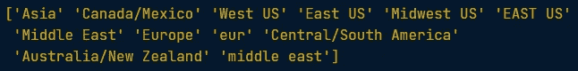
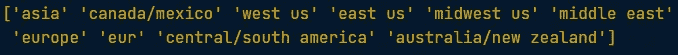
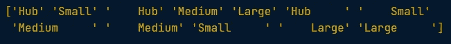
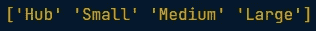
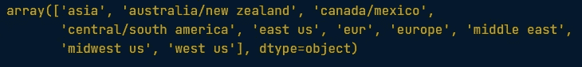
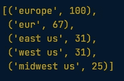
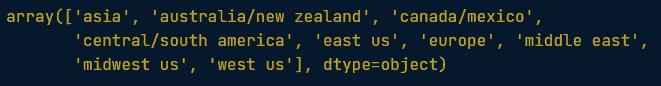

# 数据清理:不一致的数据输入

> 原文：<https://medium.com/nerd-for-tech/data-cleaning-inconsistent-data-entry-7731ac3c52c7?source=collection_archive---------3----------------------->


由[intellespot](http://www.intellspot.com/what-is-data-cleansing/)拍摄的照片

有几种方法可以清除数据输入的不一致性，并确保数据已被清除并准备好进行分析。当然，第一种方法是手动检查每一行，如果发现不一致的地方就修复。但是，有一种更有效的方法可以做到这一点，比如做一些初步的文本预处理。

# 设置我们的环境

首先需要做的是加载将要使用的库和数据集。在本笔记本中，将使用 Datacamp 课程中的航空公司数据帧。

```
# import modules
import pandas as pd# assign url of file: url
url = '<https://assets.datacamp.com/production/repositories/5737/datasets/ba95dfa6d750e4bf2ddda2349cfe0af80ab765ff/airlines_final.csv>'# read file airlines
airlines = pd.read_csv(url, sep=',')# print the head of the DataFrame
print(airlines.head())
```

现在我们准备好开始了！您可以像往常一样，在这里花一点时间查看数据并熟悉它

# 做一些初步的文本预处理

在本练习中，Datacamp 提供了一个示例，使用了航空公司数据帧中的两个分类列，分别是 dest_region 和 dest_size。由于分类数据和文本数据的非结构化性质，它们通常是数据集中最混乱的部分。在本章中做一些初步的文本预处理意味着如何修复类别标签中的空白和大小写不一致。

# 修复大写不一致

```
# get all the unique values in the 'dest_region' column
dest_region = airlines['dest_region'].unique()# sort them alphabetically and then take a closer look
dest_region.sort()
dest_region
```



输出:“目标区域”中的唯一值

从输出来看，它显示 dest_region 列由于大小写而具有不一致的值。例如“美国东部”和“美国东部”，“中东”和“中东”。首先可以做的就是把所有的东西都变成小写。

# 小写字母

```
# Lower dest_region column
airlines['dest_region'] = airlines['dest_region'].str.lower()# Verify changes have been effected
print(airlines['dest_region'].unique())
```



输出:使所有内容小写后,' dest_region '中的唯一值

从输出中可以看出，dest_region 列没有因大写而导致的不一致值。

# 修复空白

```
# get all the unique values in the 'dest_size' column
dest_size = airlines['dest_size'].unique()# sort them alphabetically and then take a closer look
dest_size.sort()
dest_size
```



输出:“目标大小”中的唯一值

从输出中可以看出，dest_size 列只有由前导空格和尾随空格引起的不一致的值。例如“中枢”和“中枢”。可以做的第一件事是删除单元格开头和结尾的空白。

# 删除空白

```
# Remove white spaces from `dest_size`
airlines['dest_size'] = airlines['dest_size'].str.strip()# Verify changes have been effected
print(airlines['dest_size'].unique())
```



输出:删除空白后' dest_size '中的唯一值

从输出中可以看出，dest_size 列没有因前导空格和尾随空格而导致的不一致值。大小写不一致和尾随空白在文本数据中很常见，这样做可以修复 80%的文本数据输入不一致。

# 使用模糊匹配纠正不一致的数据输入

好的，让我们再看一下 dest_region 列，看看是否还有不一致的地方。

```
# get all the unique values in the 'dest_region' column
dest_region = airlines['dest_region'].unique()# sort them alphabetically and then take a closer look
dest_region.sort()
dest_region
```



输出:“目标区域”中的唯一值

看起来确实还有一些不一致的地方:“欧洲”和“欧元”应该是一样的。

[fuzzywuzzy](https://github.com/seatgeek/fuzzywuzzy) 包来帮助识别哪些字符串彼此最接近。这个数据集足够小，我们也许可以手动纠正错误，但这种方法不能很好地扩展。(你会想要手动纠正一千个错误吗？一万呢？尽早实现自动化通常是个好主意。

> **模糊匹配:**自动寻找与目标字符串非常相似的文本字符串的过程。一般来说，如果将一个字符串转换为另一个字符串，需要更改的字符越少，就认为该字符串与另一个字符串越“接近”。所以“apple”和“snapple”相距两个变化(加上“s”和“n”)，而“in”和“on”相距一个变化(r 用“o”代替“I”)。你不可能总是 100%地依赖模糊匹配，但它通常会为你节省一点时间。

给定两个字符串，Fuzzywuzzy 返回一个比率。比率越接近 100，两个字符串之间的编辑距离就越小。在这里，我们将从 dest_region 列表中获取距离“欧洲”最近的五个字符串。

```
# get the top 5 closest matches to "europe"
matches = fuzzywuzzy.process.extract("europe", dest_region, limit=5, scorer=fuzzywuzzy.fuzz.token_sort_ratio)# take a look at them
matches
```



输出:最接近“欧洲”的前 5 个匹配项

从输出中可以看出，dest_region 中的两个条目非常接近“欧洲”:“欧洲”和“欧元”。让我们用“欧洲”替换 dest_region 列中比率大于 65 的所有行。

```
def replace_matches_in_column(df, column, string_to_match, min_ratio = 65):
    # get a list of unique strings
    strings = df[column].unique()

    # get the top 5 closest matches to our input string
    matches = fuzzywuzzy.process.extract(string_to_match, strings, 
                                         limit=5, scorer=fuzzywuzzy.fuzz.token_sort_ratio)# only get matches with a ratio > 65
    close_matches = [matches[0] for matches in matches if matches[1] >= min_ratio]# get the rows of all the close matches in our dataframe
    rows_with_matches = df[column].isin(close_matches)

     # replace all rows with close matches with the input matches 
    df.loc[rows_with_matches, column] = string_to_match

    # let us know the function's done
    print("All done!")
```

现在让我们再次检查 dest_region 列中的唯一值，确保我们已经正确地整理了欧洲。

```
# use the function to replace close matches to "europe" with "europe"
replace_matches_in_column(df=airlines, column='dest_region', string_to_match="europe")# get all the unique values in the 'dest_region' column
dest_region = airlines['dest_region'].unique()# sort them alphabetically and then take a closer look
dest_region.sort()
dest_region
```



从输出来看，dest_region 列似乎没有问题。现在，我们在数据框架中只有“欧洲”,我们不需要手动更改任何内容。

来源:

[数据营课程:用 Python 清理数据](https://campus.datacamp.com/courses/cleaning-data-in-python/text-and-categorical-data-problems?ex=6)

[Rachael Tatman:数据清理挑战不一致的数据输入](https://www.kaggle.com/rtatman/data-cleaning-challenge-inconsistent-data-entry)