# 酒店预订需求数据集的数据清洗

> 原文：<https://medium.com/nerd-for-tech/data-cleaning-on-hotel-booking-demand-dataset-df19922adf0a?source=collection_archive---------4----------------------->

马丁·比约克在 [Unsplash](https://unsplash.com?utm_source=medium&utm_medium=referral) 上的照片

该数据集包含城市酒店和度假酒店的预订信息，并且包括诸如预订时间、停留时间、成人、儿童和/或婴儿的数量以及可用停车位数量等信息。

这是数据集的链接

 [## 酒店预订需求

### 摘自论文:酒店预订需求数据集

www.kaggle.com](https://www.kaggle.com/jessemostipak/hotel-booking-demand) 

对此数据集执行一些基本的数据清理。让我们先了解一下我们的数据。

这里，是数据描述。

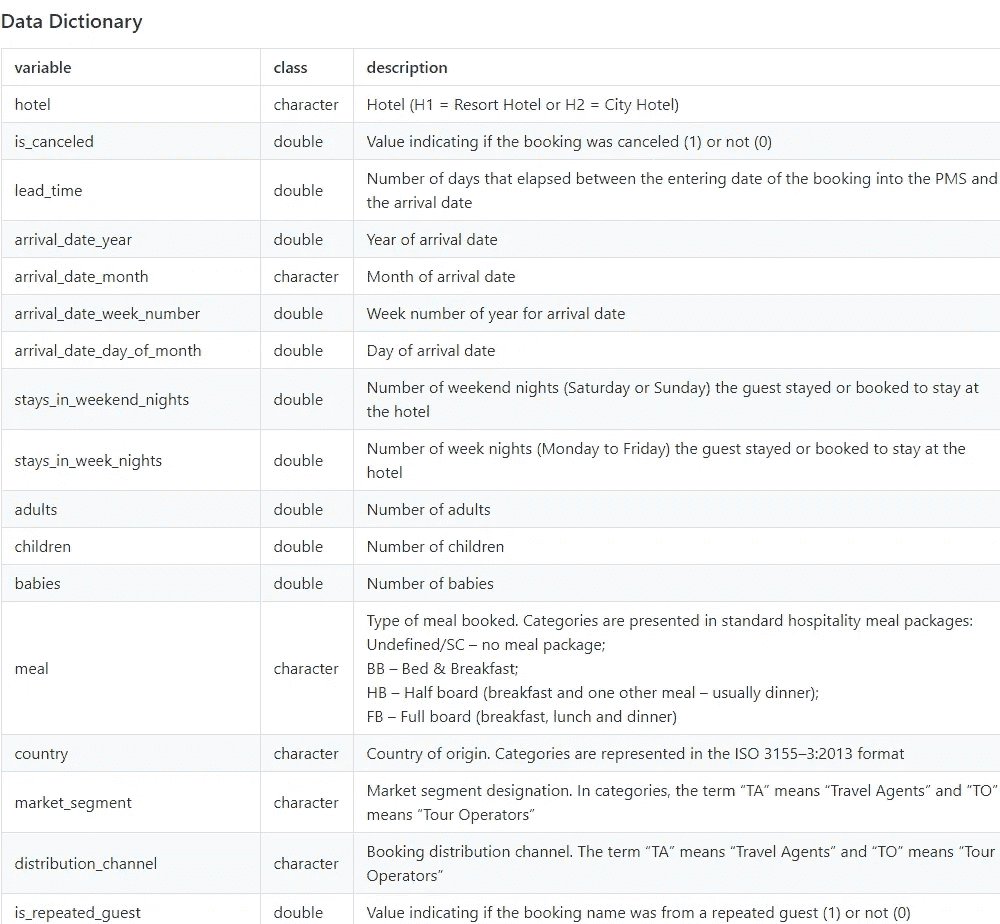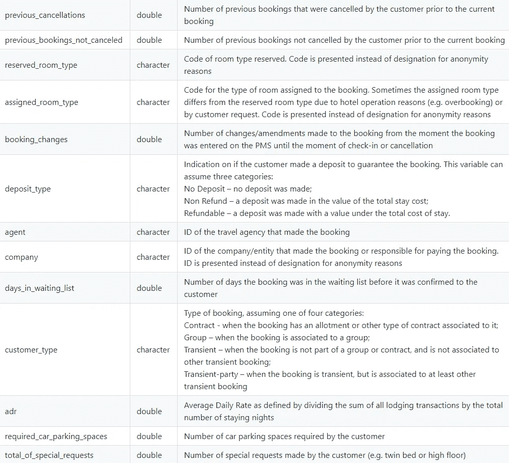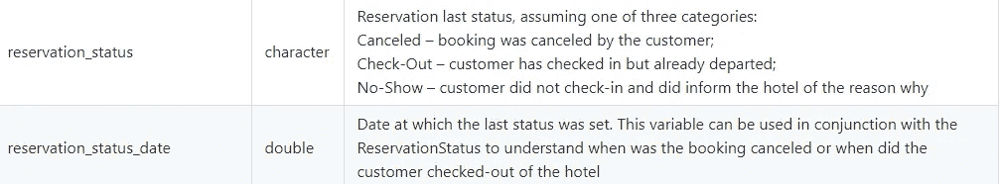

让我们从导入所需的包(NumPy，pandas)和数据集开始

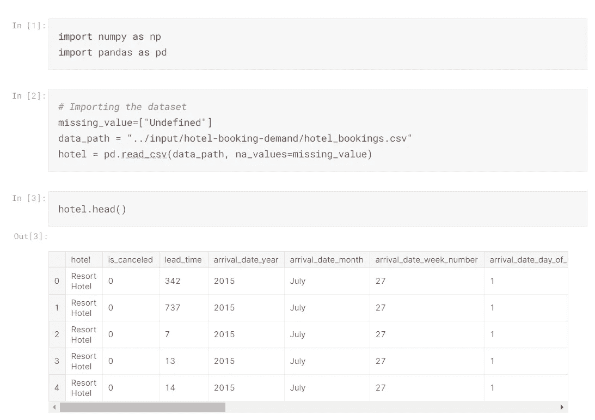

默认情况下，NaN/NA 在 pandas 中被称为缺失值。但有时数据集甚至可能包含空白或未定义的文字，熊猫不会将其识别为缺失值。因此，我们必须在一个数组中显式指定这些值，并将该数组传递给 **na_values** 参数

例如，missing_values = ["undefined "，" none "，"-" ]

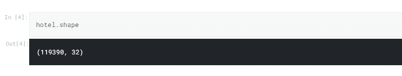

我们的数据集的维度是 119390 行和 32 列。

现在，让我们提取一些信息，比如每列中非空值的数量以及它们的数据类型

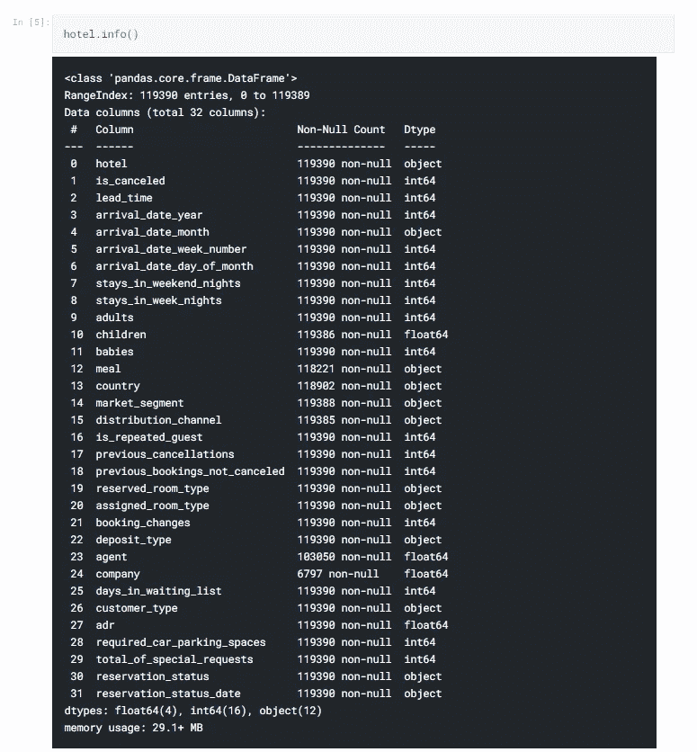

使用 pd.to_datetime 将对象数据类型“reservation_status_date”转换为 DateTime 数据类型

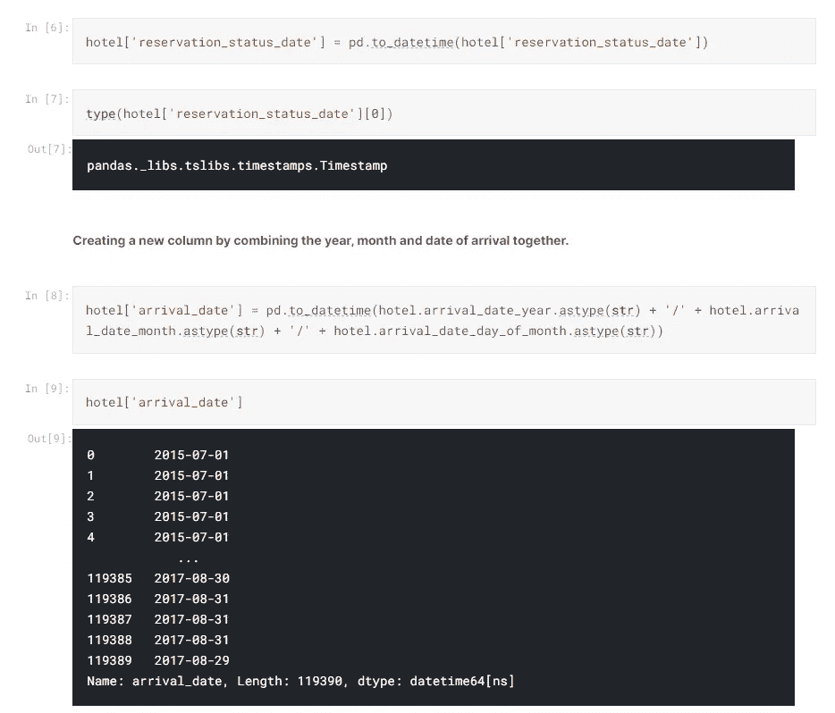

在上面的例子中，我们使用字符串连接合并了三列，即年、月和日，从而创建了一个新列。还将其数据类型转换为日期时间。现在，我们的数据集中总共有 33 列。

到目前为止，我们执行了基本的操作，如转换数据类型和管理列。

现在，让我们实际上对数据执行操作

**1)查找每一列中缺失值的数量**

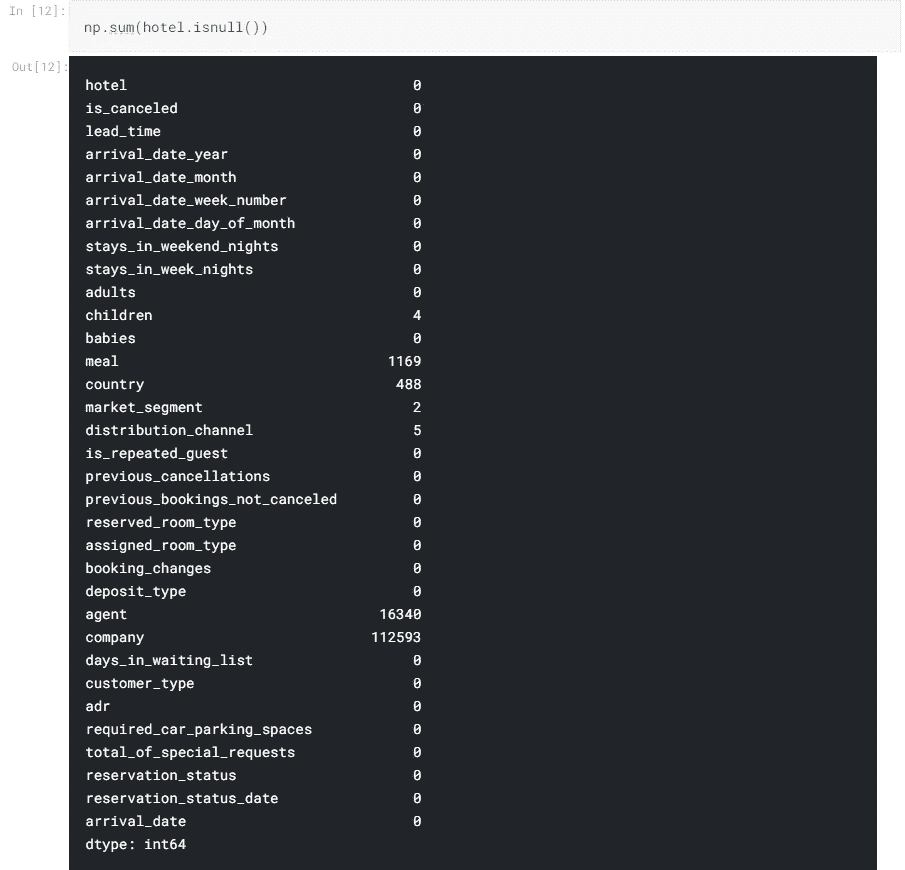

数据集包含 7 列空值。这些空值需要填充或省略(列消除/行消除)。

**2)查找缺失值的指标**

让我们查找 children 列的 4 个缺失值的索引。查找索引不会做太多的事情，但是在验证值是否被修改时会很有帮助。

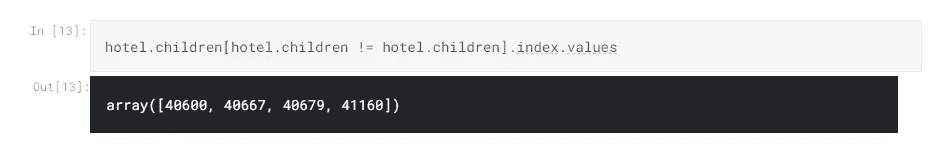

**3)移除不需要的列**

通常，如果一列中超过 70%的值缺失，并且没有办法填充缺失的值，则可以从数据集中完全删除该列。

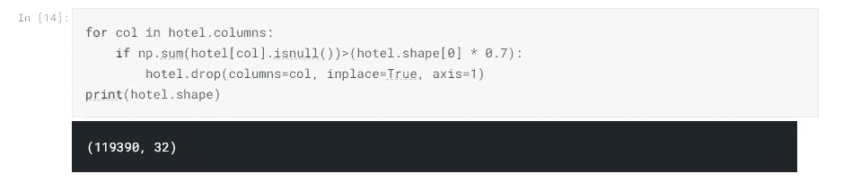

删除包含超过 10 万个缺失值的公司列。因此，此时列的总数是 32。

“到达日期周数”列是没有用的，因为我们已经有 3 列给出到达日期的年、月和日。此外，由于我们已经创建了一个显示日期的新列，我们不再需要 3 个单独的列。因此，让我们删除这些列

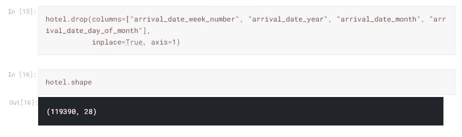

再删除 4 列后，此时列的总数为 28。

**4)删除不需要的行**

根据我们预测的值，我们可以删除整个代理 id 列，也可以删除包含空值的行。
我已经展示了如何删除列，让我们删除代理列中缺少值的所有行

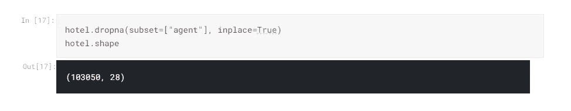

**5)填充栏的缺失值**

首先，让我们填充 children 列
,这里我使用 mean 作为一个值，用缺失的值替换。因为 mean 可以是 float 数据类型，所以我使用 floor 方法取了最小的整数

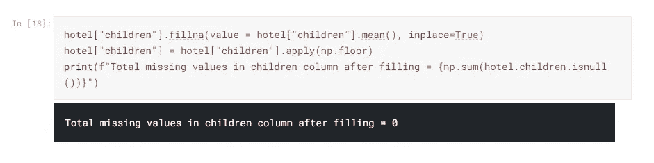

现在，让我们填写市场细分和分销渠道
,因为两者使用的填写方法相同，因为使用了循环

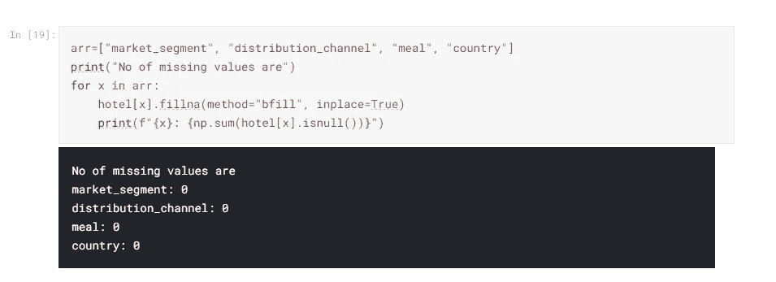

现在让我们检查我们的数据集是否没有空值。

是的，它是！😊

最后，我们有 103050 行和 28 列。

*我们做了一些列的修改，填充了缺失的值，减少了一些不需要的行，将一些数据类型更改为合适的类型，现在我们的数据非常干净，可以输入到我们的模型中了。*

感谢您的阅读！

编码快乐！！！😊