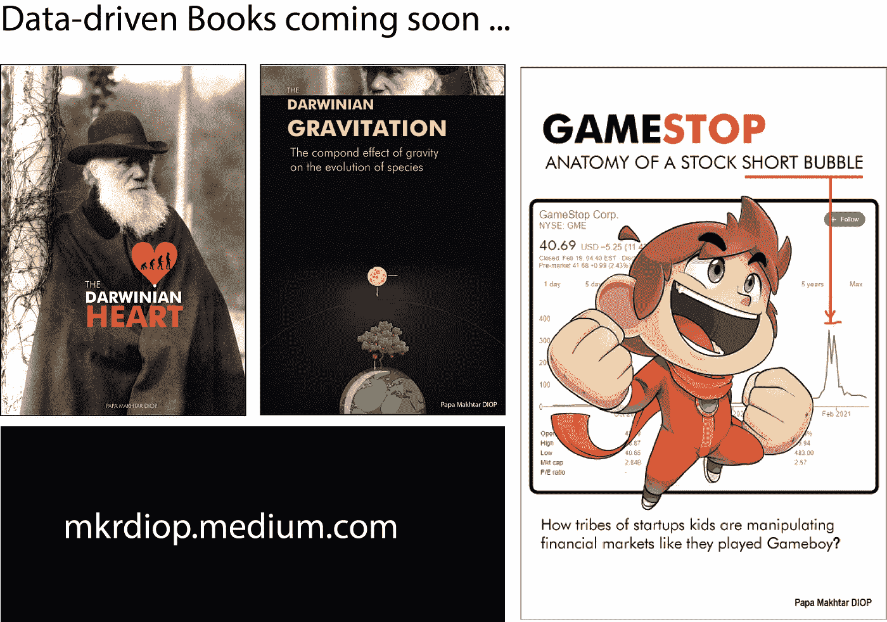
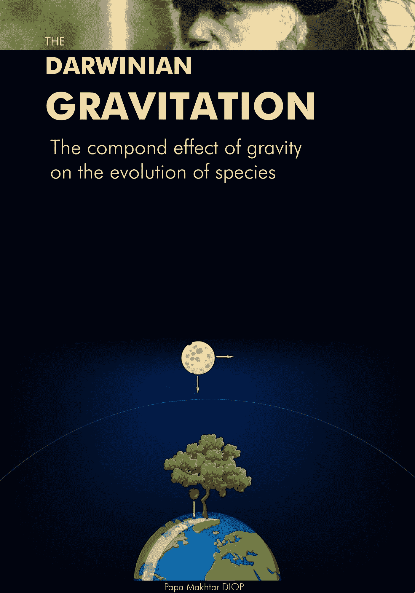

# 数据驱动的书籍

> 原文：<https://medium.com/nerd-for-tech/data-driven-books-f79472da715c?source=collection_archive---------17----------------------->

## 因为书籍的价值被低估了，尽管它们仍然越来越重要

Papa makhtar diop 的数据驱动书

D 数据驱动的营销，数据驱动的产品，数据驱动的创业，现在的数据驱动的书籍。

是的，关于数据带给我们的关键洞察力的书。既然我们已经收集了这么多关于我们、我们的行为和我们的环境的数据，是时候坐下来看看它们，理解它们在对我们说什么了。我们能从他们那里得到什么样的飞跃。是的，这些数据是我们从 globe.com、社交网络、脸书和推特开始利用所有这些社交网络收集的。计算社会科学现在有数据显示这个领域有多重要，它有助于关注认知科学和心理学，因为它是关于人类的社会行为。但是如果你对野生自然感兴趣，你也有所有这些由专业人类学家、博物学家、生物学家，甚至可以说是科学家收集的数据。当你忙于获得下一次点击或下一次销售时，所有这些数据都可供你使用，帮助我们更好地了解自己和我们的世界，而不是打断我们。数据的可用性是[我的书 Gamestop](https://mkrdiop.medium.com/sorry-because-i-did-not-keep-my-promise-5c403dc2c884) 的整整一章，剖析了股票泡沫，因为金融数据的可用性在一定程度上助长了这一事件。当然，看到一个理论并试图证明它不是一件容易的事情，如果你像我一样是一个没有资金支持的独立科学家，独自工作就更是如此。但产出值得挑战，认为在某个时间点，一个关心世界的机构可以追随和支持，这并不疯狂。处理数据和监测网络效应有财务和商业目标，但他们强调了需要做的科学工作，因为这个世界比另一个复制产品或服务更需要它，后者是成功的，因为它是由市场的[学生](https://mkrdiop.medium.com/students-of-the-markets-11698b4543d5)精心策划的。

因为我相信这仍然是唯一一种不需要团队就能成功的项目、公司或想法，但是有别人的支持也未尝不可。所以感谢阅读，因为这样做你也支持我和我的工作。

计算社会和金融科学最重要。

PS:请希望并祝愿我会出版这些数据驱动的书籍，因为达尔文的心脏和达尔文的万有引力对于我这样一个谦逊而简单的人来说是两个如此大的话题。

帕帕·马克塔·DIOP 的《达尔文的心》

帕帕·马克塔·DIOP 的《达尔文的心》