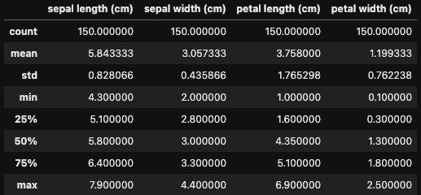
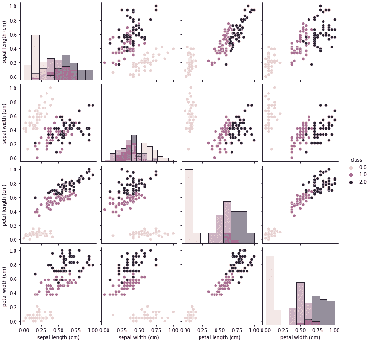
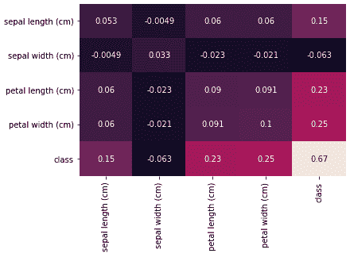
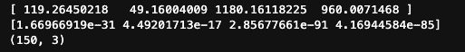
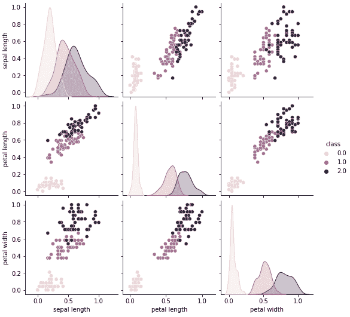
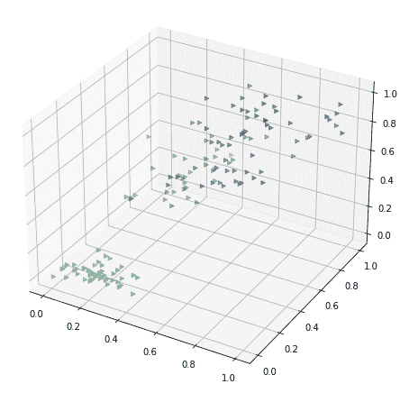
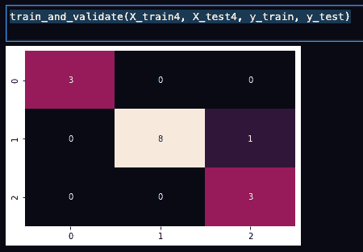
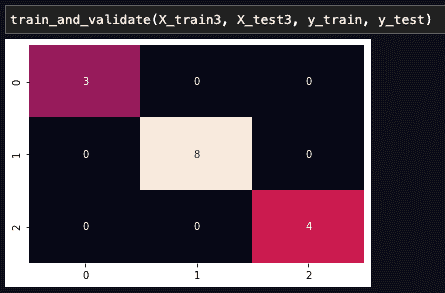

# 数据工程:Iris 数据集的特征选择示例

> 原文：<https://medium.com/nerd-for-tech/data-engineering-a-feature-selection-example-with-the-iris-dataset-11f0554e4b00?source=collection_archive---------2----------------------->

# 介绍

至于数据工程师和数据科学家成员的最佳比例，8:2 是一个非常普遍的比例。当然，没有固定的“最佳”比例，这完全取决于公司的设置、开发人员的可用性等。但是从这个比例中，我们可以大致看到工作量落在这两个类别上:数据工程与机器学习算法研究。事实上，更好的数据工程工作可以极大地有利于机器学习算法，并最终获得响应反馈和成本节约。

在这篇文章中，我们给出了一个演示来展示特征选择是如何使整个机器学习过程受益的。

以下内容仅限于监督、分类任务。该思想可以应用于其他类别机器学习任务，但是它们可能需要不同的数据工程和特征分析过程。

# 数据工程

从机器学习的角度来看，数据工程包括数据集收集、数据集清洗/转换、特征选择、特征转换。在这里，我们将重点放在特征选择上，以显示它如何有利于机器学习过程。

# 特征分析

在我们的例子中，我们使用了著名的 iris 数据集。它是结构良好的，干净的，平衡的。

```
from sklearn import datasets

# load data to dict derived class Bunch
iris = datasets.load_iris()
target = datasets.load_iris().target

# convert to dataframe for processing 
iris = pd.DataFrame(iris.data, columns = iris.feature_names)
```

以确保数据平衡。在我们的例子中，每个类都有同样的 50 个样本。

```
import seaborn as snsplt.hist(target)
```


检查它的最小值、最大值和其他基本信息，以确保我们没有异常值

```
iris.describe()
```



现在，让我们将它规范化，并将特性与类的相关性可视化

```
#to normalize dataset, we use this handy MinMaxScaler
from sklearn.preprocessing import MinMaxScalerscaler = MinMaxScaler()
scaler.fit(iris)iris_norm=scaler.transform(iris)# visualizing features and target
iris_norm = pd.DataFrame(iris_norm, columns = iris.columns)
iris_norm_ = pd.DataFrame(np.hstack((iris_norm, target[:, np.newaxis])), columns = iris.columns.tolist() + ['class'])
sns.pairplot(iris_norm_, hue = 'class', diag_kind='hist')
```



正如我们所看到的，除了萼片宽度/萼片长度对之外，所有其他对都可以非常清楚地将 3 类分开。1 班和 2 班在图表中纠结。

此外，让我们检查它们在特性和类之间的相关性:

```
# manually verify the correlation among features and classes
iris_cov = iris_norm_.cov()
sns.heatmap(iris_cov, annot = True, cbar = False)
```



# 特征选择

理想情况下，我们想要一个 a)与类更相关，b)与其他特征不太相关的特征。a)是最重要的因素，因为完全不相关的话是无法贡献一个算法的。b)可以使过程更有效果，但这是超出本文的另一个话题。

从协方差热图中，我们可以看到“萼片宽度”与类别的相关性最小。这可以解释为什么类 1 和类 2 在上一节的 pairplot 图中纠缠在一起。

让我们用 sklearn SelectKBest 模型选出最好的 3 个特征。因为所有 4 个特征都是连续的，我们用 f 检验来做这个。我们的目标是移除“萼片宽度”功能。

```
from sklearn.feature_selection import SelectKBest, f_classifbestfeatures = SelectKBest(score_func=f_classif, k=3)
iris_trim = bestfeatures.fit_transform(iris_norm, target)print(bestfeatures.scores_)
print(bestfeatures.pvalues_)
print(iris_trim.shape)
```



如您所见，第二个要素得分最低，p 值最大。并且得到的数据集的形状是 150×3，则第二特征(萼片宽度)被移除。

让我们再看一遍配对图:



我们现在可以为这 3 个特征绘制一个 3D 图表，以获得更直观的视图。

```
from mpl_toolkits import mplot3d
fig = plt.figure(figsize=(8,8))
ax = plt.axes(projection='3d')
ax.scatter3D(iris_trim[:, 0], iris_trim[:, 1], iris_trim[:, 2], c = target, cmap='Accent', marker = '>')
```



# 确认

现在，让我们比较 4 个特征的情况和 3 个特征的情况。首先定义一个训练和验证函数，然后准备两个数据集。

```
def train_and_validate(X_train, X_test, y_train, y_test):
    mode = GaussianNB()    
    mode.fit(X_train, y_train);
    y_calc = mode.predict(X_test)
    y_prob = mode.predict_proba(X_test)
    #print(y_prob)
    mat = confusion_matrix(y_test, y_calc)
    sns.heatmap(mat.T, annot=True, cbar = False)X_train4, X_test4, y_train, y_test = train_test_split(iris_norm, target, test_size = 0.10, stratify = None, random_state=0)
X_train3, X_test3 = X_train4.drop(['sepal width (cm)'], axis=1), X_test4.drop(['sepal width (cm)'], axis=1)
```

运行并比较



正如我们所看到的，减少的特征集有一个更好的结果。在混淆矩阵中，3 特征数据集产生 100%的准确度，而 4 特征集模型遗漏了一个样本。

我更改了 random_state 以生成不同的数据集来重复这个过程，我可以看到 3 个要素的数据集表现得更好，或者至少与 4 个要素的数据集一样好。

# 结论

更好准备的数据集可以有益于机器学习过程。正确选择特征集不仅可以节省模型训练时间和存储空间，而且可以得到更准确的结果。