# 历史奥运数据集的数据探索

> 原文：<https://medium.com/nerd-for-tech/data-exploration-of-historical-olympics-dataset-2d50a7d0611d?source=collection_archive---------2----------------------->

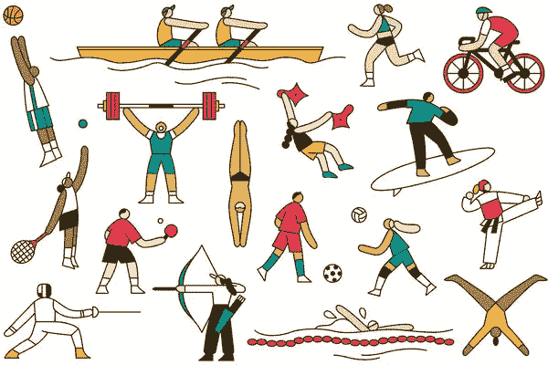

在这个笔记本中，我使用 python 来运行一些数据探索技术，以提供我查看数据集的视图。

这是现代奥运会的历史数据集，包括从 1896 年雅典奥运会到 2016 年里约奥运会的所有比赛。

请注意，直到 1992 年，冬季奥运会和夏季奥运会在同一年举行。从那以后，他们错开时间，这样冬季奥运会以四年为一个周期，从 1994 年开始，然后是 1996 年的夏天，然后是 1998 年的冬天，等等。

我主要对夏季奥运会进行分析

数据是 2018 年 5 月从[www.sports-reference.com](https://www.sports-reference.com/)刮来的。数据集也可以通过 [Kaggle](https://www.kaggle.com/heesoo37/120-years-of-olympic-history-athletes-and-results) 访问。

## 数据集内容

文件运动员 _ 事件. csv 包含 271116 行和 15 列；每一行对应一个参加奥运会单项比赛的运动员。这些列如下:

1.  ID——每位运动员的唯一号码
2.  姓名——运动员的姓名
3.  性——男或女
4.  年龄—整数
5.  高度—以厘米为单位
6.  重量—以千克为单位
7.  团队——团队名称
8.  NOC —国家奥林匹克委员会 3 个字母的代码
9.  游戏—年份和季节
10.  年份—整数
11.  季节——夏天或冬天
12.  城市—主办城市
13.  运动——运动
14.  事件—事件
15.  奖牌——金、银、铜或钠。

# 目录索引

1.  [导入数据集](#4e1f)
2.  [数据准备&清洗](#6f4e)
3.  [探索性分析和可视化](#5722)
4.  [参加奥运会最多的国家](#aa81)
5.  [年龄分布](#ab33)
6.  [性别分布](#f928)
7.  [跨季节参与者](#bf41)
8.  [提问和回答问题](#b358)
9.  Q1:在上届奥运会中，哪个国家获得了最多的金牌？
10.  Q2:每年赢得奖牌最多的国家是哪几个？
11.  问:为国家赢得最多奥运奖牌的前 10 名个人是谁？
12.  [Q4:基于年龄、身高和体重的奖牌分布？](#f7ff)
13.  问 5:女性参加奥运会？
14.  [50 岁以上个人获得奖牌](#c4f9)
15.  [推论和结论](#62a6)
16.  [参考资料和未来工作](#525c)

# 导入数据集

我使用库 Opendatasets 下载了数据集，如下所示

让我们来阅读熊猫数据框架中的数据

让我们检查一下数据集的大小

# 数据准备和清理

因为年龄、身高、体重都是数字列。用零代替这些值。
对于奖牌，我将用 None 替换 NaN 值
也将年龄字段转换为整数

# 探索性分析和可视化

在我们就奥运数据集提问之前，了解参与者的人口统计数据，如国家、年龄、性别等，会有所帮助。有必要探究这些变量，以了解参与者在全球体育界的代表性。

## 参加奥运会最多的国家

我使用 seaborn 库来构建可视化

由于美国历史上赢得了最多的奖牌，所以美国的参与度最高是有道理的。令人惊讶的是，前 10 名国家中没有苏联。

## 年龄分布

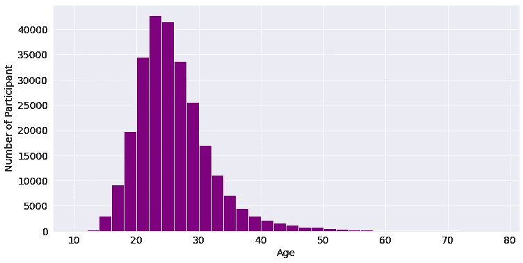

从上面的分布中，我们观察到最大的参与者年龄在 22-26 岁之间，这是有意义的，因为年龄越小的人在积极的运动中表现越好。

## 性别分布

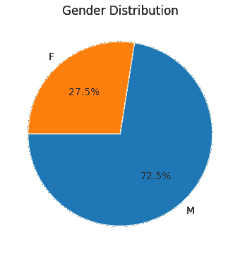

男性似乎在参与方面占主导地位。让我们检查一下 1900 年至 2016 年的女性参与者

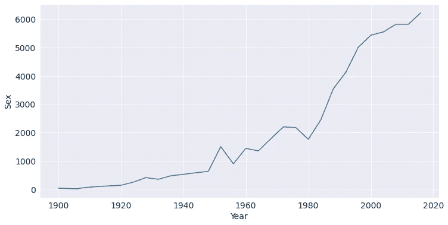

多年来女性的参与情况

尽管女性的参与率为 27.5%，但如上所示，这一比例在过去几年中有了显著提高

## 不同季节的参与者

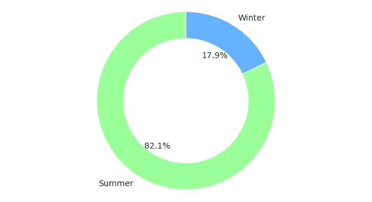

发现跨季节参与的人

为什么冬奥会的参赛人数少，让我们试着探索冬奥会和夏奥会的运动项目

根据上述数据，夏季奥运会有 52 个项目和 651 个比赛项目，冬季奥运会有 17 个项目和 119 个比赛项目。因此我们有更多的人参加夏季奥运会

# 提问和回答问题

我们已经对奥运会的参与者有了一些了解。让我们提出一些具体的问题，并尝试使用数据框操作和可视化来回答这些问题。

## 问:在上届奥运会中，哪些国家获得了最多的金牌

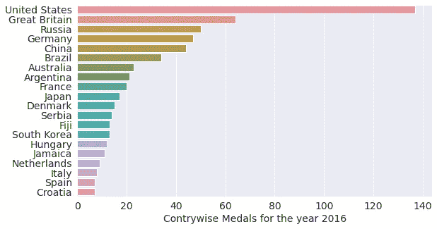

美国似乎在 2016 年上届奥运会的金牌榜上领先。我很想知道哪项运动获得的金牌最多。

似乎游泳为我们赢得了最多的金牌。下面是相同的可视化表示。

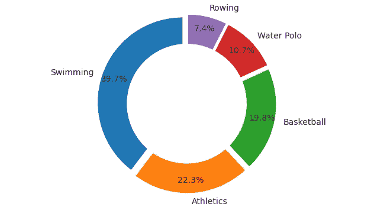

前五大运动项目中奖牌分布最多

## 问:每年赢得最多奖牌的国家有哪些？

以下是我们从上述图片中获得的见解

*   美国似乎已经赢得了最多的奖牌。
*   苏联似乎在奥运会上赢得了最多的奖牌。
*   苏联联盟的最大获胜方差
*   德国、瑞典、英国和希腊曾经获得过最多的奖牌

## 问:为国家赢得最多奥运奖牌的前 10 名选手

迈克尔·弗雷德·菲尔普斯

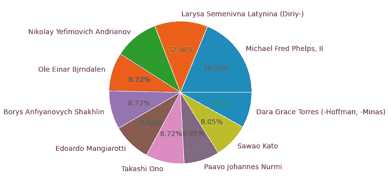

## 问:奖牌分布基于年龄、身高和体重

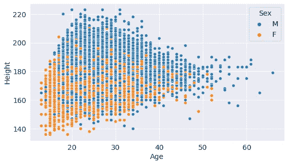

一个有趣的现象是，身高不到 140，年龄不到 20 岁的运动员也能在奥运会上获得奖牌。让我们看看他们在哪个项目上争夺奖牌

很明显，身高和年龄较低的运动员似乎在体操方面表现出色

# 年龄和体重

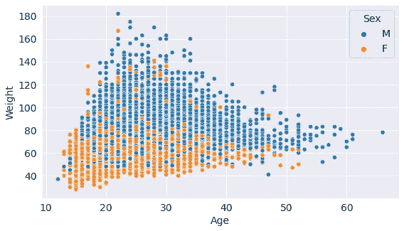

让我们看看体重高的奖牌获得者和体重低的奖牌获得者

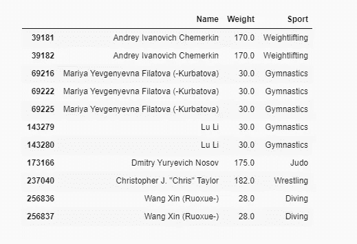

# 身高和体重

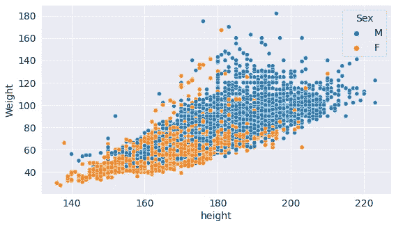

让我们评价一下体重高的运动员

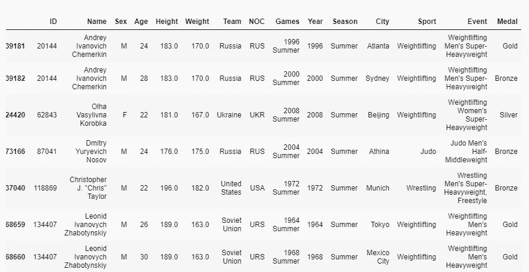

据我观察，大多数这类运动是摔跤、举重和柔道

## 问:女性参加奥运会

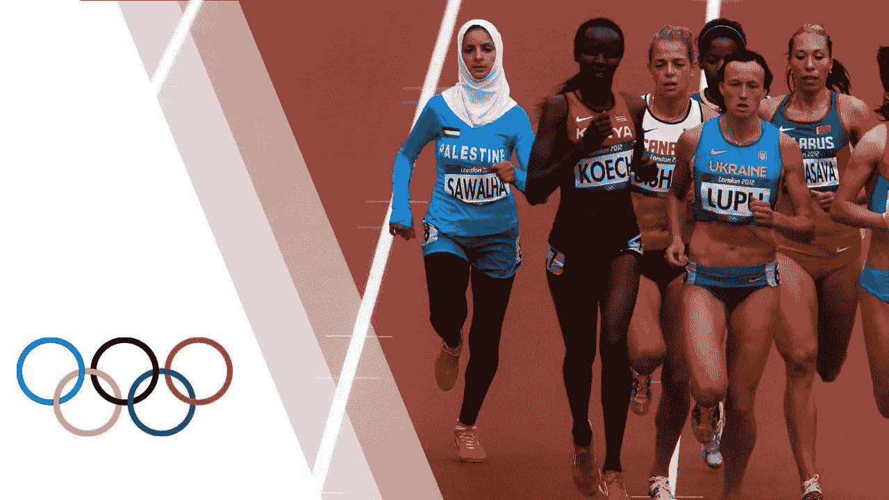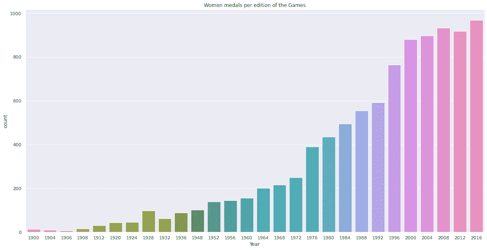

正如我们看到的趋势，妇女的参与在过去几年中平均一直在增加

## 50 岁以上个人获得奖章

50 岁以上的人一直在从事马术、射击、帆船、艺术比赛和射箭。这些运动似乎需要更多的精神力量，然后是体力。

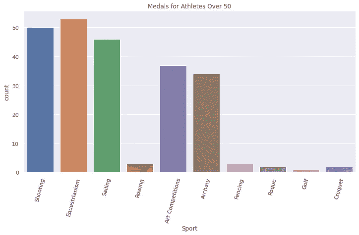

# 推论和结论

我们从调查中得出了许多推论。以下是其中一些的摘要:

*   美国似乎在最大的金牌参与和游戏的整体参与方面占优势。
*   我们观察从 12 岁到 58 岁的运动员赢得奖牌。
*   与冬季奥运会相比，夏季奥运会有更多的项目和运动。
*   在 120 年的奥运会历史中，迈克尔·弗雷德·菲尔普斯二世为他的国家赢得了最多的奖牌，也就是 28 枚
*   我们看到女性参与者逐年上升的趋势。
*   参与高重量(如> 150)似乎在摔跤，举重和柔道做得很好。

# 参考

查看以下资源，了解有关本笔记本中使用的数据集和工具的更多信息:

*   120 年奥运历史:[https://www . ka ggle . com/hee soo 37/120 年奥运历史-运动员与成绩](https://www.kaggle.com/heesoo37/120-years-of-olympic-history-athletes-and-results)
*   熊猫用户指南:【https://pandas.pydata.org/docs/user_guide/index.html 
*   Matplotlib 用户指南:【https://matplotlib.org/3.3.1/users/index.html 
*   Seaborn 用户指南&教程:[https://seaborn.pydata.org/tutorial.html](https://seaborn.pydata.org/tutorial.html)
*   opendatasets Python 库:[https://github.com/JovianML/opendatasets](https://github.com/JovianML/opendatasets)

整个笔记本可以通过访问[。我要感谢](https://jovian.ai/hargurjeet/olympics-dataset-analysis) [Aakash N S](https://medium.com/u/ca6fe690e934?source=post_page-----2d50a7d0611d--------------------------------) 和@Jovian 社区提供了从零到熊猫课程的所有必要培训。

我真的希望你们能从这篇文章中学到一些东西。随意👏如果你喜欢它的内容。这让我保持动力。

感谢您阅读帖子。快乐学习😃