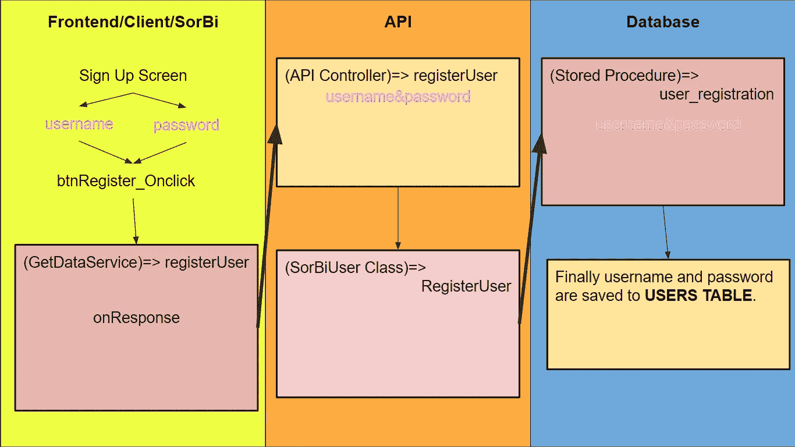
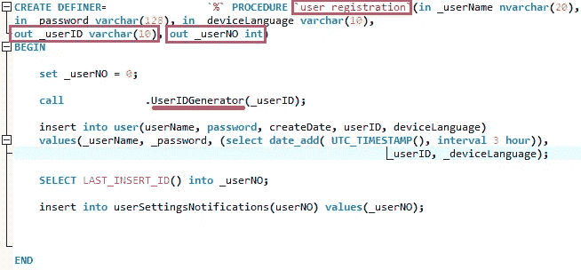
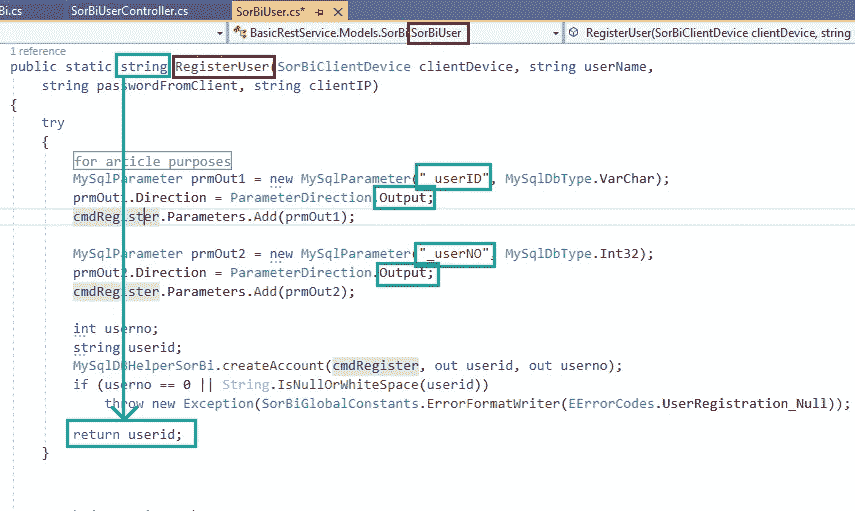
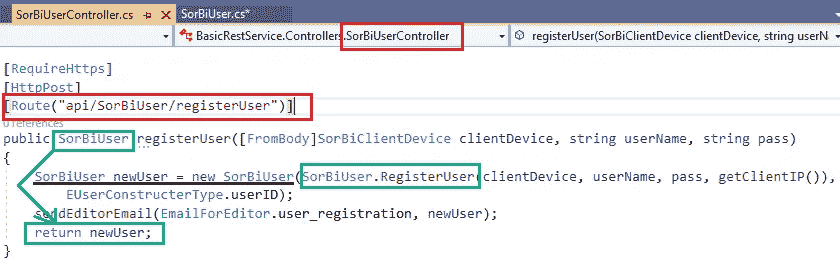
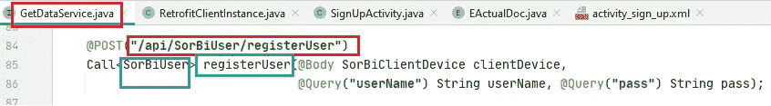
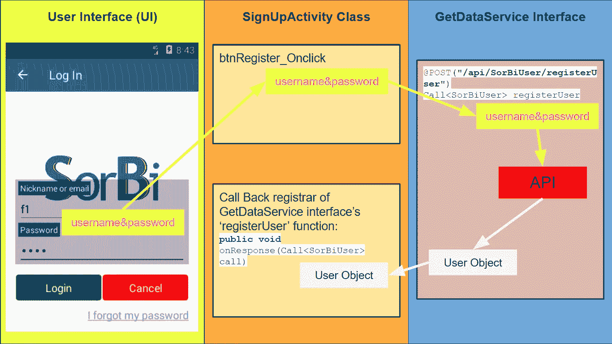
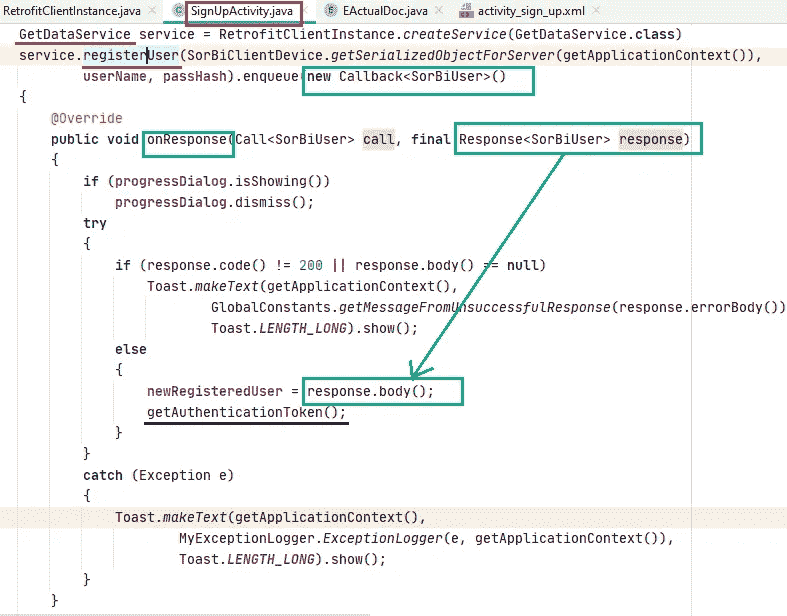
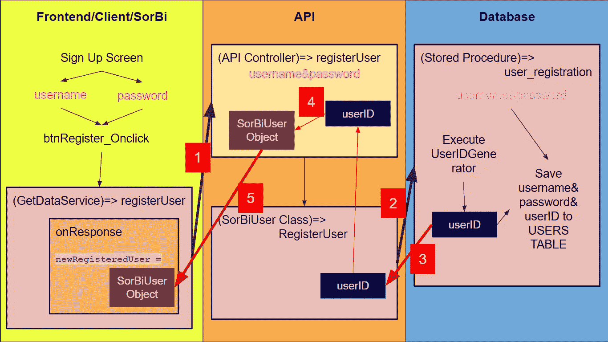

# 从后端到前端的数据流/[测试文章系列第 5 部分中的软件开发工程师]

> 原文：<https://medium.com/nerd-for-tech/data-flow-from-backend-to-frontend-software-developer-in-test-article-series-part-5-f4c68e907609?source=collection_archive---------0----------------------->

这是我的“如何成为一名测试中的软件开发工程师”文章系列的第五篇文章。所有这些文章都是以问答的形式写的。正如我从我的一些菲律宾朋友那里了解到的，这个方法是苏格拉底为了更好地解释事物而发明的。因此，我希望技术和非技术的家伙将受益于这些文章。

你可以在这里找到第一条****第二条 [**这里**](https://kicchi.medium.com/agile-methodology-and-scrum-framework-software-developer-in-test-article-series-part-2-af5f2dd3e6ac) ，第三条 [**这里**](https://kicchi.medium.com/evaluation-from-requirement-to-user-story-software-developer-in-test-article-series-part-3-4602ff86959f) ，第四条 [**这里**](https://kicchi.medium.com/flow-between-frontend-and-backend-software-developer-in-test-article-series-part-4-8a8d6db27e10) 。强烈建议在这篇之前先看前面的文章。****

****由于我已经做了 11 年多的软件开发人员，我将提供一些真实的和可行的示例代码。这些代码样本源自移动应用程序、桌面应用程序、web 应用程序、web 服务以及各种数据库过程。****

****为了更好地说明问题，Q 女士和索比作为例子在我的文章中大量使用。****

*******女士 Q:*** 一位女商人，也是索比 app 的客户。她付钱给一家软件开发公司开发索比应用程序。****

*******索比:*** 一款用于创建和分享民调的 android 应用。在本系列文章中，以 SorBi 为例。这款应用可在 [**Google Play**](https://play.google.com/store/apps/details?id=com.lespania.sorbi) 上下载，支持英语和土耳其语。****

****让我们享受学习令人兴奋的数据数据流步骤吧！****

> ****问**问题:**在之前的会话中，我们从用户界面跟踪用户名和密码数据到它们的最终目的地；数据库。这是一个从前端到后端的数据流示例。这太令人兴奋了。因为，正如我看到的，有步骤检查数据的**数据一致性**和**系统兼容性**。反向流动有类似的步骤吗？****

******回答:**正如您所说，我们跟踪从 SorBi 用户界面到 MySql 数据库的数据。逆向流，我的意思是从数据库中检索数据，发送到客户端(SorBi app)最后在用户界面上显示数据有类似的步骤。然而这一次，出于数据方便的考虑，我们没有处理数据，但我们以某种方式将它们解释为**用户友好的格式**。****

****下图总结了从前端到后端的用户名和密码数据流，正如我们在上一节课中所做的那样:****

********

****从前端到后端的数据流图****

****一旦在 SorBi 应用程序中创建了一个用户帐户(正如我们在 [**之前的会话**](https://kicchi.medium.com/flow-between-frontend-and-backend-software-developer-in-test-article-series-part-4-8a8d6db27e10) 中所做的)，后端会立即将新用户的信息发送到前端。在本次会议中，我们将跟踪用户信息。****

****P请关注步骤****

# ****检查服务器端/应用程序编程接口(API)/后端****

****让我们从索比数据库开始。SorBi 数据库是一个 MySQL 数据库。如上图所示，我们执行的最后一步是名为“ **user_registration** ”的 MySQL 存储过程。****

********

****MySQL 数据库中的“user_registration”存储过程****

****上图向我们展示了存储过程(一种函数)“user_registration”。粉色矩形表示 **_userID** 和 _userNO 变量是 out 参数类型。这意味着这些参数将被发送给调用“user_registration”的代码。 **UserIDGenerator** (红线所指)为当前注册用户生成一个新的 userID。****

# ****K **EEP 跟踪由 UserIDGenerator 生成的 **userID** 的**。****

> ******问:**所以，按照我的理解，我们把用户名和密码发送到数据库保存，数据库为当前注册的用户生成一个 userID。我们将如何处理这个用户标识呢？****

******答:**这个用户标识对于每个会员来说都是唯一的。我们将有机会用那个用户标识来识别一个注册用户。此外，我们将**将**大量数据链接到具有该用户 ID 的 SorBi 成员。例如，如果一个用户名为 f1 的用户投票，我们会将该投票的 **pollID** 链接到 f1 的 **userID** 。因此，当轮询时间结束时，SorBi 系统将发送**通知**给 f1，通知他/她轮询的结果。****

> ******问:**我明白了。在**生成 userID** 之后，很可能接下来的动作就是发送给 API，不是吗？****

******答:**生成 userID 后，如上图所示，userID 会存储在 _userID 参数中。此参数的类型已过时。这意味着这个参数将被发送给调用的 **API** 函数。让我们在**调用**这个存储过程的 API 方法中找到 **out 类型的**变量。****

****如第一个图所示，调用“user_registration”存储过程的 API 方法是 SorBiUser 类的' **RegisterUser** 函数。该功能解释如下:****

********

****SorBiUser 类的“RegisterUser”函数****

****如您所见，绿色矩形表示 **_userID** 和 _userNO 参数是传递给数据库的“user_registration”存储过程的 out 类型参数。执行“user_registration”数据库存储过程后，新生成的 _userID 返回到 API 的 RegisterUser 函数底部用蓝色矩形指向的“ **userid** ”局部变量。最后，这个“userid”局部变量具有新注册用户的 userid 值。****

****正如你看到的蓝色矩形，RegisterUser 函数的**返回类型**是“string”，所以在最下面一行是**返回** " **userid** 局部变量给调用函数。****

> ****问:“注册”、“用户”和“用户标识”这三个词有很多不同的组合。它有目的吗？****

******答:**实际上，**链接**一个应用的所有三个层次(数据库、web 服务、前端)的变量和过程是最重要的。****

****我的意思是，例如，我们将(RegisterUser' API 函数的)“userID”局部变量与(MySQL 数据库存储过程的)“user_registration”的“_ userID”(out type)参数相链接。正如你所看到的，变量名是不同的(_userID & userid)，但是它们的**数据类型是相同的**，并且它们都是**相互链接**。此外，API 函数名和数据库存储过程名是不同的(register user&user _ registration ),但是我们从一个内部调用另一个。我们没有义务使这些名称相同。****

****另一方面，在某些情况下，你给某些类和变量取了完全相同的名字。但是到目前为止，我们可以自由地为我们的变量和函数使用不同的名字，只要它们有意义。****

> ****问:如果我们回到我们的例子，最后我们处理了 SorBiUser 类的 RegisterUser 函数。下一步是什么？哪个函数**正在调用**这个 RegisterUser 函数？****

******答:**这个 RegisterUser 函数是从名为 SorBiUserController 的 API 控制器中调用的**。SorBiUserController 的" **registerUser** "函数是**调用方法**。这种方法解释如下:******

****

**SorBiUserController 的“registerUser”功能**

**这个“registerUser”函数调用 SorBiUser 类的 RegisterUser 函数，就像我们看到的蓝色矩形一样。我们知道 RegisterUser 函数返回新注册用户的 id (userid)。这个“registerUser”函数使用那个**返回的 userid** 作为 SorBiUser 类的构造函数参数，以便**创建一个用户对象**，如黑线所示。在创建了新注册的用户对象(该对象包含新注册的用户信息)之后，该 API 控制器函数“register user”**将该对象返回给请求客户端**，因为它用绿色矩形表示。**

# **检查客户端/图形用户界面(GUI)/前端**

> ****问:**正如我从图中看到的，这三层的人员都以某种方式**与**相互联系在一起。不管你是从后端还是前端开始跟踪，如果你正确地跟踪链接**节点**，你就能明白发生了什么。客户端呢，我是说索比 app？**

****答:**正如我们在第一个数据流图上看到的，客户端通过 GetDataService 接口发送 API 调用。这个接口是客户端和 API (Web 服务)之间的桥梁。对于我们当前的示例，客户端正在使用 GetDataService 接口的" **registerUser** "函数，如下图所示。**

****

**GetDataService 接口和 registerUser API 调用**

**正如我们在蓝色矩形中看到的，这个“register user”**API 调用**有一个作为 SorBiUser 对象的**返回类型。****

> ****问:**SorBiUser 对象和我们从 API 返回的对象是同一个对象吗？**

****答:**正是。如你所说，这是客户端和 API 之间的一种**链接**。请记住，我们正在从 API 返回新创建的 SorBiUser 对象。这个用户对象将被那个“register user”API 调用的**回调注册器**捕获和处理。**

> ****问:**坚持住！什么是回拨和回拨注册商？**

****A:** 回调函数是作为参数传递给其他代码的任何可执行代码；其他代码应该在给定的时间或完成分配的任务时回调参数。**

**回调注册器是回调函数的一个**实现**。**

**该 API 调用的回调注册器在 SorBi Android 应用程序的 SignUpActivity 类中。让我们检查一下:**

****

**用户注册的前端步骤**

**下图显示了 GetDataService 的“register user”API 调用的回调注册器的实现:**

****

**GetDataService 的“register user”API 调用的回调注册器**

**正如你看到的蓝色矩形，我们正在注册一个回调函数来处理返回的 SorBiUser 对象。这个' **onResponse** '回调实现方法**将在 API 为我们的 API 调用**返回时执行(在我们的例子中是 GetDataService 接口的' registerUser' API 调用)。**

**“onResponse”方法有一个名为“ **response** ”的 SorBiUser 对象类型参数。正如您看到的绿色矩形，这个响应对象的主体(从 API 返回的 SorBiUser 对象)被分配给名为' **newRegisteredUser** '的类范围变量。之后，正如我们看到的黑线所示，应用程序将调用'**getAuthenticationToken()**'来验证用户的身份，以便将来执行特定于成员的操作。**

**下图显示了流程开始时的所有步骤:**

****

**前端和后端之间的数据流**

**黑线显示用户名和密码从前端到后端的数据流。红线显示了从后端到前端的 userID 和 SorBiUser 对象数据流。**

1.  **用户名和密码从 SorBi 发送到 API**
2.  **用户名和密码从 API 发送到数据库**
3.  **新生成的用户标识从数据库发送到 API**
4.  **在 API 中，使用新生成的 userID 创建了一个 SorBiUser 对象。该对象保存新注册用户的数据。**
5.  **SorBiUser 对象被发送到 SorBi Android 应用程序。“onResponse”方法捕获返回的 SorBiUser 对象，并将其赋给变量 newRegisteredUser。**

> ****问:**最后，我们有了客户端的 SorBiUser 对象。那么拥有这个物体的目的是什么呢？实际上什么是 SorBiUser 对象？**

****答:**🤭你为什么等了这么久才问这些问题？**

**SorBiUser 对象是 SorBiUser 类的一个实例。简而言之，它保存用户相关的数据。我们将在整个 SorBi Android 应用程序中使用该对象。索比 app 有很多**会员相关的**动作。因此，与登录用户相关的 SorBiUser 对象对于应用完整性、应用安全性、用户体验和应用维护至关重要。**

> ****问:**在本次会议开始时，你提到了一个术语“**用户友好格式**”。你这话是什么意思？**

**现在，我们有了一个来自 API 的 SorBiUser 对象。该对象有一些类似的字段和值:**

> **" userID": "45prfg78bf45548f "**
> 
> **"创建日期":" 2021–07–23t 18:25:43.511 z "**
> 
> **"用户名":" f1 "**
> 
> **" avatarFile": "hr647djkf "**

**例如，用户正在使用土耳其语。在这种情况下，我们必须以土耳其**文化**格式显示日期。上面的示例包括格式不同于土耳其文化的“createDate”字段。所以我们将其更改为类似“23.07.2021 21:25”的土耳其文化格式。**

**例如，有一个名为“avatarFile”的字段。正如我们看到的，它只是一个字符串类型的数据。用户与那些无意义的数据无关。但是 SorBi 应用程序背后的代码使用该数据从 SorBi 应用程序的文件服务器获取用户的头像，并将其加载到相关的图像视图中。**

**所有这些都是为了将数据转换成“用户友好的格式”。**

> ****问:**现在我对整个前端和后端数据交换的逻辑完全满意。实际上它是很重的东西，不是吗？**

****答:**我们检查了三层；前端，API，后端。前端在 Android Studio 中用 Java 编码。API 在 Visual Studio 用 c#编码，数据库是 MySQL 实例。**

**我们检查了**

*   **三个不同的层次，**
*   **三种不同的软件语言，**
*   **三种不同的开发环境，**
*   **以及它们之间的相互联系。**

**所以，正如你所说，这是一个沉重的会议。但是，无论如何，我们不能再回避这个东西了。放轻松。在未来的会议中再见。👋**