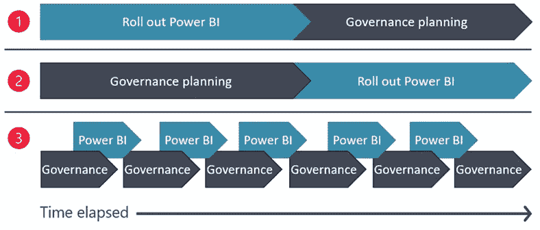

# 数据治理

> 原文：<https://medium.com/nerd-for-tech/data-governance-b8458cfa33a0?source=collection_archive---------6----------------------->

亨特·哈里特在 [Unsplash](https://unsplash.com?utm_source=medium&utm_medium=referral) 上的照片

数据治理是我们许多人谈论的学科之一，但这很难具体定义，因为它涵盖了我们与数据关系的许多方面，我想说是所有方面。然而，这是那些通常不被注意的方面之一，我们没有给予太多的关注，尽管欧盟似乎愿意监管什么，哦，令人惊讶的是，因此它遵循 2020 年 11 月的“数据治理法案”，你可以在这里查阅[，该法案旨在试图增加数据中介之间的信任，以加强欧盟内部的交换机制，具体针对以下情况:](https://eur-lex.europa.eu/legal-content/EN/TXT/HTML/?uri=CELEX:52020PC0767)

*   公共部门数据的传输
*   公司之间交换数据以换取报酬
*   将个人数据转移给中介，以帮助个人行使 GDPR 授予的权利
*   出于利他目的的数据传输

事实是，我对如此多的立法感到厌倦，特别是当它混淆术语时，因为我已经命名了特定的情况，以反映该法律面向数据交换的治理，但这并不意味着如果我们的场景不是与邻居共享数据，我们就不必担心它。

## 那么，什么是数据治理呢？

出现在 [DAMA-DMBOK](https://www.dama.org/cpages/body-of-knowledge) 中的正式定义称，数据治理被定义为对数据资产的管理行使权力和控制(规划、监控和遵从)。也就是说，基本上，正如我所说的，所有这些任务都与数据本身的开发没有直接关系，但是“围绕”着数据。似乎合乎逻辑的是，如果我们在谈论基于我们的数据的战略和商业决策，我们就有对它们的控制和监测机制。但是，当涉及到定义确保良好数据治理所必需的程序和技术时，有不同的方法，在这一点上，我倾向于选择由 [Robert S. Seiner](https://www.linkedin.com/in/robert-s-seiner-445313/) 定义的方法，即在他的[同名著作](https://www.amazon.es/Non-Invasive-Data-Governance-Resistance-Greatest/dp/1935504851)中反映的“非侵入式数据治理”。基本上，它描述了一个基于二维矩阵的理论框架，该框架反映了数据治理的所有关键概念，并允许我们在较高层次上展示成功实施我们的数据治理战略的关键标准。

该矩阵一方面基于公司的组织级别(分为五个级别)，另一方面基于我们数据平台的组件(分为六个组件)，您可以在这里看到一个示例。在矩阵中以这种方式跨越它们，我们可以清楚地看到每一级的责任，我们可以更精确地集中我们的努力。

## 我可以用什么工具来实现它？

从一开始，我们必须更多地考虑程序和顺序，而不是具体的工具，尽管在这个过程中有一些工具会帮助我们。例如，如果我们考虑 Power BI 架构，我建议您在采用路线图中查看 [Governance Power BI 采用路线图:Governance—Power BI | Microsoft Docs](https://docs.microsoft.com/en-us/power-bi/guidance/powerbi-adoption-roadmap-governance)在那里，您会看到与 Seiner 指南密切相关的一些方面，涉及角色和组件，此外，您还会看到实现它的三个不同选项，如下图所示:

每种方法都有其优缺点，首先取决于您的组织是否已经部署了 Power BI，以及您是否已经在所有级别完成了部署。但是从我的角度来看，实现数据治理策略时最关键的方面是决定我们将数据和内容(报告、KPI 等)的所有权“放置”在哪里。)无论我们选择分布式系统(数据网格类型)还是集中式系统，这都将是问题的核心，因为这也将标志着我们在数据治理策略方面的必要努力。

**总结**。在你开始实现事情之前，我的建议是:
-决定谁将是数据和内容的所有者，也就是说，谁将定义要实现的业务规则，解释指标并维护它们的字典
-回顾 Seiner 框架，并绘制矩阵
-搜索你的工具来实现上述决定的选项