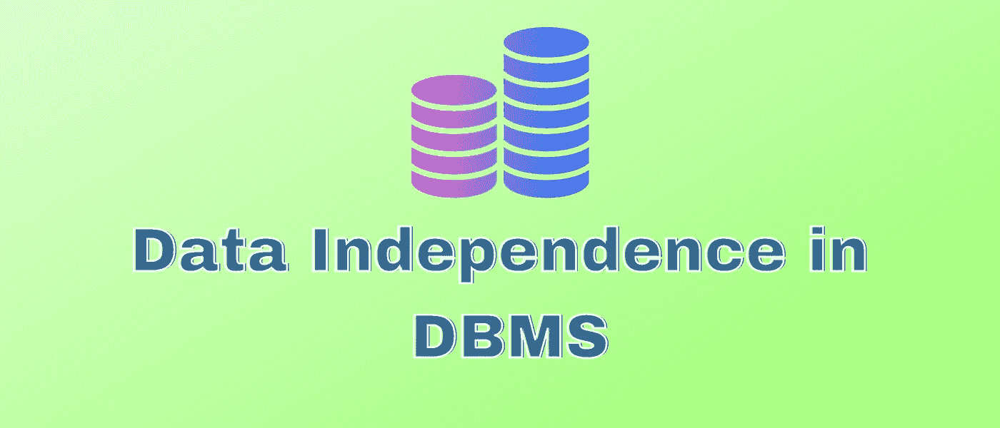
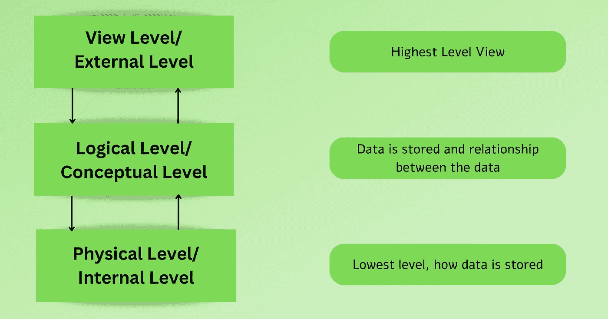
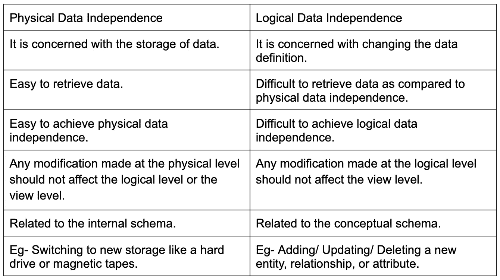

# 数据库管理系统中的数据独立性

> 原文：<https://medium.com/nerd-for-tech/data-independence-in-dbms-6c0b3b98f79?source=collection_archive---------3----------------------->

# **概述**

DBMS 中的数据独立性是在数据库管理系统的一个层次上改变模式而不影响其上一层的能力。

我们可以更改一个级别的数据，但是它不应该影响另一个级别的数据。数据更改不会影响下一个更高级别的数据结构或访问方法。

DBMS 中的数据独立性也称为数据抽象。DBMS 中有两种类型的数据独立性——物理数据独立性和逻辑数据独立性。

# **范围**

*   本文讨论了数据库管理系统中数据独立性的概念。
*   将深入讨论数据独立性的类型。
*   将讨论数据独立性的需要和重要性。

# **简介**

[DBMS](https://www.scaler.com/topics/dbms/) 中的数据独立性是在数据库管理系统的一个层次上改变模式而不影响其上一层的能力。我们可以更改一个级别的数据，但是它不应该影响另一个级别的数据。

可以修改程序模式，而无需改变程序代码或为该代码重写的应用程序。数据在逻辑上和物理上都与程序分离。这是因为对数据的任何更改都不会影响程序的执行。

顾名思义，数据独立于程序或用户。DBMS 中的数据独立性也称为数据抽象。DBMS 中有两种类型的数据独立性——物理数据独立性和逻辑数据独立性。我们将在本文后面深入讨论这两种类型。

我们知道数据库是多层设计的。数据库设计遵循三层设计或三模式架构。通过这个体系结构，我们可以解释 DBMS 中数据独立性的概念。

当一个级别发生变化时，其他级别的数据应该不会受到影响。这节省了我们更改数据库所需的时间和成本。让我们先来理解 DBMS 中的[三模式架构](https://www.youtube.com/watch?v=vuXnRRG-m5M)

模式架构由三个层次组成——视图层、逻辑层和物理层，从上到下排列。

1.  **视图级别或外部级别** -外部级别或视图级别是最高级别。这个级别仅描述数据库的某些部分。术语“视图”与这个级别相关。它只向用户显示数据库中对他们来说必要和相关的部分。因此，在视图级别或外部级别，只向用户显示必要的部分。
2.  **逻辑层或概念层**——在逻辑层，**存储什么**数据以及数据之间的关系在这里描述。该数据库以复杂的实现方式和简单的结构来描述。
3.  **物理层或内部层**——这是数据库模式中最低或最底层。它用于定义**数据如何**存储在数据库中。在物理层或内部层，定义内部使用的数据结构。

下图说明了三架构体系结构。

顶级或最高级别是视图级别或外部级别。中间层是逻辑或概念层。最低层是物理层或内部层。

在我们进入下一部分之前，理解 DBMS 中数据独立性的需要是很重要的。数据库管理系统用于保存大量数据。它还存储用户输入的信息。

数据库管理系统由元数据组成，元数据包含有关数据的信息，以便于查找、检索和更新数据。但是，一旦存储了元数据，如果存储的数据是相互依赖的，那么更改数据就有点困难了。

为了解决这个问题，元数据按级别排列，以便在一个级别更新数据不会影响另一个级别。

# **数据独立性的类型**

DBMS 中有两种类型的数据独立性——物理数据独立性和逻辑数据独立性。让我们详细讨论这两种类型。

**物理数据独立性**——我们知道三模式架构中的最低层是物理层。物理数据独立性与物理级别有关。

数据库管理系统能够在物理层进行任何更改，而不会影响更高级别的模式。因此，在物理级别所做的任何修改都不应该影响逻辑级别或视图级别。很容易实现物理数据独立。

物理数据独立性是数据库管理系统在不改变概念模式的情况下改变内部模式的能力。它发生在逻辑接口层，将概念层与物理层分开。

要求物理数据独立，因为它-

*   允许用户逻辑地设计数据库。
*   允许我们在不影响概念映射的情况下修改物理设备。

**逻辑数据独立性**——我们知道三模式架构中的中间层是逻辑层。逻辑数据独立性与逻辑级别有关。数据库管理系统能够在逻辑级别进行任何更改，而不会影响更高级别的模式。

因此，在逻辑层所做的任何修改都不应该影响视图层。与物理数据独立性相比，实现逻辑数据独立性更加困难。它是在不改变外部视图或 [API](https://www.redhat.com/en/topics/api/what-are-application-programming-interfaces) 的情况下改变概念模式的能力。

需要逻辑数据独立性，因为它-

*   确保如果表被修改，数据不会受到影响。
*   吸收由于外部和概念级别之间的映射而进行的更改。

# **物理数据独立性变化的例子**

*   切换到新的存储设备，如硬盘或磁带。
*   数据库从一个驱动器到另一个驱动器的位置变化。(比如 c 盘转 D 盘)
*   修改文件组织技术。
*   改变内部技术，如哈希算法。
*   使用不同的数据结构。
*   更改使用的索引或访问方法。

# **逻辑数据独立性改变的例子**

*   将现有记录分成两个或多个。
*   将记录合并成一个记录。
*   添加/更新/删除新的实体、关系或属性。

# **物理和逻辑数据独立性的区别**

# **优点**

*   数据库管理变得简单而经济。
*   提高了数据的质量。
*   不需要在应用程序中改变[数据结构](https://www.techtarget.com/searchdatamanagement/definition/data-structure)。
*   易于在物理层面进行修改。

# **结论**

*   DBMS 中的数据独立性是在数据库管理系统的一个层次上改变模式而不影响其上一层的能力。
*   数据独立于程序或用户。DBMS 中的数据独立性也称为数据抽象。
*   DBMS 中有两种类型的数据独立性——物理数据独立性和逻辑数据独立性。
*   在物理数据独立性中，在物理层进行的任何修改都不应该影响逻辑层或视图层。
*   在逻辑数据独立性中，在逻辑层所做的任何修改都不应该影响视图层。
*   与逻辑数据独立性相比，更容易实现物理数据独立性。
*   一些优点包括-数据库管理变得容易和负担得起，数据质量得到提高，并且不需要改变应用程序中的数据结构。