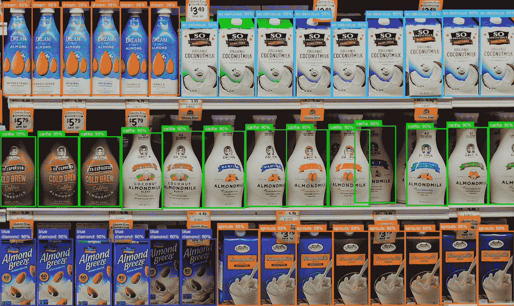

# 新零售中的数据标签案例研究——图像识别和标签

> 原文：<https://medium.com/nerd-for-tech/data-labeling-case-study-in-new-retail-image-recognition-and-labeling-53762cbd40b0?source=collection_archive---------4----------------------->

互联网时代，碎片化的消费行为让传统零售方式难以为继。新零售作为一种全新的零售解决方案，已经被广泛应用。

随着图像识别等 AI 技术的快速发展，新零售企业普遍实现了降本增效。高盛预测，到 2025 年，人工智能的应用将为零售业每年节省 540 亿美元的成本，并带来 410 亿美元的收入。

更多阅读:[什么是新零售？](https://tinyurl.com/5dcv5ucr)

## 视觉识别

目前新零售行业最流行的解决方案之一是“视觉识别解决方案”，以图像识别为技术核心，以摄像头为硬件核心，对目标商品进行检测和分类，实现自动识别，提升购物体验，同时节省人力成本。

这种解决方案离不开数据标签服务的支持。我们想分享一个新零售场景中产品展示检测的标签案例，以直观地展示具体的人工智能应用。

1.注释对象

商品/价格标签/前面缺货，后面有货/无商品出售

2.标签类型

图像 2D 框架

3.类别属性

标签 A(商品):标注所有类别的待售商品；

标签 B(价签标签):除空白价格外的所有标签；

标签 C(无商品出售):显示估计的短缺量。关于空的空间，根据价格标签的位置来想象物体的大小。

标签 D(前货架缺货，后面有货):前排商品已售出，后面有商品出售。将待售商品的空白处贴上标签。

4.各种物品的标签规则和标准

a.关于堆叠的产品，每一个都要贴上标签(比如方便面)；

b.关于扁平的产品，只需要标注最上面的(比如巧克力)；

c.判断依据:泄露的部分是否能确定是什么样的产品；

d.对于内外定位的产品，只需标注最外面的一个；

e.被遮盖的物体需要通过想象勾勒出它的完整尺寸；

# 结束

将您的数据标注任务外包给[字节桥](https://tinyurl.com/4syxz9ct)，您可以更便宜、更快速地获得高质量的 ML 训练数据集！

*   无需信用卡的免费试用:您可以快速获得样品结果，检查输出，并直接向我们的项目经理反馈。
*   100%人工验证
*   透明标准定价:[有明确定价](https://www.bytebridge.io/#/?module=price)(含人工成本)

为什么不试一试呢？