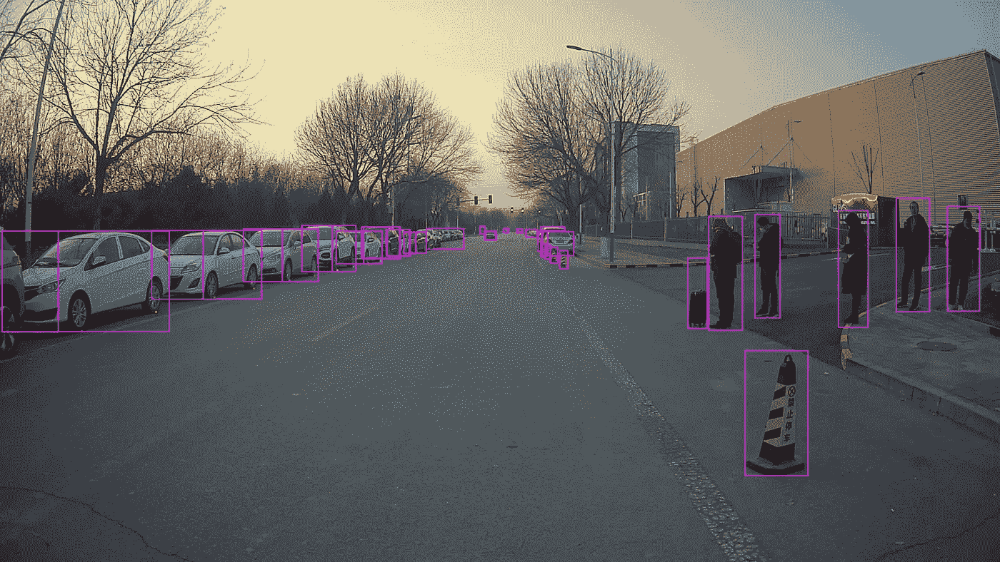

# 2021 年最佳数据标签公司

> 原文：<https://medium.com/nerd-for-tech/data-labeling-how-a-human-powered-data-labeling-platform-accelerates-ai-industrys-development-15f3421db831?source=collection_archive---------9----------------------->

## 新冠肺炎期间人工数据标签平台如何加速人工智能产业的发展

2019 年的新冠肺炎疫情扰乱了全球的日常生活。由于物理条件的限制，传统企业正在加强数字化转型和业务自动化的战略。

# **数据标注是一项简单但困难的任务**

标签化数据是 AI/ML 行业的核心。数据的**质量和数量**决定了人工智能模型的性能。结果表明，由 10 名贴标机和 3 名 QA 检查员组成的内部经验丰富的团队能够在 8 天内完成约 10，000 幅自动驾驶车道图像的贴标。

事实上，训练一个模型需要数万甚至数百万个无偏倚数据样本，这需要花费大量时间。

在困难时期，一些数据标签公司被迫转向在家工作的模式，这在沟通、数据质量和检查方面带来了挑战。

例如，谷歌云已经正式宣布其数据标签服务有限或不可用，直到另行通知。用户只能通过电子邮件请求数据标记任务，但不能通过云控制台、Google Cloud SDK 或 API 启动新的数据标记任务。

业内人士表示，数据标注是一项简单但困难的工作。一方面，一旦标签标准被设定，数据标签员只需要遵循原则和规则。另一方面，如果训练数据有偏差，算法模型不能很好地开发，AI 公司需要重新启动数据标注过程。时机很重要，一旦公司落后于进度，产品就可能被竞争对手超越。

根据 Alegion 发布的报告，大多数人工智能组织表示，训练人工智能的过程比预期更困难。数据规模和质量问题成为他们的主要障碍。

# 结束

将您的数据标注任务外包给[字节桥](https://tinyurl.com/4z9b6cjb)，您可以更便宜、更快速地获得高质量的 ML 训练数据集！

*   无需信用卡的免费试用:您可以快速获得样品结果，检查输出，并直接向我们的项目经理反馈。
*   100%人工验证
*   透明和标准定价:[有明确的定价](https://www.bytebridge.io/#/?module=price)(包含人工成本)

为什么不试一试呢？

**相关文章:**

1 [数据标注——如何选择数据标注公司](https://tinyurl.com/u32bv8jk)

2[2021 年机器学习数据标注公司](https://tinyurl.com/26ch6xfw)

3 [数据标注服务——如何为 ML 项目获取好的训练数据？](https://tinyurl.com/yxd5apwe)

4 [无偏向训练数据——机器学习的新瓶颈](https://tinyurl.com/3wv9knbw)

5 [数据标注服务及其关键优势——灵活性？](http://tinyurl.com/tys3gcfd)