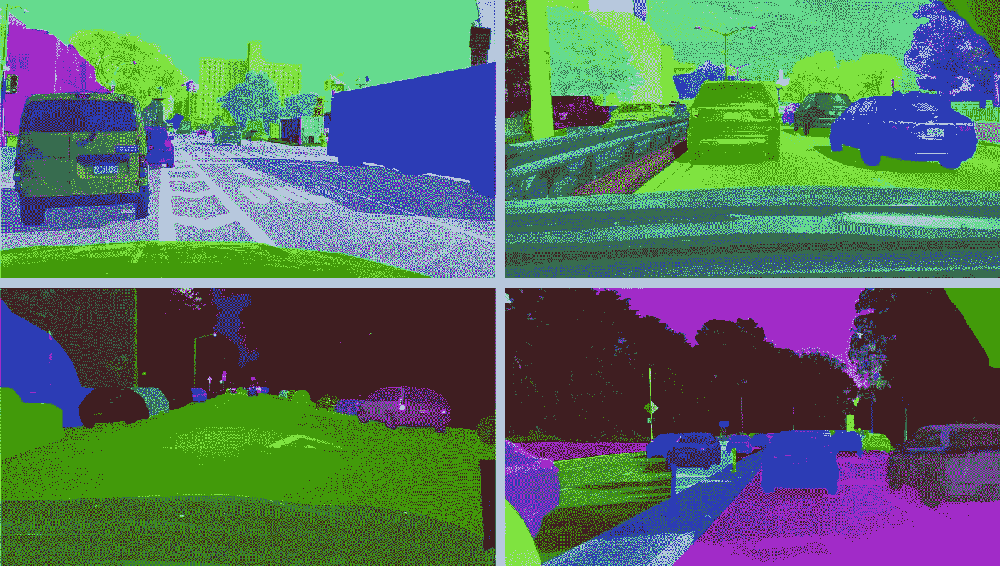

# 自动驾驶是如何通过机器学习实现的？

> 原文：<https://medium.com/nerd-for-tech/data-labeling-how-auto-driving-achieved-through-machine-learning-659d44b40082?source=collection_archive---------21----------------------->

## 有监督的深度学习需要大规模的标记数据

# 有监督的深度学习需要大规模的标记数据

自动驾驶的主流算法模型主要基于有监督的深度学习。它是一种算法模型，推导出已知变量和因变量之间的函数关系。需要大量的结构化标记数据来训练和调整模型。

# 自动驾驶中的标签类型

自动驾驶中常见的标注类型通常包括 2D 包围盒、3D 包围盒、多边形、图像分割、视频标注、3D 点云标注等。其中图像语义分割被广泛应用。

从概念上讲，图像语义分割是计算机视觉中一种重要的标注类型。包括[图像分类](https://tinyurl.com/48w576p7)，目标检测，图像分割，像素级主分割。

## **图像分割**

[**语义分割**](https://tinyurl.com/48w576p7) 的结果是将图像变换成若干个色块，每个色块代表图像的一部分。

[分割](https://tinyurl.com/48w576p7)

这些带注释的分割图像可用于训练算法。自动驾驶汽车在行驶过程中，将车载摄像头或雷达检测到的图像输入到神经网络系统中，经过良好训练的算法模型可以自动对图像进行分割和分类，从而避开道路上的行人、车辆等障碍物。

目前，在自动驾驶图像的 [**语义分割**](https://tinyurl.com/48w576p7) 领域，常用的标注对象主要分为以下几类:

**01。可通行道路区域**
行驶区域通常是指汽车可以行驶的区域。

**02。**护栏
位于道路两侧，主要包括栏杆、路障和其他障碍物。

03。交通标志(垂直部分)

只需标注垂直的部分，如路牌、红绿灯等。

04 年。路边建筑

道路两侧的建筑物，包括高层建筑和低层建筑，以及其他人造物体。

# 结束

将你的数据标注任务外包给 [ByteBridge](https://tinyurl.com/2r5ae7sw) ，你可以更便宜更快的获得高质量的 ML 训练数据集！

*   无需信用卡的免费试用:您可以快速获得样品结果，检查输出，并直接向我们的项目经理反馈。
*   100%人工验证
*   透明和标准定价:[有明确的定价](https://www.bytebridge.io/#/?module=price)(包括人工成本)

**为什么不试一试？**

## **相关文章:**

[1](/nerd-for-tech/data-annotation-service-how-an-automated-data-labeling-platform-fuels-autonomous-vehicles-f7dd343c7ae1) [数据标签服务如何赋能自动驾驶行业 2021？](https://tinyurl.com/2bn3urz8)

[2 标签服务案例研究—视频标注—车牌识别](https://becominghuman.ai/labeling-case-study-video-annotation-license-plate-recognition-e94ce0260e43)

[3 2021 年自主汽车高质量训练数据](/nerd-for-tech/high-quality-training-data-for-autonomous-cars-22d542d62cbf)

[4 什么是语义分割、实例分割、全景分割？](/nerd-for-tech/what-is-semantic-segmentation-instance-segmentation-panoramic-segmentation-3bbb03856c12)

[5 数据标签和标注服务如何赋能自动驾驶巴士？](https://bytebridge.medium.com/how-data-labeling-and-annotation-services-empower-self-driving-bus-f187c90f40c)