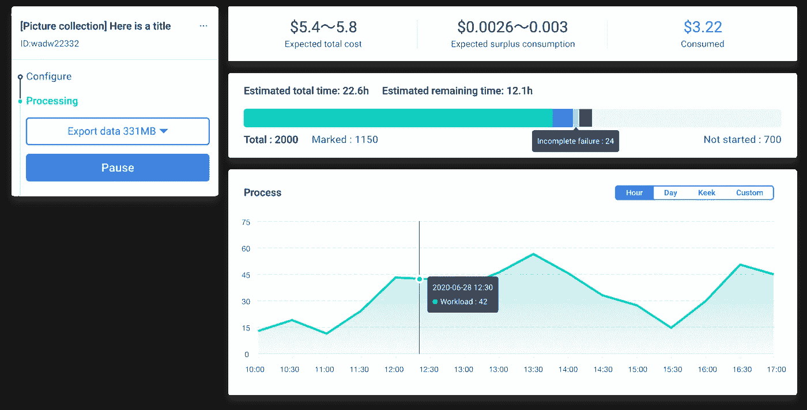

# 2021 年的数据标注服务和流程

> 原文：<https://medium.com/nerd-for-tech/data-labeling-how-data-annotation-company-acquires-core-competence-through-technology-b8e2330bfb57?source=collection_archive---------21----------------------->

## **没有训练数据，就没有机器学习模型**

# 数据注释

数据标注技术用于使机器学习模型的对象可识别和可理解。它对于机器学习(ML)行业的发展至关重要，如人脸识别、自动驾驶、空中无人机、机器人和许多其他人工智能应用。

数据标注是对未经处理的原始数据进行加工的过程，包括语音、图片、文本、视频等。，并将其转换为人工智能算法可以识别的结构化数据。

# 数据注释工具平台

目前，数据标注工具平台是数据标注行业的重要趋势之一。高质量的数据标注服务平台应具备以下特征:

## **1。工作流程系统**

在正常情况下，一个完整的标注项目，从开始到结束，需要多个过程，如构建自定义标注工具、预处理数据的脚本、项目创建、贴标机培训、工人绩效跟踪、数据安全和合规性、质量检查、数据交付等。每个流程都可以细分为更详细的工作流程。

以项目创建为例，需要从头开始完成以下步骤:

新建项目—上传数据—需求管理—注释方案—处理—注释输出—发布项目

一个完善、顺畅的工作流系统对项目管理具有重要意义。全程**工作流系统**可以有效帮助项目团队控制项目，避免不必要的成本，提高运营效率。

## **2。不同的角色**

从角色配置的角度来看，数据标注参与者大致可以分为标注者、审核员、质检员、管理员(项目经理、甲方代表)等。

不同的角色有不同的权限，对应不同的工作和级别。以注释器为例，工作是遵循指南并完成基本的注释任务。注释者更关心完成的、拒绝的和合格的数据的数量，因为这些与他们自己的收入有关。

另一方面，项目经理更关心全局，比如项目完成、数据质量、角色授权分配、项目进度等等。

# 贴标过程可视化

机器学习的成功依赖于人类劳动力，然而，一个人的精力总是有限的。他或她接触的数据越多，出错的概率就越大。因此，平台数据可视化变得尤为重要。

自动化管理连接不同的角色，生成定制的数据服务，帮助不同的角色快速掌握项目操作，不仅缩短了解项目所需的时间，还可以减少错误问题。

ByteBridge，一个人力和 ML 驱动的数据标签工具平台

# 结束

将你的数据标注任务外包给 [ByteBridge](https://tinyurl.com/2xaxcaz7) ，你可以更便宜更快的获得高质量的 ML 训练数据集！

*   无需信用卡的免费试用:您可以快速获得样品结果，检查输出，并直接向我们的项目经理反馈。
*   100%人工验证
*   透明标准定价:[有明确的定价](https://www.bytebridge.io/#/?module=price)(含人工成本)

**为什么不试一试？**

**相关文章:**

1[2021 年机器学习数据标注公司](https://tinyurl.com/26ch6xfw)

2 [为什么高质量的训练数据对 AI 机器学习如此重要？](https://tinyurl.com/3uby7zbp)

3 [数据标注服务:自动数据标注 VS 手动数据](https://tinyurl.com/r6nvdyky)

4 [数据标注服务及其关键优势——灵活性](http://tinyurl.com/tys3gcfd)

5 [客户对数据标注服务的需求和期望](https://tinyurl.com/hlyth6gh)