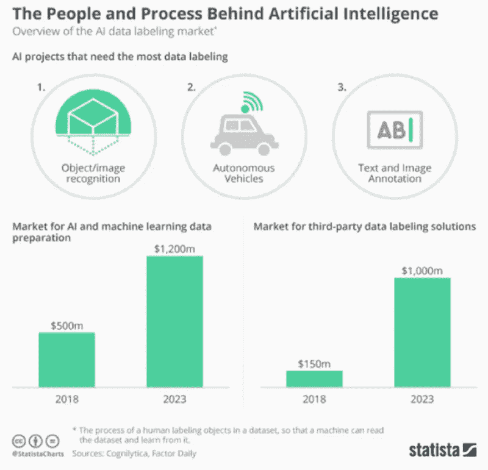

# 数据标注和注释外包服务

> 原文：<https://medium.com/nerd-for-tech/data-labeling-new-trends-and-challenges-in-data-annotation-industry-ea376f10c3dc?source=collection_archive---------6----------------------->

## 人工智能行业的不断增长推动了数据注释行业的发展

# 数据注释市场规模

根据研究与市场的报告，2019 年全球数据注释市场价值 6.955 亿美元，预计到 2027 年将达到 64.5 亿美元。预计从 2020 年到 2027 年，CAGR 将以 32.54%的速度增长，蓬勃发展的数据注释市场正在见证未来的巨大增长。

**数据注释行业受到人工智能行业不断增长的推动**。目前人工智能的商业化在计算能力和算法上已经到了基本成熟的阶段。为了更好地满足落地需求，解决行业特定痛点，用于算法训练的可扩展标注数据依然不可或缺。

资料来源:统计数据

都说数据决定 AI 实现的成功。而且前瞻性的数据产品和高度定制化的数据服务已经成为行业发展的主流。

在接下来的几年中，数据注释行业将面临以下趋势和挑战。

# 趋势:行业洗牌，竞争加剧

经过多年的发展，数据标注行业已经进入快速增长期。

从微观上看，市场的不断扩大意味着更多的参与者和更多的竞争。由于进入门槛低，对人力资源的过度依赖，行业内聚集了大量中小型数据服务商。

随着技术门槛的提高，AI 企业的各种诉求，人力成本的增加，中小型数据服务商将面临越来越大的成本压力。未来 1-2 年，行业将可能迎来一波“洗牌期”。

随着商业落地的加快，AI 公司也对数据服务提出了新的要求。质量、精致和定制在需求方面越来越受欢迎。在供应方面，技术力量、受控管理等等带来了新的挑战。

# 挑战:新需求下的落后产业发展

如前所述，更具前瞻性的数据产品和高度定制化的数据服务已经成为行业发展的主流。然而，目前的行业发展水平远远不能满足这些新的需求。数据注释行业面临以下挑战:

**1。不同的行业和业务场景对数据标注有不同的要求。现有的注释能力还不够完善，不足以支持定制服务。**

[数据标注](https://tinyurl.com/55kpczaf)应用场景广泛，包括自动驾驶、智能安防、新零售、AI 教育、工业机器人、智能农业等领域。

不同的场景有不同的[标注](https://tinyurl.com/55kpczaf)要求，比如自动驾驶行业主要集中在行人识别、车辆识别、红绿灯、道路识别等方面。安防行业主要集中在人脸识别、人脸检测、视觉搜索、关键点、车牌识别。

**2。客户痛点:贴标效率低，数据质量差，缺乏人机配合。**

数据标注行业的特殊性决定了其对人力的高度依赖。目前主流的标注方法是标注者借助标注工具完成工作。

由于标注者能力的参差不齐和标注工具功能的不完善，数据服务总是在效率和数据质量方面存在不足。

此外，目前很多数据服务商忽视或者不具备人机协作能力，没有意识到 AI 行业对数据标注的相互作用。事实上，人工智能辅助工具不仅可以有效地提高效率，还可以大大提高准确性。

**3。依赖众包和分包的数据标签服务提供商无法保证质量。**

目前数据标注主要依靠人力资源，人力资源占总成本的大部分。因此，许多数据服务提供商放弃了他们内部的标签团队，转而外包来完成标签业务。

相比于内部[贴标](https://tinyurl.com/55kpczaf)团队，众包和分包成本更低，变得更加灵活。但是，标注环太长，无法配合，数据质量难以控制。从长远来看，内部贴标团队更符合产业发展的需要。

**综上所述，** [**数据标注**](https://tinyurl.com/55kpczaf) **行业前景广阔，但也面临诸多挑战。**

在可预见的行业变革时期，中大型数据服务提供商都无法避免这种变化。只有增强自主研发的技术实力，加快进化速度，才能在新时代具有竞争力。

# 结束

将你的数据标注任务外包给 [ByteBridge](https://tinyurl.com/55kpczaf) ，你可以更便宜更快的获得高质量的 ML 训练数据集！

*   无需信用卡的免费试用:您可以快速获得样品结果，检查输出，并直接向我们的项目经理反馈。
*   100%人工验证
*   透明标准定价:[有明确的定价](https://www.bytebridge.io/#/?module=price)(含人工成本)

**为什么不试一试？**

## 相关文章:

[1](https://tinyurl.com/vpadjbsn) [数据标注服务——从后台到前台](https://tinyurl.com/vpadjbsn)

[2 数据标注服务:自动数据标注 VS 手动数据](https://tinyurl.com/r6nvdyky)

[3 高质量训练数据在不同 AI 算法阶段的重要性](https://tinyurl.com/4k3h2ujv)

[4 如何让数据标注更高效？](https://tinyurl.com/1amyxmhb)

[5 数据标注服务及其关键优势——灵活性](http://tinyurl.com/tys3gcfd)