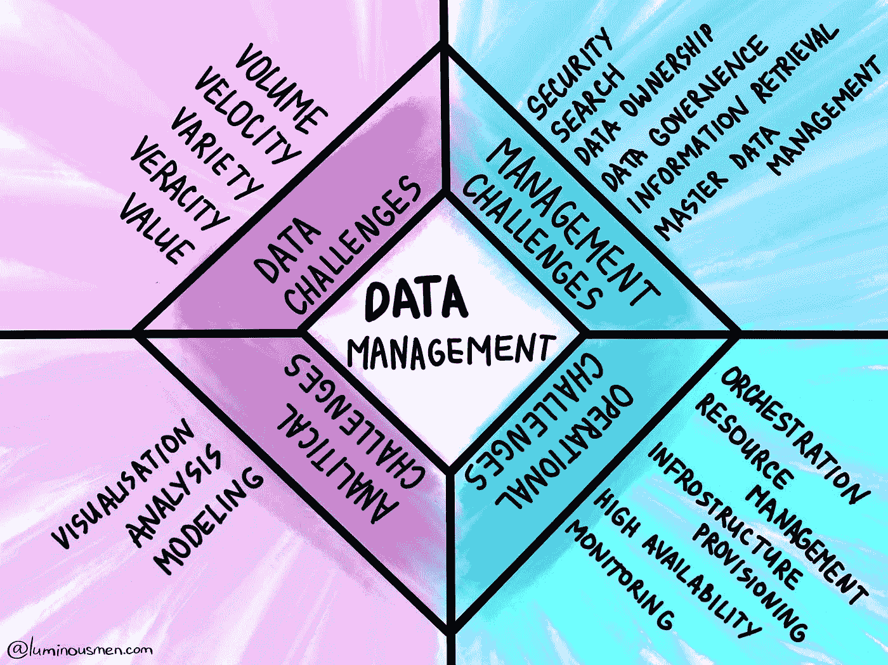

# 数据工程技能

> 原文：<https://medium.com/nerd-for-tech/data-management-skills-2cfd6710804a?source=collection_archive---------24----------------------->

我的朋友问了我一个有趣的问题，关于哪些技能值得数据管理专家学习，以及如何构建一个[成长路线图](https://github.com/datastacktv/data-engineer-roadmap)。

其实这个问题让我思考是因为我脑子里一直没有一个清晰的画面。这只是我对这个话题的想法，在很大程度上，我只是**推测**数据管理的现状和未来。

# 先决条件