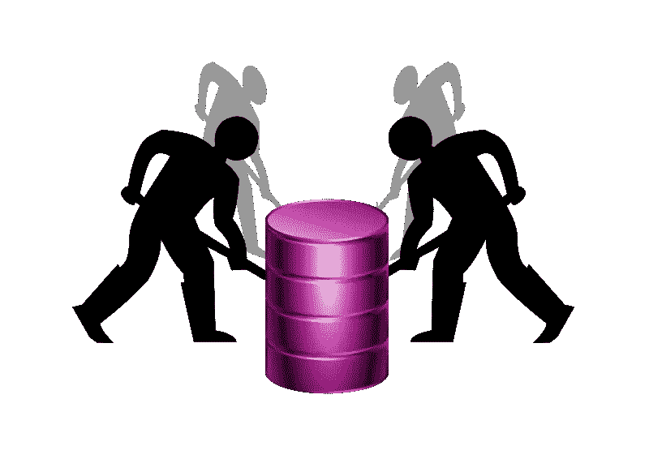

# 数据挖掘—了解数据！

> 原文：<https://medium.com/nerd-for-tech/data-mining-getting-to-know-data-cf22c1ae7232?source=collection_archive---------16----------------------->

分析数据

[https://commons.wikimedia.org/wiki/File:Data_Mining.svg](https://commons.wikimedia.org/wiki/File:Data_Mining.svg)

在这篇文章中，我试图用简单的术语解释什么是数据挖掘。在开始讨论什么是数据挖掘之前，我们先来看看为什么我们需要数据挖掘？
过去几十年来，数据呈指数级增长，现在数据已经成为所有业务和创业公司的核心，为了在竞争激烈的市场中生存，有必要分析这些数据并做出正确的决策。使用和分析数据的传统方式是不可能的，因为现在数据是以 TB 和 pentabyte 为单位的。因此，采用一些新的方法和技术来处理这些数据是非常重要的。
现在回到什么是数据挖掘？
数据挖掘的简单定义如下，
**从海量数据中提取感兴趣的模式或知识称为数据挖掘。** 这里的有趣指的是从数据中获得的非平凡的、隐含的、先前未知的、有用的信息。
数据挖掘也可以称为自动分析数据的任务。

[https://unsplash.com/photos/mcSDtbWXUZU](https://unsplash.com/photos/mcSDtbWXUZU)

数据挖掘有许多替代名称，其中一些是数据库中的**知识发现(KDD)** 、**知识提取**、**数据/模式分析**、**商业智能**等等。这里重要的一点是，数据挖掘总是基于历史数据，而不是当前数据。
现在让我们看看数据挖掘需要什么样的数据，它有什么功能，
数据挖掘通常是在关系数据库、事务数据库和数据仓库中进行的。一些高级数据集如时间序列、传感器数据集、文本数据或来自万维网的数据也被用于数据挖掘。
数据挖掘的一些功能如下，
它主要用于描述，即概括或总结事物，并从数据中得出一些有用的模式，例如，如果在购物中心，如果一个人买了一部智能手机，那么他/她也会买一个手机套/外壳或耳机/耳塞，这样店主就会对其进行分析，并将这些产品放在附近，这样人们就可以接触到这些产品，或者向其他人推荐这些产品。
数据挖掘也用于聚类分析、离群点分析或趋势分析。

数据挖掘/KDD 的过程包括以下 7 个步骤:1)理解数据并知道挖掘的目标。2)选择合适的数据。
3)数据预处理。
4)转换数据。
5)应用数据挖掘算法或开发一些模式。
6)解释模式的结果。7)知识发现。

虽然我们可以使用数据挖掘来分析数据，但在使用它时也存在一些问题，它们如下:
数据是多样化的，各种技术的性能，不完整的数据，如果数据来自不同类型的来源，并且不一致或不完整，则可能会在解释模式时导致一些问题。

更详细的信息可以在[这里](https://www.javatpoint.com/data-mining)找到。