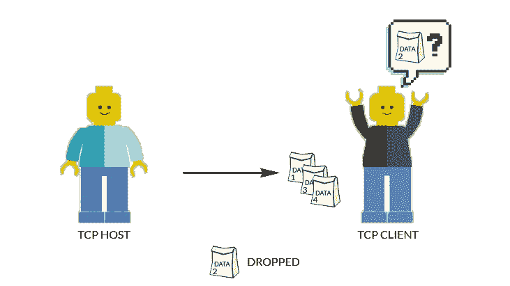
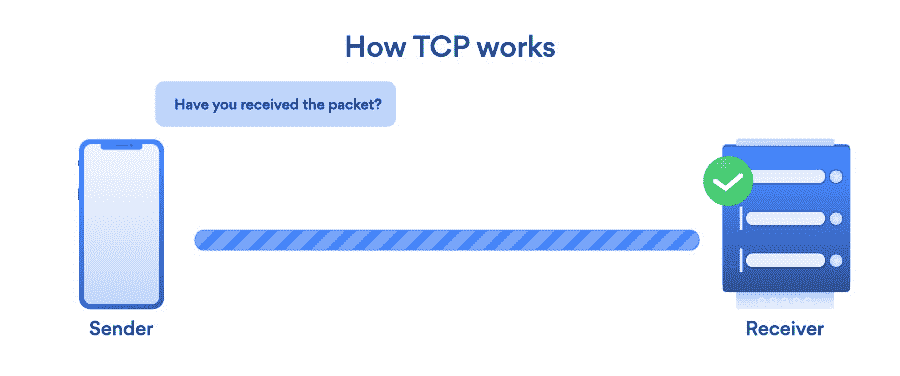
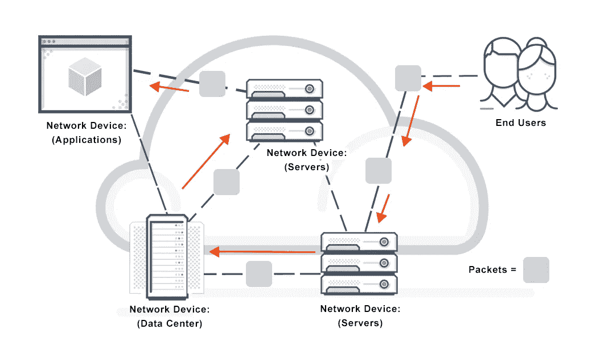

# 通俗地说就是数据包

> 原文：<https://medium.com/nerd-for-tech/data-packets-in-laymans-terms-a0f725d2bffc?source=collection_archive---------1----------------------->

# 介绍

数据包是 TCP/IP 网络上通信的基本单位。通过 TCP 连接发送的数据被分成称为数据包的小组。每个数据包都包含少量数据和其他重要信息，例如数据包的目的地。然后数据包通过网络到达最终目的地。只有比特(0 和 1)通过介质传输(如果您不了解比特和字节，这里的[是一个很好的资源)。](https://www.open.edu/openlearncreate/mod/oucontent/view.php?id=30714&printable=1)

TCP 连接([图片来源](https://nordvpn.com/blog/tcp-or-udp-which-is-better/)

让我们把上面的过程分解成非常简单的术语。把一个包想象成一个有钱的钱包。钱变成了数据，钱包变成了包。当你把钱包放在橱柜里时，橱柜就成了最终目的地，而初始目的地就是你之前放钱包的地方(可能是你的口袋)。在这种情况下，你的手就变成了网络，钱包(包)通过这个网络从你的口袋(初始目的地)转移到橱柜(最终目的地)。

现在假设你有 20 张 100 美元的钞票，你要去银行存这笔钱。一个钱包装不下。因此你需要两个。在这种情况下，你有两个包(两个钱包)。当您到达银行时，您从口袋中取出两个钱包(包)(初始目的地),并将钱(数据)存入银行(最终目的地)。这就是数据包的工作原理。当一个请求被发送时，请求的主体被分成不同的包。这些数据包随后通过网络发送，并很快被服务器接收。

# 附加说明

分组交换([图像源](https://avinetworks.com/glossary/packet-switching/)

将这些数据分组并通过网络发送到服务器的过程称为分组交换。通过这个过程，数据传输变得高效。现在有各种类型的分组交换，但我不会在这篇文章中讨论它，因为这篇文章都是关于数据包的！

> 注意:数据包可以通过不同的路由到达最终目的地。

如果你喜欢这篇文章，掌声会激励我继续写这样的文章:)