# Python 中的数据预处理:解释了所有重要步骤

> 原文：<https://medium.com/nerd-for-tech/data-preprocessing-and-cleaning-in-python-all-important-steps-explained-6093b8cb0864?source=collection_archive---------2----------------------->


在过去的 3 年里，我一直在处理数据，随着时间的推移，机器学习行业发生了很多变化。没有变的是数据预处理和清洗。令人惊讶的是，大多数从业者不愿意工作或学习这一部分。

因为我几乎每天都在做这件事，所以我决定写下我在数据预处理中遵循的常见步骤和实践。

# 加载数据

您可以使用您选择的任何 CSV。在我们的示例中，我们将使用员工及其缺勤时间的数据。我们将有多个特征，稍后可用于预测员工的缺勤情况。从加载开始，仔细查看数据。

```
import pandas as pd
raw_csv_data=pd.read_csv("absenteeism_data.csv")
df=raw_csv_data.copy()
df
```

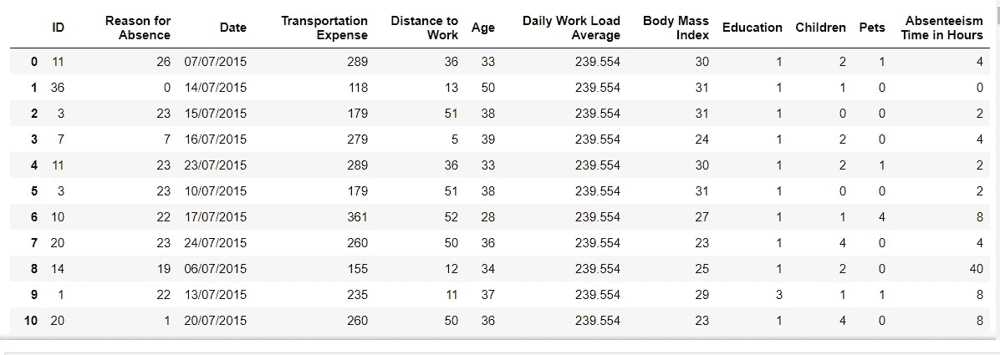

> copy 函数用于创建表的副本，以便以后在需要时以原始格式使用它。如果你愿意，可以跳过这一步。

# 在 Jupyter 笔记本中获取全部输出数据

当我刚接触 Jupyter 的时候，我常常为没有在笔记本上获得完整的输出而烦恼。让我们先讨论一下

```
pd.options.display.max_columns= None
pd.options.display.max_rows= None
```

这两行将获取您的完整数据，从而使您更容易通过滚动来查看完整数据。

# 理解数据

当你开始一个全新的问题，有陌生的数据时，这是你应该做的(我的意思是我就是这么做的)。

```
df.info()
```

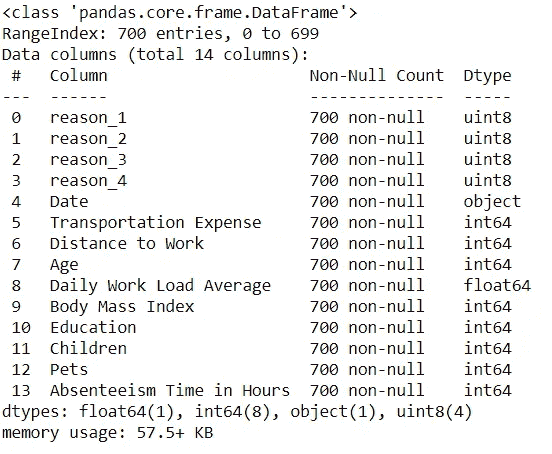

**Info()** 函数将帮助您了解是否有任何**空值**以及要素的数据类型。如果你是一个 ML 从业者，你知道这些参数的重要性。

```
df.describe()
```

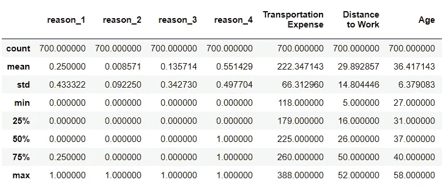

**Describe()** 函数将对您的特征进行数学评估。这不是一个强制步骤，但有时在理解数据和列时会很方便。请记住，您对数据的理解越好，模型的表现就越好。

# 移除冗余

我们将尝试找到对我们的**相关**变量没有任何影响的列。因变量是告诉我们产出或结果的变量。例如，在我们的数据中，最后一列是因变量，它告诉我们员工是否缺席。

我认为 **ID** 列不会影响员工休假或缺勤的决定。所以让我们摆脱它。

```
df=df.drop(['ID'],axis=1)
df
```

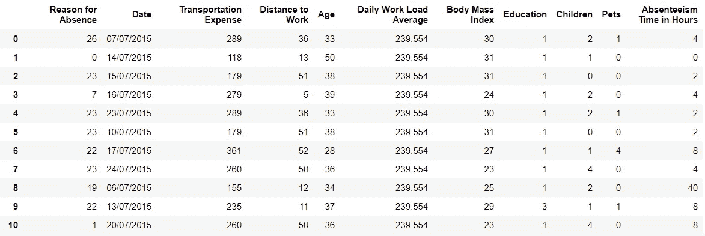

> 很好，我们放弃了。你认为我们还应该删除哪个栏目？我现在不会放弃任何其他的，但是你可以在评论中写下来。

# 一键编码

实话实说吧。这对每个人来说都是一个艰难的话题，甚至我也在努力。如果你不能一开始就理解它，记住其他人都面临着同样的问题。尽情享受吧。

再看柱子。

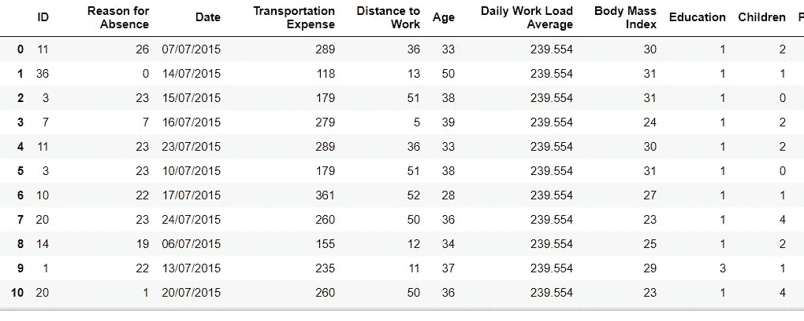

有一个列“**旷工原因**”，有一个大范围的数值，每个数值都有与之相关的东西。以一个样表为例。

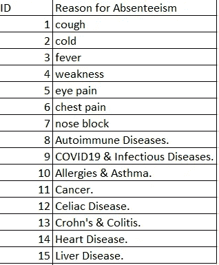

此表不完整。我创建了一个虚拟表来说明。让我们来理解这个栏目的价值观。

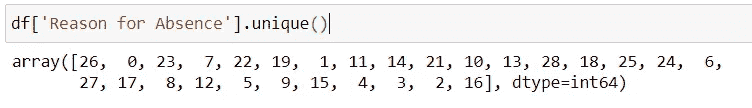

```
sorted(df['Reason for Absence'].unique())
```

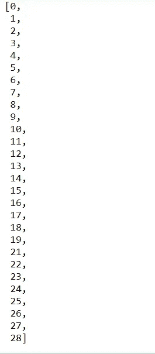

所以基本上我们有从 0 到 28 的值，所有这些值都有一个对应的原因。

> 我们不能以这种形式使用它们，因为计算机会从数字上理解它们，并可能认为 28>1，这是不正确的，因为我们只是用不同的数字来指代缺勤的**原因。因此 28=1。这些数字出现的频率才是重要的(除了 0)。数字 28 在我们的数据中出现了多少次决定了它的重要性。**

所以我们将使用**一键编码**来使用这些。我们将开始向列中添加虚拟值。

```
reason_columns=pd.get_dummies(df['Reason for Absence'], drop_first=True)
```

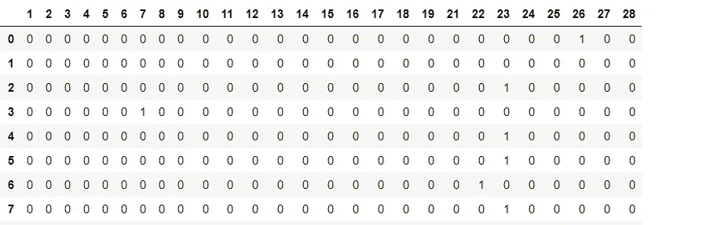

这不是完整的照片，总行数将是 700

我们创建了一个 dim(700，28)矩阵。28 列，因为我们有 28 节课。这样，我们可以找到我们的类的频率，而不是使用它们的数值。以第三行的 7 为例。这意味着第三行的值为 7。

***然而 28 列有点太多了吧？***

让我们假设这些类中的一些有相似的原因。所以我们可以打他们。请看这张图表，以便更好地理解它

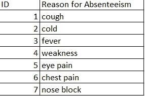

我们可以将所有这些原因归为一类，其他价值观也是如此。例如，在 28 个值中，我们可以创建 4 个类。这里需要指出的是，我们将面临**数据丢失**。一旦我们将数据归为 4 类，我们将无法在以后找到确切的原因。因此，这是唯一可取的，如果这些信息是可分组的，或者说是相似的。因此，数据丢失不会产生整体影响。让我将前 14 列合并，并为其创建 1 列(类)

```
reason_type_1=reason_columns.loc[:,1:14]
reason_type_1
```

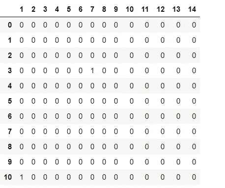

我们将使用函数 **max()** 创建 1 列。一旦我们使用这个函数，我们将知道 1–14 存在，但是关于哪个值存在的信息将丢失。

```
reason_type_1=reason_columns.loc[:,1:14].max(axis=1)
reason_type_1
```

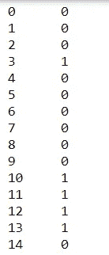

这里我们知道第三行的值为 1，这意味着存在(1–14)之间的任何值，但是是哪一个呢？如前所述，我们现在不知道。

**注意:列值完全不同，因此我们不应将这些数据分组。**

现在让我们把所有的数据分成 4 类。

```
reason_type_1=reason_columns.loc[:,1:14].max(axis=1)
reason_type_2=reason_columns.loc[:,15:17].max(axis=1)
reason_type_3=reason_columns.loc[:,18:22].max(axis=1)
reason_type_4=reason_columns.loc[:,23:28].max(axis=1)
```

# 用数据框架连接列

让我们首先从表中删除列“**缺勤原因**”，并添加我们创建的四个新列。

> 如果我们不删除这个列，我们将会遇到一个叫做**共线性**的问题。这是统计学的一个重要概念，在面试中经常被问到。

```
df=df.drop(['Reason for Absence'], axis=1)
```

让我们将这四列串联起来，代替这一列“**缺勤原因**”。请记住，有 28 列应该替换为这一列，但我们将它们归入了 4 列。

```
df=pd.concat([df,reason_type_1,reason_type_2,reason_type_3,reason_type_4 ],axis=1)
```

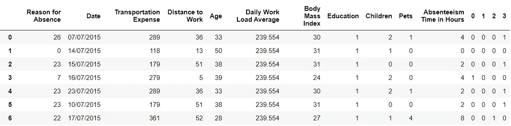

接下来，我们需要**重命名**这些列，使它们更具可读性。

```
column_values=['Date', 'Transportation Expense',
       'Distance to Work', 'Age', 'Daily Work Load Average',
       'Body Mass Index', 'Education', 'Children', 'Pets',
       'Absenteeism Time in Hours', 'reason_1', 'reason_2', 'reason_3','reason_4']df.columns=column_values
df
```

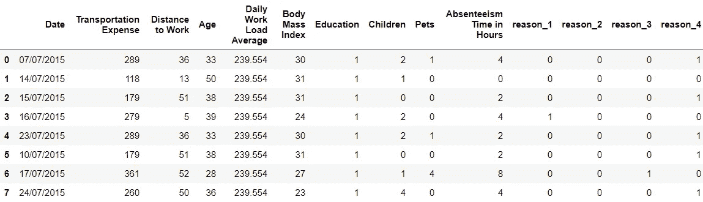

让我们**重新安排**这张桌子，把我们的专栏放在前面，那是它们应该在的地方。

```
column_names_reordered=[ 'reason_1', 'reason_2', 'reason_3','reason_4','Date', 'Transportation Expense',
       'Distance to Work', 'Age', 'Daily Work Load Average',
       'Body Mass Index', 'Education', 'Children', 'Pets',
       'Absenteeism Time in Hours']
df=df[column_names_reordered]
```


这看起来不错。我们完成了这个专栏，走吧。

# 处理日期时间值

> 如果日期-时间列不会让你做噩梦，你还算是数据专家吗？在你的采访中，有多少次你被要求操纵或处理日期栏？是的，没错。

让我们努力理解日期列。当我们导入数据时，日期列作为字符串数据类型加载。要应用日期函数，我们需要将它们转换成日期时间格式。

```
df_reason_mod=df.copy()
df_reason_mod['Date']=pd.to_datetime(df_reason_mod['Date'], format='%d/%m/%Y')
```

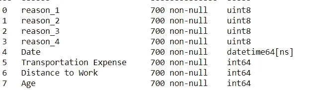

是的，我们做到了。让我们从这个列中提取出**日期**和**月份**，并在这里再创建两个列。

```
list_months=[]
for i in range(len(df)):
    list_months.append(df_reason_mod['Date'][i].month)
df_reason_mod
```

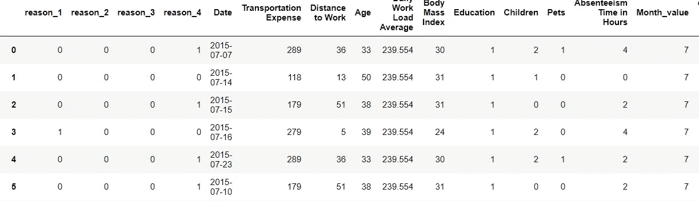

我们已经从日期列中提取了月份值。现在让我们提取日值。

```
def date_to_Week(date_value):
    return date_value.weekday()
df_reason_mod["day_of the week"]=df_reason_mod["Date"].apply(date_to_Week)
df_reason_mod
```

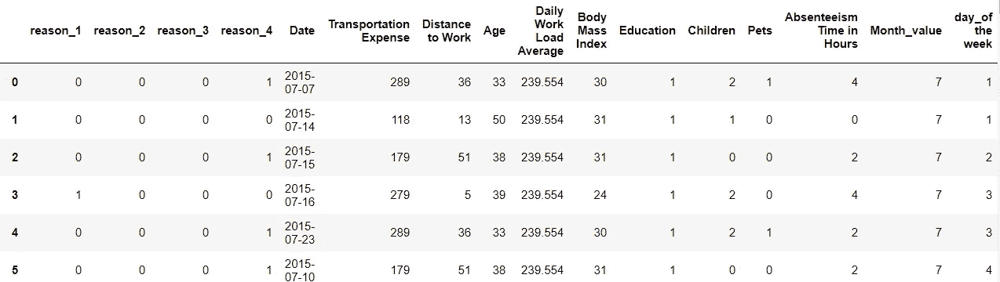

我们现在可以删除日期列。

```
df_reason_mod.drop(['Date], axis=1)
```

所以我们做了 ML 实践者和数据人。恭喜你。

# 将数据保存到 CSV

现在您已经清理了数据，您可以将这些数据发送给您的 ML 工程师同事，让他制作模型。

```
df_preprocessed=df_reason_mod.copy()
df_preprocessed.to_csv('Absenteeism_preprocessed.csv', index=False).
```

# 结论

这些是我在预处理数据时最常执行的操作。我们没有涉及的一个重要步骤是处理空值，因为幸运的是我们的数据中没有空值。