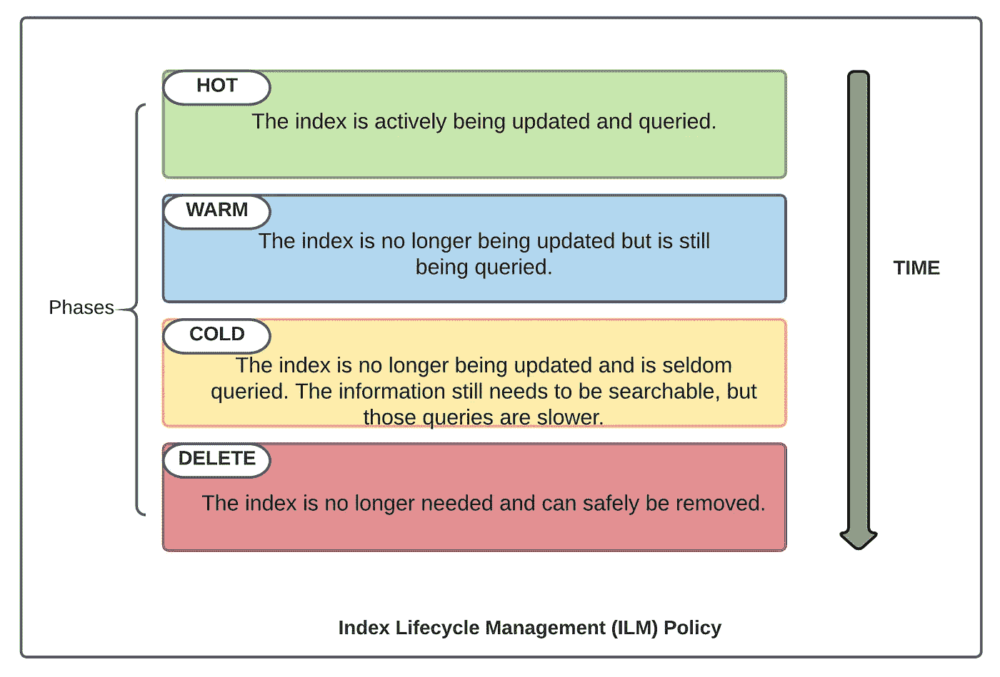
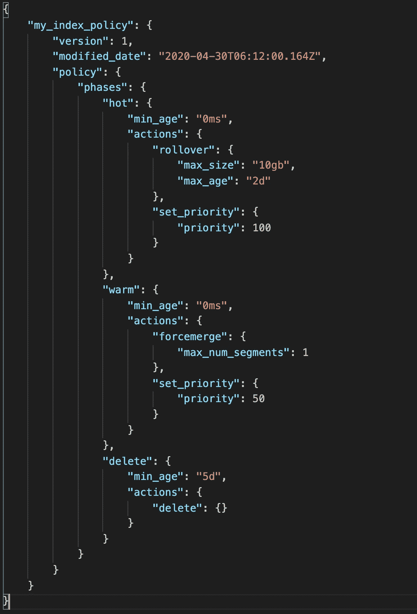
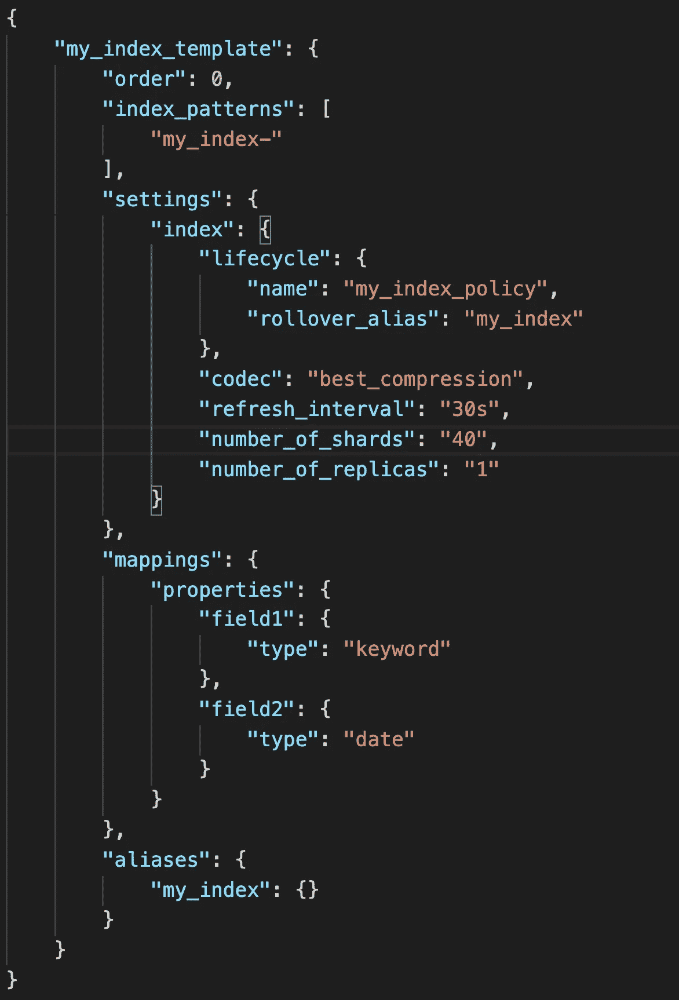
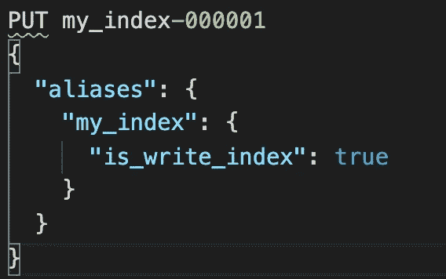
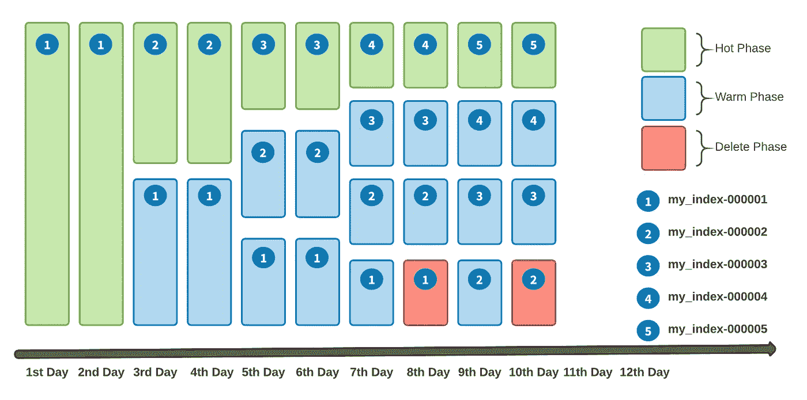

# 弹性搜索中的数据翻转

> 原文：<https://medium.com/nerd-for-tech/data-rollover-in-elasticsearch-b809bb9f150a?source=collection_archive---------0----------------------->

我们生活在一个应用程序运行在海量数据上的时代。为了让我们的应用程序**高效搜索**和**节省空间**，我们需要从数据存储中截取过时的数据。删除旧数据有助于减少查询检索结果的搜索空间，并且需要更少的硬件来存储文档。从 Elasticsearch 索引中删除单个文档是一项非常昂贵的操作。Elasticsearch 提供了一种更好的方法来实现这一点。我们可以创建并应用索引生命周期管理(ILM)策略，根据我们的性能、弹性和保留要求自动管理我们的索引。


如果你不熟悉 Elasticsearch 的基础知识。我会推荐你参考这篇文章 [Elasticsearch Internals](/@shivanshugoyal0111/elasticsearch-internals-4c4c9ec077fa?source=friends_link&sk=252e1dcbfd3bed798a61e59a07e94e63) 。每当需要从索引中自动删除文档时，索引应该是时序索引。时间序列索引需要附加 ILM 策略，以经历索引的四个可能阶段。

> ILM 保单的所有 4 个阶段并不是强制性的。例如，一个策略只能有热阶段和删除阶段。



1.  **热阶段:**这是我们主动写入和查询索引的阶段。为了更快地更新，当索引变得太大或太旧时，我们可以翻转索引。它有一个索引优先级标签。设置节点重启后恢复索引的优先级。优先级较高的索引在优先级较低的索引之前恢复。
2.  **暖阶段:**我们还在查询我们的索引，但是是只读的。我们可以将碎片分配给性能较低的硬件。为了更快的搜索，我们可以减少碎片的数量，并强制合并片段。它还具有索引优先级和强制合并标签。强制合并通过合并较小的文件和清除已删除的文件，有助于减少碎片中的段数
3.  **冷阶段:**我们不太频繁地查询您的索引，因此我们可以在性能明显较低的硬件上分配碎片。因为我们的查询更慢，所以我们可以减少副本的数量。
4.  **删除阶段:**不再需要索引。



索引生命周期策略定义

## 什么是最小年龄？

最小年龄是索引等待进入某个阶段的时间。`min_age`的默认值是 0 秒。在上面的例子中，索引一创建就进入热阶段。对于其他阶段，min_age 是仅当索引被翻转时翻转完成时开始的年龄。例如，索引将在其总寿命`(2 days to be in hot phase + wait for 5 more days to elapse after the rollover is completed)`的 7 天后进入删除阶段。

> `min_age`通常是指从索引创建时起经过的时间，除非配置了`index.lifecycle.origination_date`索引设置，在这种情况下，`min_age`将是从指定日期起经过的时间。如果索引翻转，那么`min_age`是从索引翻转的时间起经过的时间。这里的目的是执行与数据最后一次写入翻转索引的时间相关的以下阶段和操作。

让我们举一个指数没有滚动的例子。

```
{
    "policy": {
        "phases": {
            "warm": {
                "min_age": "7d",
                "actions": {
                    "readonly": {}
                }
            },
            "delete": {
                "min_age": "30d",
                "actions": {
                    "delete": {}
                }
            }
        }
    }
}
```

在上面的示例中，一个索引在创建 7 天后将有资格进入[热](https://www.elastic.co/guide/en/elasticsearch/reference/7.5/ilm-policy-definition.html)阶段，此时[只读](https://www.elastic.co/guide/en/elasticsearch/reference/7.5/_actions.html#ilm-readonly-action)操作将把该索引设置为只读。在创建日期之后 30 天之前，该指数不能进入删除阶段。一旦指数超过 30 天🎂将进入[删除阶段](https://www.elastic.co/guide/en/elasticsearch/reference/7.5/ilm-policy-definition.html)被删除。

## 翻转标签中的 max_age 和 max_size 是什么？

索引将处于热状态，直到至少满足一个定义的条件。

```
//API to get index lifecycle policies
**GET _ilm/policy/**//API to get a particular policy
**GET _ilm/policy/my_index_policy**
```

> 一个索引停留在一个阶段，直到它满足它的最小年龄并完成定义的动作。

指数 ILM 策略告诉 elasticsearch 将指数移动到哪个阶段，以及在每个定义的阶段采取什么措施。在手动创建索引时，可以将策略应用于索引。但是对于时序索引，策略需要附加索引模板，这有助于在目标索引发生翻转时创建引用相同索引模板的新索引。

## 我们来了解一下什么是指数模板？

索引模板是一种告诉 Elasticsearch 如何配置索引的方式，当它被手动创建或通过在索引中索引文档来创建时。



该索引模板将应用于所有以 **my_index-** 开头的索引，所有索引将遵循相同的 **my_index_policy** 生命周期策略。

在上面的模板定义中， **my_index** 是一个别名，可以用作一个**常量**名称，在索引中搜索/索引文档。例如， **my_index-000001** 、 **my_index-000002** 是 2 个遵循上述指标模板的指标，以及***my _ index _ policy***生命周期策略。

```
//API to get all the defined templates in a cluster
**GET /_template** //API to get a particular template
**GET /_template/my_index_template**//API to create a template
**PUT /_template/my_index_template along with request body**
```

## 创建时间序列索引的步骤

1.  创建索引策略来决定索引的生命周期。创建策略的定义已经解释过了。
2.  创建索引模板，以便在现有索引从热阶段转移到其他阶段时自动创建新索引。创建索引模板的定义已经添加。
3.  首先，我们需要引导一个初始索引，并将其指定为索引模板中指定的翻转别名的写索引。此索引的名称必须与模板的索引模式匹配，并以数字结尾。在翻转时，该值会递增以生成新索引的名称。



引导时序索引以遵循生命周期政策和索引模板

## 让我们理解这个策略如何作用于创建的索引。



使用 my_index_policy 的索引翻转

*   所有索引都可以通过相同的别名`my_index`进行搜索
*   `my_index_000001`和`my_index_000002`分别在第 8 天和第 10 天被删除。
*   处于热阶段的索引将只允许写入。
*   删除索引会删除索引中的所有文档以及元数据。
*   在上面的示例中，由于删除阶段 min_age 为 5 天，索引在暖阶段停留 5 天，以等待进入删除阶段。
*   当当前索引发生翻转时，它会创建一个新的索引，该索引的编号会增加(例如，从`my_index_000001`到`my_index_000002`)，当前索引将进入预热阶段，新索引将启用写操作。

我试图借助图表，用简单的语言解释时间序列指数的指数生命周期管理策略，以滚动来自弹性搜索指数的数据。 [Elasticsearch 官方文档](https://www.elastic.co/guide/en/elasticsearch/reference/7.9/index-lifecycle-management.html)有详细的段落来阅读更多相关内容。

感谢阅读！