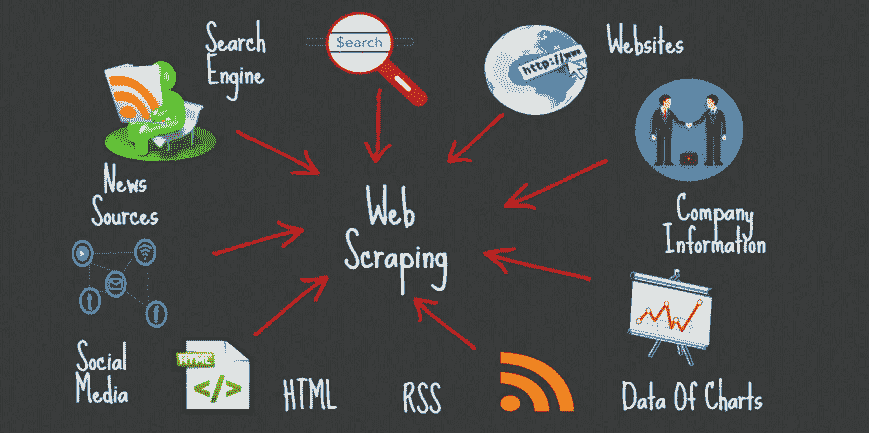
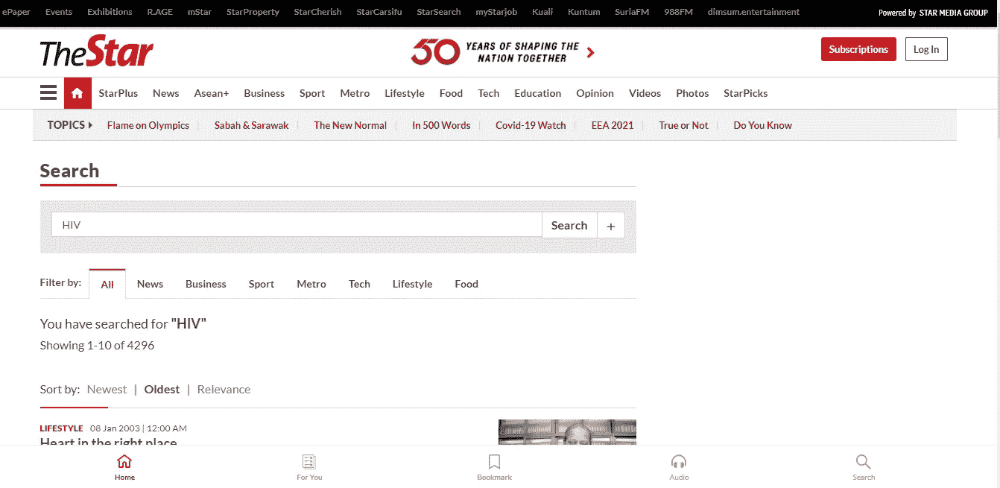
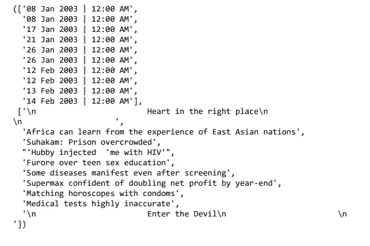
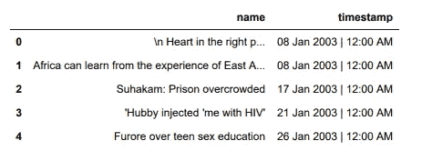

# 数据科学系列 EP 1

> 原文：<https://medium.com/nerd-for-tech/data-science-series-9ae81d6f0352?source=collection_archive---------15----------------------->

# 第 1 章:使用 Python 进行 Web 报废

> **什么是 Web 报废？**

Web 抓取是一个高效快速地自动提取数据的过程。在网络抓取的帮助下，你可以在你的电脑上从任何网站提取数据，不管数据有多大。术语**抓取**是指从另一个来源(网页)获取信息，并将其保存到本地文件中。



图片来源:【Promptcloud.com 

因此，web scraping 简化了提取数据的过程，通过自动化加快了提取速度，并通过以 CSV 格式提供废弃数据来创建对废弃数据的轻松访问。

假设你正在做一个[项目](http://rushichudasama.ml/)，你需要玩家的名字、统计数据和性能细节来比较不同的玩家。如果你从不同的网站获取数据，这将花费很长时间，但在这种情况下，网络抓取会使你的工作更容易，并会引导你达到预期的结果。

> 我们开始吧

例如，如果我们希望从出现在网站页面上的表中获取全部数据，我们的代码将通过这些方法进行收集:

1.  向劳动者索取特定 URL 的内容(源代码)
2.  下载返回的物质。
3.  区分页面中对我们需要的表格很重要的部分。
4.  将这些片段集中并(如果重要的话)重新格式化成一个数据集，我们可以按照我们需要的方式进行分解或使用。

# 美味的汤

Beautiful Soup 是一个 Python 库，用于从 HTML 和 XML 记录中提取信息。它倾向于按需使用，因为它需要一条信息(报告或 URL)来创建一个 soup 对象，因为没有其他人的帮助，它无法创建一个站点页面。您可以利用附带的 Python 内容来组合页面标题和超链接。

代码:-

如需完整代码，请查看本博客末尾的实现链接。

**安装依赖关系:**

```
!pip install requests bs4 html5lib
```

**设置 Chrome 驱动:**

从这个[链接](https://chromedriver.chromium.org/downloads)下载 Chrome 驱动。

解压文件，在你喜欢的地方设置文件，然后 ***在环境变量中添加 PATH 变量。***

我在**系统变量**中添加了路径。

我在工作目录中添加了一个 chrome 驱动程序。

```
driver = webdriver.Chrome("chromedriver")
```

你必须添加你的 chromedriver.exe 路径

**网页信息:**

我们在给定的[网站](https://www.thestar.com.my/search/?q=HIV&qsort=oldest&qrec=10&qstockcode=&pgno=1)上有很多关于博客的信息。我们想获取表，特别是关于主题和发布日期/时间的列。

制作一个主题和日期/时间的空列表。

```
time = []
name = []
```

将网页的 Url 添加到驱动程序中，这样我们就可以获得特定网页的源代码。

```
driver.get(["](https://www.thestar.com.my/search/?q=HIV&qsort=oldest&qrec=10&qstockcode=&pgno=1)[https://www.thestar.com.my/search/?q=HIV&qsort=oldest&qrec=10&qstockcode=&pgno=1](https://www.thestar.com.my/search/?q=HIV&qsort=oldest&qrec=10&qstockcode=&pgno=1)")
```



**刮数据:**

```
content = driver.page_source
soup = BeautifulSoup(content)
```

首先，我们获得页面的源代码，然后创建一个漂亮的 Soup 对象，以便我们可以对它执行一些操作。


现在我们必须知道我们要获取什么，类名是什么，什么特定的标签包含我们想要的信息。所有这些问答都可以通过**查看网页**得到。为此，你应该对 HTML 和 CSS 有一点点**的了解。**

所以对于我们博客的数据，我们抓取了包含在 *'* 行列表-列表 *'* 类之间的整个表。Soup 有一个内置的函数 find，它将查找我们的模式的所有出现。

```
table = soup.find_all('div' , attrs={'class' : 'row list-listing'})
```

在线上方，意味着在特定的 web 页面中查找 div 标签，该页面有一个类名 *'* 行列表-列表'。

现在我们有了一个表，但是我们只想获取一些列，所以我们必须再次过滤这个表。

```
time = []
name = []
for item in soup.find_all('div' , attrs={'class' : 'row list-listing'}):
   time.append(item.find('span' , attrs={'class' :        'timestamp'}).text)
  name.append(item.find('h2' , attrs={'class' : 'f18'}).text)
```

这里我们首先从表中取出所有数据，并制作一个列表结构 的 ***列表。因此 data[0]表示博客网页上可用的表格的第一列。***



**将数据转换为熊猫数据帧:**

Pandas 是一个快速、不可思议、适应性强且易于使用的开源信息调查和控制工具，基于 Python 编程语言之上。


```
import pandas as pd
data = pd.DataFrame({'name':name , 'timestamp':time})
```



**将数据帧保存为 CSV:**

```
data.to_csv('blog_name_time_data.csv')
```

通过使用 ***to_csv*** 功能，我们可以将数据帧转换为 csv 文件。

> ***代号:***

[](https://github.com/Rushi-45/Data-Science-Series/tree/main/Practical1) [## 数据科学系列/实践 1 在主史茹-45/数据科学系列

### 在 GitHub 上创建一个帐户，为史茹-45/数据科学系列的开发做出贡献。

github.com](https://github.com/Rushi-45/Data-Science-Series/tree/main/Practical1) 

> ***结论:***

我们可以通过使用 web 抓取库(如 beautiful soup、scrappy 等)从网页中获取任何数据。在转换成 pandas 后，我们可以对该数据应用所有 Pandas 函数。

更多关于**熊猫**功能[在这里。](https://pandas.pydata.org/pandas-docs/stable/reference/general_functions.html)

更多关于**美汤** [在这里。](https://beautiful-soup-4.readthedocs.io/en/latest/)

> ***领英:***

[](https://www.linkedin.com/in/rushi-chudasama-63473819a/) [## 印度古吉拉特邦巴鲁奇史茹楚达萨马-钱杜拜 s .帕特尔理工学院

### 在世界上最大的职业社区 LinkedIn 上查看史茹·丘达萨马的个人资料。史茹教育上市于…

www.linkedin.com](https://www.linkedin.com/in/rushi-chudasama-63473819a/) 

> ***更多项目和博客:***

***项目:***

[](https://github.com/Rushi-45) [## 史茹-45 -概述

### 阻止或报告隐私和安全是最大的问题，我们制作了一个 Android 应用程序，用于阻止…

github.com](https://github.com/Rushi-45) 

**博客:**

[](/@rushi-positive) [## 史茹中号

### 网络技术是各种各样的工具和技术，它们被用在…

medium.com](/@rushi-positive) 

> ***最后注意:***

**感谢阅读！如果你喜欢这篇文章，请点击**👏尽可能多的按按钮。这将意味着很多，并鼓励我继续分享我的知识。如果你喜欢我的内容，请在 medium 上关注我，我会尽可能多地发布博客。