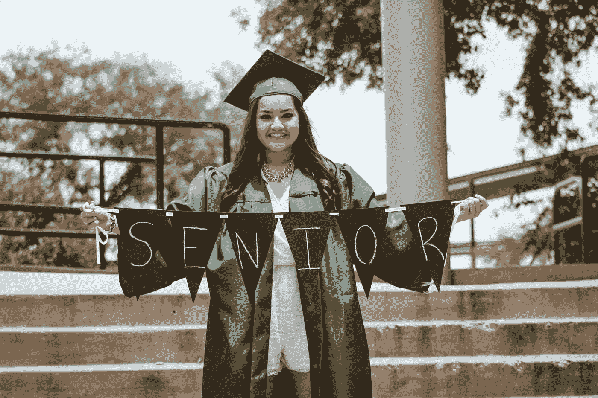

# 数据科学本科生之旅第 1 部分

> 原文：<https://medium.com/nerd-for-tech/data-science-undergrad-journey-part1-why-did-i-choose-data-science-as-my-major-606202be1aba?source=collection_archive---------14----------------------->

## 第 1 部分:我为什么选择数据科学作为本科专业？

胡安·拉莫斯在 [Unsplash](https://unsplash.com?utm_source=medium&utm_medium=referral) 上的照片

你好世界！我是艾莉森。我是一名数据科学专业的大四学生。我刚刚结束了本科学习的第三年，所以我差不多完成了。除了最后的顶点工程，我完成了所有的主要课程。因此，我在暑假期间坐在我的房间里，对自己说:现在需要一些反思和一些未来的规划。

先说反思。

# 系列介绍

我希望这个系列能够总结我在过去三年的数据科学之旅中的动机、关键决策以及学术和实习经历。许多人找到我，问我关于数据科学的问题(确实，现在有更多的数据科学项目，但数据科学本科生仍然相对较少)，所以我想为什么不分享我的故事，同时提高我的写作技能？希望我写的东西能对你有所帮助。

在这篇文章中，我将谈谈我是如何进入数据科学的，以及我为什么选择数据科学作为我的本科专业。

# 为什么是数据科学？

## 大学之前

我从小就喜欢 STEM。在 STEM 科目中，我最喜欢数学。事实上，我整个高中都在 STEM 班，只有 10 个女孩和 30 个男孩(是的，这是中国的事情)。但中国的高中是以高考为导向的，所以我从来没有接触过高考(中国 SAT，或中国高考)中没有测试过的东西。在大学之前，我对编码或计算机编程毫无经验。我从来不懂技术，也无法想象自己会成为任何类型的程序员。但是，由于我很喜欢 STEM，所以我在考虑在未来的职业生涯中追求 STEM。但是我到底预见到自己在做什么？我不知道。谢天谢地，我们大学采用的是博雅教育。我们所有人都是带着一个尚未确定的专业进去的，直到大二结束的时候，我们可以找出最合适的一个或两个专业。重大探索中的试错把我引向了数据科学。

## 大一第一学期

我最初想的是数学专业，因为我是根据我的高考成绩被选中参加数学专业的高级数学课的。但是仅仅过了一个星期我就放弃了这门课和追求数学专业的想法。我几乎不觉得课堂上的数学证明有趣。不要误解我。它们很有用，也很吸引人，但我开始明白我在寻找一些更基于应用的东西，因为我同时也在上我的第一堂编程课。

老实说，我上 Python 入门课是为了满足我的文科或核心课程的要求。正如我提到的，我在上大学之前没有编程经验，也无法想象自己会成为一名程序员。我心想:如果我真的喜欢 Python 入门课，那将是我有幸拥有的一种奇妙的意外收获。如果事实证明我讨厌它，至少我完成了这个要求，这样我就再也不需要学习任何与计算机相关的东西了。

我非常喜欢编程。

入门课并不意味着让任何人气馁，所以我从设计简单而有用的算法和解决小的编程问题中获得了乐趣。随着课程变得越来越难，我更加喜欢挑战。很明显，我找到了我真正喜欢的东西。虽然我在阅读托马斯·霍布斯或西蒙娜·德·波伏娃时很容易睡着，但在解决编程问题时，我会格外精力充沛。当我陷入 for 循环和 OOP 的沉思时，甚至网飞也失去了对我的吸引力。所以在我大一的第一个学期，我知道我的专业需要涉及编码，最好是 Python，这样基本上缩小到计算机科学和数据科学。

## 大一第二学期

我选择数据科学是因为我们的计算机科学课程缺少我所寻找的数学方面。另一方面，数据科学具有严格的数学成分。当时，我正在攀登 Python 陡峭的学习曲线，并深入概率统计领域。**数据科学是我的爱好、数学和编程的更好结合**。那就数据科学吧！

等等，还没有结束…还没有。

事实证明，要宣布我的专业是数据科学，我需要选择一个方向，或者一个方向。毕竟，数据科学是一种解决问题的工具。你还需要选择你想解决的问题的领域。浓度包括从金融到基因组学到政治学的一切。我最终选择了人工智能作为我的赛道，因为我在那段时间从事机器人方面的研究。

然后在大一第二学期进行到一半的时候，我成功申报了自己的专业:**数据科学，专修人工智能**。

## 迄今

我从来没有想过要换专业，尽管我们都可以相对容易地换专业。课堂是智力刺激，课堂项目是有益的。我在数据科学和人工智能领域有过实习和研究机会，让我看到了直接的影响。总体而言，数据科学是我真正喜欢的东西。这是我在接下来的几年里想要做的事情。

# 我觉得有用的下一个课后课程

在我的下一篇文章中，我计划详细讨论我为完成我的专业学位要求而学习的数据科学课程，以及我认为有帮助的相关课程。

 [## 数据科学本科生之旅第 2 部分:我觉得有用的学校课程

### 您正在向数据科学过渡吗？或者你和我一样是数据科学本科生？如果我…

medium.com](/nerd-for-tech/data-science-undergrad-journey-part2-school-courses-i-find-helpful-a3b7f9b47258) 

谢谢你阅读我的博客！希望对你有帮助。

github:[https://github.com/AlisonYao](https://github.com/AlisonYao)

https://www.kaggle.com/alisonyao