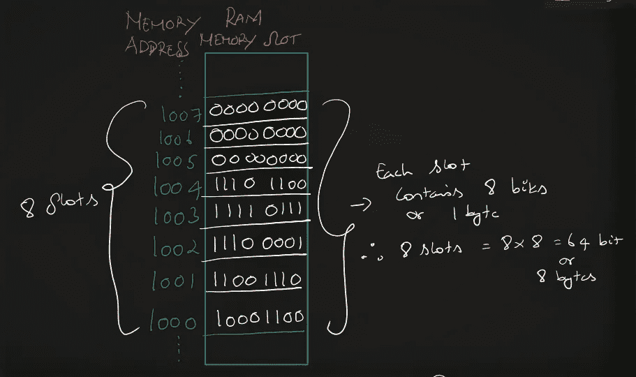
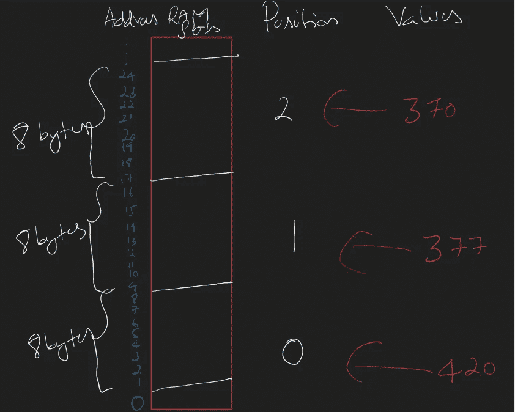

# 从头开始的数据结构系列# 5[数据结构的先决条件 II]

> 原文：<https://medium.com/nerd-for-tech/data-structures-from-scratch-bot-up-series-5-3e2b1f03ce95?source=collection_archive---------23----------------------->

对前一篇文章的简单回顾

内存与存储

计算机内存是随机存取存储器

RAM 就像架子。每个盘架包含 8 个位置或插槽→1 个字节

8 位配置有局限性，因此 32 位和 64 位配置也有局限性

RAM-存储器-地址-位-字节

今天，我们将自己构建数据结构，或者至少想要构建数据结构

我们拿 10 个架子，每个架子都有相应的编号

货架的用途？存储数据简单

为了简单起见，我们将考虑数字和字符(最原始的)

从上一篇文章中，我们发现了单字节存储的局限性，因为它最多只能存储 255 个值

因此，我们使用 4 字节(32 位)或 8 字节(64 位)系统

就像数字一样，字符以相似的方式存储，只是每个字符都被映射到数字，最终数字被转换成二进制。这种映射称为编码。

到目前为止很简单…我认为是时候把事情复杂化了(只是一点点)

如果我们必须存储一组数字或字符怎么办
为什么？实际上，我们不使用单个字符或数字
例如，“John Doe”是由许多字符组成的字符串

让我们存储一组数字

只有 3 个数字(420，377，370)

位置— 0，1，2。

值— 420，377，370。

插图:

为了存储每个值，我们分配 64 位(8 字节或 8 个槽)

为了存储这组数字，我们需要 24 字节的存储单元(即 8*3)，或者我可以说我需要 24 个架子

我们将在 RAM
中寻找 24 个连续不间断的货架，然后我们将存储这些值。

RAM 中的连续插槽

好吧。我们储存了，我们的目的也解决了。但是等等！

如果我们能在这里找到洞见呢？

1)我存储了一组数字
2)我存储了一组与位置顺序相同的数字
3)我在 RAM 中连续不间断的存储位置存储了一组数字
4)所有存储的值占用了相同数量的字节
5)所有存储的值都是同一类型的“数字”

原谅我拐弯抹角，但这是值得的。本质上，我们从不同的角度描述了我们所做的事情

如果存储符合上述描述，它在计算机世界中被称为‘阵列’。
是的！我们建造了一个阵列