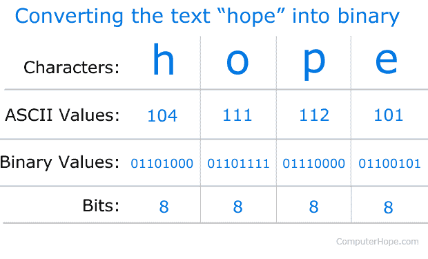
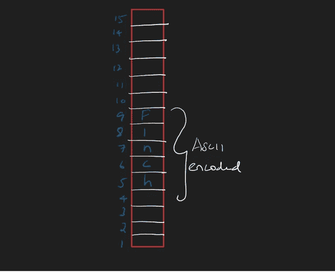
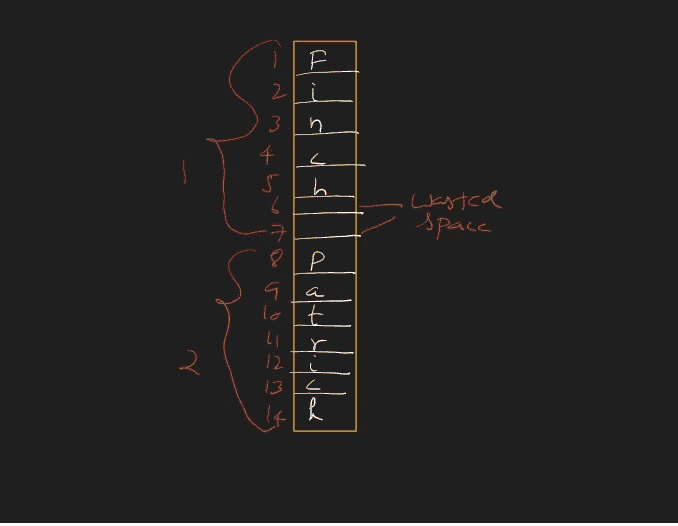
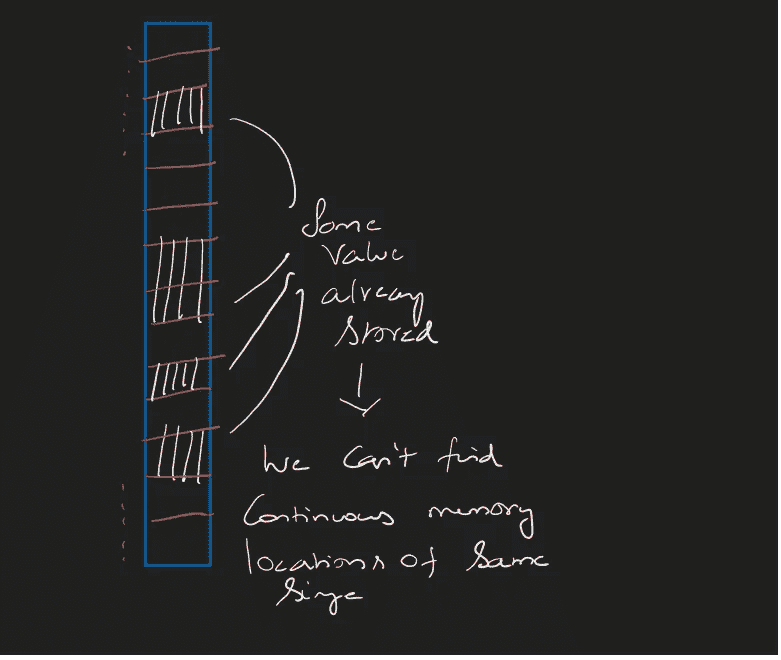
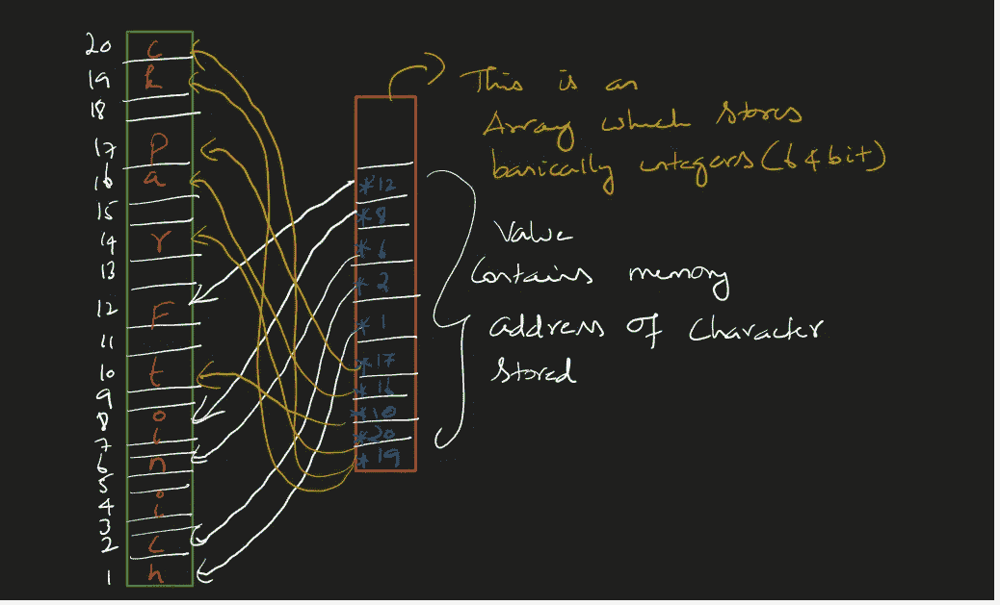

# 从头开始的数据结构系列# 6[数组]

> 原文：<https://medium.com/nerd-for-tech/data-structures-from-scratch-bot-up-series-6-d62f6a4b12f2?source=collection_archive---------28----------------------->

对前一篇文章的简单回顾

我们建立了一个数据结构，在 RAM 的连续存储单元中存储一组数字。我们给它起了一个好听的名字叫‘数组’。

因为它们存储在连续的内存位置，所以它们是按顺序放置的。这样的位置被称为“数组索引”。

重述够了。让我们把视野扩大一点

如果我们想存储一系列字符呢？

计算机世界中的一系列字符= 'String '。注:字符包括特殊字符、空格等。

好吧，让我们存储“芬奇”…但是等等！计算机只能理解 0 和 1(二进制)。我需要找到一种方法将字符转换成二进制。

为此，我们将每个已知字符映射到数字(见 ASCII 表)
然后数字可以很容易地转换成二进制。我们上面做的叫做‘字符编码’(只是行话)。

字符— ASCII —二进制

是时候采取实际行动了。让我们储存

我们有一系列的角色**‘F’‘I’‘n’‘c’‘h’**

请注意:

每个字符适合一个字节。
它们都存储在一个连续的内存位置。
都是相同的数据类型。

因此，我们可以舒服地说它是一个'**数组**'

简单！好吧，那么让我们复杂化

如果我们想存储“一系列字符的系列”呢

没道理？
参见，一系列字符= '字符串'
一系列字符= '一系列字符串'

这就像存储像“芬奇”、“帕特里克”等名字

“Finch”中的字符数= 5
“Patrick”中的字符数= 7

展示了浪费的空间

对于一个数组，我们需要某种类型的数据吗？在这种情况下，是人物→没问题！

我们需要为两个字符串分配相同数量的空间→问题因为(5！= 7).
目前我们将为所有人分配最大值(在本例中为 7)。
注意:这里对于第一个索引(finch) →浪费了 2 个字节

我们需要连续的内存分配→如果可用的话好的，但是我们需要有另一个计划来存储它。不是吗？

没有连续的内存位置？

我们现在面临的是空间限制？

我们有 12 个字节，但不在连续的位置

所以我们尽可能地存储这些值。
然后我们将组成一个数组，包含这些字符的存储位置。

只包含指向字符的内存位置的数组

这个数组实质上包含了按顺序排列的内存位置。
**内存位置为整数。**
我们对数据的类型没有问题，等间距(64 bit)，连续位置。

我们为克服空间问题而构建的数组称为“**指针**”。

**指针**正好指向内存
RAM 通过识别**号**前的**星**来区分指针和普通整数

我想我们今天吃得太多了。让我们在这里结束