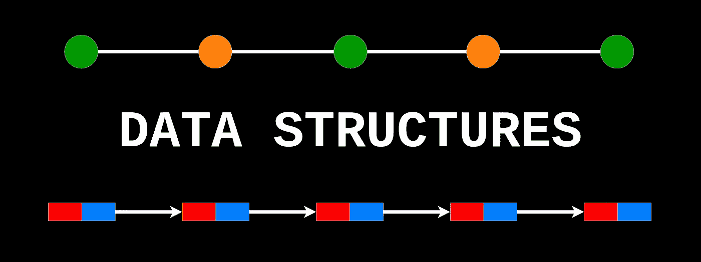
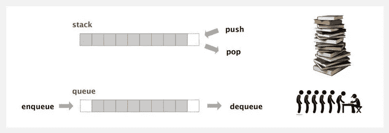
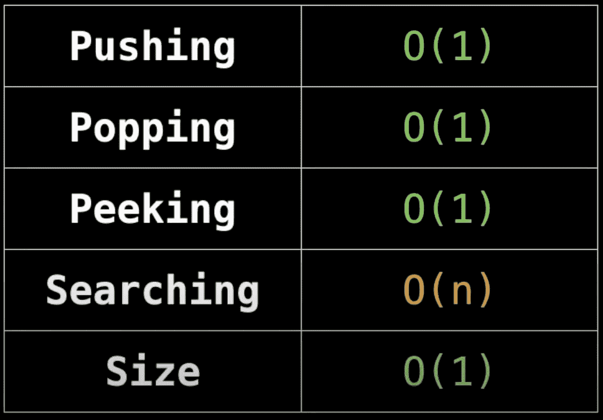
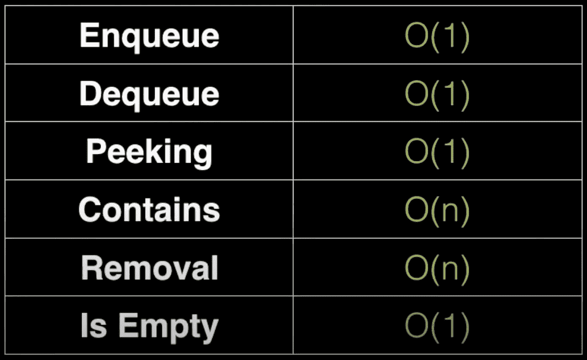
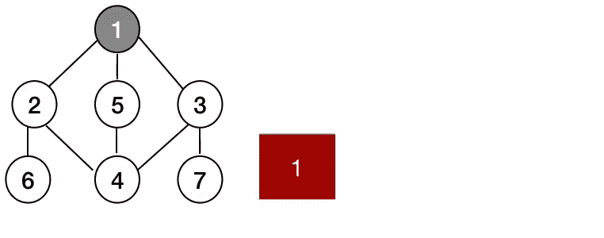
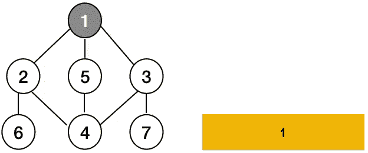

# 数据结构:堆栈和队列

> 原文：<https://medium.com/nerd-for-tech/data-structures-stacks-and-queues-a708303e3665?source=collection_archive---------7----------------------->

## 数据结构和最著名的相关算法指南



在本文中，我将解释两种重要的数据结构，并且我将在以后的文章中写一些更流行的数据结构。我们第一次讨论需要使用我们已经讨论过的更简单的数据结构来实现的数据结构。如果你需要更多的信息，你可以参考以前的文章。

[](https://jhonny-chamoun.medium.com/data-structures-linked-list-994f798cd64e) [## 数据结构:链表

### 数据结构和最著名的相关算法指南

jhonny-chamoun.medium.com](https://jhonny-chamoun.medium.com/data-structures-linked-list-994f798cd64e) [](https://jhonny-chamoun.medium.com/data-structures-arrays-13e8bf06b055) [## 数据结构:数组

### 数据结构和最著名的相关算法指南

jhonny-chamoun.medium.com](https://jhonny-chamoun.medium.com/data-structures-arrays-13e8bf06b055) 

请记住，这些文章假设我们的读者熟悉数据结构的概念以及为什么在软件开发中使用它们，并且它将深入我们正在研究的每个数据结构的定义、不同类型、实现和复杂性。

# 定义

栈和队列都是模拟真实场景的线性数据结构。堆栈模拟后进先出情况，队列模拟先进先出情况。

两种数据结构都用于组织对数据的访问，不同之处在于每种结构组织访问的方式…



**Push** 是向堆栈添加元素的方法，而 **Pop** 是访问和删除堆栈顶部元素的方法。

**Enqueue** 是向队列中添加元素的方法， **Dequeue** 是移除之前已入队的元素。

# 使用

## 堆

1-文本编辑器中的撤销功能。
2-编译器语法-检查括号和大括号耦合。
3-造型桩。
4-支持递归，并跟踪之前的函数调用。
5-用于在图形或树上进行深度优先搜索。

## 长队

1-模拟等候线。
2-任何先来先服务的情况，例如在 web 服务器请求管理中。
三口气先搜索图或树遍历。

# 复杂性



## 堆

除了在我们寻找的项目不存在的情况下线性搜索之外，大多数操作都具有恒定的时间复杂度。



# 长队

类似地，队列中只有包含和移除操作是线性的。所有其他操作都具有恒定的复杂性。

# 不同语言方法

## C#

英寸 NET 中，队列和堆栈都是作为类来实现、打包和提供的，以便于调用和使用。

```
// Using a stack in c# is as easy as the below example.
Stack st = new Stack();st.Push('A');
st.Push('B');
st.Push('C');char ch = st.Pop(); //will return C;
char ch2 = st.Pop(); // returns B;// Using a queue can also be done as the below example.
Queue q = new Queue();q.Enqueue(“Two”);
q.Enqueue(“One”);

// Remove elements and print them to the console.
while (q.Count > 0)
    Console.WriteLine(q.Dequeue());
```

## Java 语言（一种计算机语言，尤用于创建网站）

Java 提供的堆栈和队列的实现略有不同。

除了用于堆栈操作的方法之外，堆栈作为继承 vector 数据类型及其所有方法的类提供。它的用法非常类似于 C#。

另一方面，队列是作为一个接口提供的，它需要使用不同的数据类型作为队列。下面是一个例子。

```
// examples of declaring a queue in JAVA.
Queue queueA = new LinkedList();
Queue queueB = new PriorityQueue();queueA.add("element 1");
queueA.add("element 2");// both poll and remove do the same with one difference, if the    // queue is empty poll return a null while remove throws an        // exception.String element1 = queueA.poll();

String element2 = queueA.remove();
```

## Java Script 语言

JavaScript 既不提供堆栈也不提供队列的预打包实现，这意味着像你我这样的开发人员或工程师需要实现它。

最简单的方法是用它们的原型方法构建构造函数，就像我们在 JAVA 和 C#中看到的那样。唯一的区别是使用对象{}进行存储。

下面的链接是一个很棒的博客，解释了 JavaScript 中堆栈和队列的实现。

[](https://code.tutsplus.com/articles/data-structures-with-javascript-stack-and-queue--cms-23348) [## JavaScript 的数据结构:堆栈和队列

### web 开发中最常用的两种数据结构是堆栈和队列。许多互联网用户…

code.tutsplus.com](https://code.tutsplus.com/articles/data-structures-with-javascript-stack-and-queue--cms-23348) 

## Ruby 和 Python

Ruby 和 Python 都没有专门针对队列和堆栈的数据结构，相反，它们提供了各自的方法和基本数据结构，因此我们可以模仿堆栈和队列的功能。

例如，Ruby 提供了用于数组的 push 和 pop 方法，提供了 LIFO 行为(堆栈)和 push/shift 或 unshift/pop，提供了 FIFO 行为(队列)。

Python 提供了与 List 捆绑在一起的 append、pop 和 pop(0 ),它还提供了带有 append、pop 和 popleft 方法的 dequeue。

# 用队列和堆栈解决的常见问题

BFS 和 DFS，主要是在树和图中，是最常见的设计模式，其中队列和堆栈起着重要的作用。

## 广度优先搜索(BFS)



逐层访问树中的所有顶点或节点。为了做到这一点，每次我们访问一个节点时，我们都将它的子节点放入一个队列中，所以在我们处理完那个节点后，我们将可以按顺序访问下一级节点。

## 深度优先搜索



从根节点开始访问树中的所有顶点或节点，并一直访问所有子节点，直到到达最深处。

DFS 使用堆栈来存储它所访问的每个顶点的子节点，以便在处理完更深的节点后再访问它们。

# 结论

当我们解释了队列和堆栈的定义以及它在不同语言中的实现和它最常见的编码模式时，请记住还有更多的数据结构来建模和修复不同的问题。我们将在以后的文章中讨论它们，以及它们的实现和帮助解决它们特定问题的最常见的编码模式。

敬请关注…